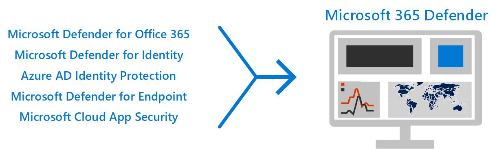

# 여러 보안 기능으로 위협 방지 Microsoft 365 E5

이 솔루션은 위협 방지 기능의 강력한 Microsoft 365 E5 보호가 중요한 이유에 대해 설명하고 있습니다. 조직의 위협 방지에 대한 개요를 Microsoft 365 E5 조직의 설정 및 구성에 접근하는 방법을 참조하세요.

## 위협 방지가 중요한 이유 

[맬웨어](/windows/security/threat-protection/intelligence/understanding-malware)및 정교한 사이버 공격(예: 파일 없는 위협)은 일반적으로 발생합니다.  기업은 효과적인 IT 보안 기능으로 자신과 고객을 보호해야 합니다. 사이버 공격은 신뢰 상실에서 재무적 위험, 비즈니스를 위협하는 다운타임 등 조직에 중요한 문제를 일으킬 수 있습니다. 위협으로부터 보호하는 것은 중요하지만 조직의 시간, 작업 및 리소스에 집중할 위치를 결정하기 어려울 수 있습니다. Microsoft 365 E5 도움이 될 수 있습니다. 

## 보안 위협 방지 Microsoft 365 E5

Microsoft 보안 솔루션은 제품 및 서비스에 기본 제공되어 있습니다. 자동화 및 기계 학습 기능은 보안 팀의 부하를 줄여 올바른 항목이 해결될 수 있도록 합니다. Microsoft 보안 솔루션의 강점은 지능형 보안 솔루션에서 매일 수조 개에 달하는 신호를 [Graph.](/graph/security-concept-overview) Microsoft 365 보안 솔루션에는 Microsoft 365 Defender, 데이터, 장치 및 ID 전반의 신호를 모아 조직에 대한 고급 위협에 대한 그림을 그릴 수 있는 솔루션이 포함되어 있습니다.

[Microsoft 365 E5](https://www.microsoft.com/microsoft-365/enterprise-e5-business-software?activetab=pivot%3aoverviewtab) 기본 제공 인텔리전스로 조직을 보호할 수 있습니다. 사용자 환경의 보안 기능을 Microsoft 365 E5 환경(사내 및 클라우드)에서 고급 위협, ID 손상 및 악의적인 작업을 감지하고 조사할 수 있습니다.

## 통합으로 더 나은 보호

이 Microsoft 365 E5 위협 방지 기능은 기본적으로 통합되어 있습니다. 각 기능의 신호는 위협을 감지하고 대응하는 전반적인 기능에 강도를 추가합니다. 결합된 기능 집합은 비 Microsoft 제품 실행에 비해 조직, 특히 다국적 조직에 가장 적합한 보호 기능을 제공합니다. 다음 이미지는 이 문서에서 설명하는 위협 방지 서비스 및 기능을 기술합니다.

Microsoft 365 Defender 통합 보안 센터 에 [신호와 데이터를 Microsoft 365 제공합니다.](/microsoft-365/security/defender/overview-security-center) 

> [!div class="mx-imgBorder"]
> 

## 배포 개요

다음 그림에서는 이러한 개별 기능을 배포하는 데 권장되는 경로를 설명하고 있습니다. 

> [!div class="mx-imgBorder"]
> 

이 비디오를 시청하고 배포 프로세스에 대한 개요를 확인하세요.
  
> [!VIDEO https://www.microsoft.com/videoplayer/embed/RE4vsI7]

다음 표에서는 구성할 수 있는 다양한 솔루션/기능과 이러한 솔루션의 기능에 대해 설명하고 있습니다.  

|단계 |솔루션/기능  |설명  |
|--|---------|---------|
| 1 |[다단계 인증 및 조건부 액세스](deploy-threat-protection-configure.md#step-1-set-up-multi-factor-authentication-and-conditional-access-policies)     |손상된 ID 및 장치로부터 보호합니다. 기본이기 때문에 이 보호로 시작해야 합니다. 이 지침에서 권장되는 구성에는 Azure AD ID 보호가 선행 구성으로 포함됩니다. 자세한 내용은 [Azure AD ID 보호를 참조하세요.](/azure/security/fundamentals/threat-detection#azure-active-directory-identity-protection)     |
| 2 |[Microsoft Defender for Identity](deploy-threat-protection-configure.md#step-2-configure-microsoft-defender-for-identity)     |  AD DS(Active Directory 도메인 서비스) 신호를 사용하여 조직에 대한 고급 위협, 손상된 ID 및 악의적인 내부자 작업을 식별, 감지 및 조사하는 클라우드 기반 보안 솔루션입니다. 다음으로 Microsoft Defender for Identity에 중점을 두는 이유는, 이 인프라가 사용자의 사내 및 클라우드 인프라를 보호하고, 종속성이나 선행 요구가 없는 것이고, 즉각적인 보안 이점을 제공할 수 있기 때문에 그 다음에 집중합니다. 자세한 내용은 ID [보호란?을 참조하세요.](/azure/active-directory/identity-protection/overview-identity-protection) | 
| 3  |[Microsoft 365 Defender](deploy-threat-protection-configure.md#step-3-turn-on-microsoft-365-defender) |신호를 결합하고 기능을 단일 솔루션으로 오케스트레이션합니다. 보안 전문가가 위협 신호를 함께 스티치하고 위협의 전체 범위와 영향을 확인할 수 있습니다. Microsoft 365 Defender 공격을 방지하거나 중지하고 영향을 받는 사서함, 끝점 및 사용자 ID를 자체적으로 고치기 위한 자동 조치를 취합니다. 자세한 내용은 를 [Microsoft 365 Defender.](/microsoft-365/security/defender/microsoft-365-defender) |
| 4  |[Office 365용 Microsoft Defender](deploy-threat-protection-configure.md#step-4-configure-microsoft-defender-for-office-365)     | 전자 메일 메시지, 링크(URL) 및 공동 작업 도구로 위협되는 악의적인 위협에 대해 조직을 보호합니다. 맬웨어, 피싱, 스푸핑 및 기타 공격 유형으로부터 보호합니다. 변경 제어, 현재 시스템에서 설정을 마이그레이션하는 등 다른 고려 사항을 배포하는 데 시간이 더 오래 걸릴 수 있기 때문에 Office 365 Microsoft Defender를 구성하는 것이 좋습니다. 자세한 내용은 Microsoft [Defender for Office 365.](/microsoft-365/security/office-365-security/defender-for-office-365)       |
| 5  |[엔드포인트용 Microsoft Defender](deploy-threat-protection-configure.md#step-5-configure-microsoft-defender-for-endpoint)    | 장치 전체에서 고급 위협을 방지, 감지, 조사 및 대응하는 데 도움이 됩니다(끝점이라고도 참조). Endpoint용 Defender는 강력한 위협 방지 제품입니다. 자세한 내용은 [끝점용 Microsoft Defender를 참조하세요.](/microsoft-365/security/defender-endpoint/microsoft-defender-endpoint)  |
| 6  |[Microsoft Cloud App Security](deploy-threat-protection-configure.md#step-6-configure-microsoft-cloud-app-security)     | 검색, 조사 및 거버넌스를 위한 클라우드 액세스 보안 브로커입니다. 데이터 및 Microsoft Cloud App Security 수집을 초기에 사용하도록 설정할 수 있습니다. SaaS 앱에 정보 및 기타 대상이 지정된 보호를 구현하는 데는 계획이 수반될 수 있으며 시간이 더 걸릴 수 있습니다. 자세한 내용은 What [is Cloud App Security?](/cloud-app-security/what-is-cloud-app-security)      | 

> [!TIP]
> 보안 팀이 여러 개 있는 조직은 동시에 기능을 구현할 수 있습니다. 예를 들어 한 팀은 끝점에 대해 Defender를 Office 365 구성할 수 있습니다. 구성이 제안된 순서를 정확히 따를 필요는 없습니다. 

## 위협 방지 솔루션 배포 계획

다음 다이어그램은 위협 방지 기능을 배포하기 위한 높은 수준의 프로세스를 보여 제공합니다. 

조직에서 최상의 보호를 사용할 수  있도록 다음 단계를 포함하는 프로세스로 보안 솔루션을 설정하고 배포합니다.

1. [다단계 인증 및 조건부 액세스 정책을 설정합니다.](deploy-threat-protection-configure.md#step-1-set-up-multi-factor-authentication-and-conditional-access-policies)
2. [Id에 대해 Microsoft Defender를 구성합니다.](deploy-threat-protection-configure.md#step-2-configure-microsoft-defender-for-identity)
3. [를 Microsoft 365 Defender.](deploy-threat-protection-configure.md#step-3-turn-on-microsoft-365-defender)
4. [에 대해 Defender를 Office 365.](deploy-threat-protection-configure.md#step-4-configure-microsoft-defender-for-office-365)
5. [끝점에 대해 Microsoft Defender를 구성합니다.](deploy-threat-protection-configure.md#step-5-configure-microsoft-defender-for-endpoint)
6. [를 Microsoft Cloud App Security.](deploy-threat-protection-configure.md#step-6-configure-microsoft-cloud-app-security)
7. [상태를 모니터링하고 작업을 수행합니다.](deploy-threat-protection-configure.md#step-7-monitor-status-and-take-actions)
8. [사용자를 교육합니다.](deploy-threat-protection-configure.md#step-8-train-users)

위협 방지 기능을 병렬로 구성할 수 있으므로 여러 네트워크 보안 팀이 서로 다른 서비스를 담당하는 경우 조직의 보호 기능을 동시에 구성할 수 있습니다.

## 다음 단계

에서 위협 방지 기능 구성을 [계속 Microsoft 365.](deploy-threat-protection-configure.md)

