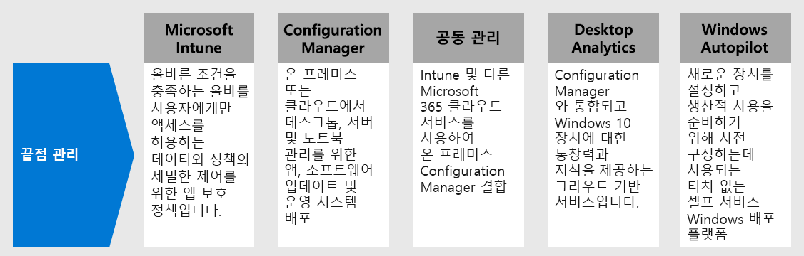
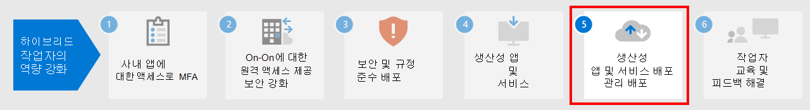

# 4단계: 장치, PC 및 기타 끝점에 대한 끝점 관리 기능 배포

하이브리드 작업자의 경우 점점 늘어나는 개인 장치를 지원해야 합니다. 끝점 관리 기능은 장치에서 리소스에 대한 액세스 권한을 부여받기 전에 특정 기준을 준수해야 하는 정책 기반의 보안 방식입니다. Microsoft Endpoint Manager는 클라우드 및 온-프레미스에서 데이터를 안전하게 유지하기 위한 최신 관리 기능을 제공합니다. 

[Microsoft Endpoint Manager](/mem/endpoint-manager-overview)는 사용자가 이미 알고 사용 중에 있는 다음 서비스를 결합하여 모바일 장치, 데스크톱 컴퓨터, 가상 머신, 내장 장치, 서버를 관리하는 서비스와 도구를 제공합니다.

## Microsoft Intune

Microsoft Intune은 Microsoft 365에 포함된 MDM(모바일 장치 관리) 및 MAM(모바일 응용 프로그램 관리)에 중점을 둔 클라우드 기반 서비스입니다. 

- **MDM:** 조직 소유의 장치의 경우 설정, 기능 및 보안을 포함하여 모든 권한을 발휘할 수 있습니다. 장치는에서 규칙과 설정을 사용하여 Intune 정책을 받는 Intune에서 "등록”되었습니다. 예를 들어, 암호와 PIN 요구 사항을 설정하고, VPN 연결을 만들고, 위협 방지를 설정하는 등의 작업을 수행할 수 있습니다.

- **MAM:** 원격 작업자는 BYOD(Bring-Your-Own Device)라고도 하는 개인 기기를 완전히 제어하는 것을 원하지 않을 수 있습니다. 하이브리드 작업자 옵션을 제공하고 계속해서 조직을 보호할 수 있습니다. 예를 들어 하이브리드 작업자가 조직 리소스에 대한 전체 액세스 권한을 원할 경우 장치를 등록할 수 있습니다. 또는 이러한 사용자가 전자 메일 또는 Microsoft Teams에만 액세스하려면 MFA(다단계 인증)가 필요한 앱 보호 정책을 사용하여 이러한 앱을 사용합니다.

자세한 내용은 이 [Microsoft Intune의 개요](/intune/fundamentals/what-is-intune)를 참조하세요.

## Configuration Manager

Configuration Manager는 온-프레미스 관리 솔루션으로서 네트워크에 있거나 또는 인터넷 기반의 데스크톱, 서버 및 노트북을 관리합니다. Configuration Manager를 사용하여 앱, 소프트웨어 업데이트 및 운영 체제를 배포합니다. 또한 규정 준수를 모니터링하고, 쿼리를 실행하고, 실시간으로 클라이언트에 대한 작업을 수행하는 등의 더 많은 작업을 수행할 수 있습니다. 클라우드를 사용하도록 설정하여 Intune, Azure AD, 엔드포인트용 Microsoft Defender 및 기타 클라우드 서비스와 통합할 수 있습니다. 

자세한 내용은 이 [Configuration Manager 개요](/mem/configmgr/core/understand/introduction)를 참조하세요.

## 공동 관리

공동 관리는 Intune과 기타 Microsoft 365 클라우드 서비스를 사용하여 기존 온-프레미스 Configuration Manager 투자와 클라우드를 결합합니다. 사용자는 Configuration Manager 또는 Intune을 다양한 워크로드에 대한 관리 기관으로 선택할 수 있습니다. 

공동 관리는 조건부 액세스 및 장치 규정 준수 적용을 비롯한 Intune 기반 클라우드 기능을 사용합니다. Intune을 이용하여 클라우드에서 다른 작업을 실행하는 동안 몇 가지 작업을 온-프레미스에 유지할 수 있습니다.

자세한 내용은 이 [공동 관리 개요](/mem/configmgr/comanage/overview)를 참조하세요.

## Desktop Analytics

Desktop Analytics는 Configuration Manager와 통합하고 사용자에게 Windows 클라이언트에 대한 의사 결정을 내리는 데 도움이 되는 정보와 인텔리전스를 제공하는 클라우드 기반 서비스입니다. Microsoft 클라우드 서비스에 연결된 수백만 개의 다른 장치에서 집계한 데이터를 조직의 데이터와 결합합니다. 

데스크톱 분석을 통해 다음의 작업을 수행할 수 있습니다.

- 조직에서 실행 중인 앱의 인벤토리를 만듭니다.
- 최신 Windows 10 기능 업데이트와 앱 호환성을 평가합니다.
- 클라우드 사용 데이터를 기반으로 하는 호환성 문제를 식별하고 완화 제안을 받습니다.
- 최소 장치 집합에서 전체 응용 프로그램 및 드라이버 공간을 나타내는 파일럿 그룹을 만듭니다.
- 파일럿 및 프로덕션 관리 장치에 Windows 10을 배포합니다.

자세한 내용은 이 [Desktop Analytics 개요](/mem/configmgr/desktop-analytics/overview)를 참조하세요.

## Windows Autopilot

Windows Autopilot은 제로터치의 셀프 서비스 Windows 배포 플랫폼입니다. 여기에는 새 장치를 설정하고 사전 구성하는 데 사용되는 기술 모음을 포함하며, 이를 통해 장치의 생산적인 활용을 위한 준비를 합니다. 또한 Windows Autopilot를 사용하여 장치를 재설정 하고 용도를 변경하며 복구를 할 수도 있습니다. 

Windows 자동 실행 기능을 사용하면 IT 부서가 쉽고 간단한 프로세스를 통해 관리할 인프라가 거의 없거나 전혀 없는 장치를 미리 구성할 수 있습니다. 

- 사용자 관점에서 보면 몇 가지 간단한 작업만 수행하면 장치를 사용할 준비가 됩니다. 
- IT 전문가의 관점에서 보면 최종 사용자가 해야하는 작업은 네트워크에 연결하고 해당 자격 증명을 확인하는 것뿐입니다.

자세한 내용은 이 [Windows Autopilot의 개요](/windows/deployment/windows-autopilot/windows-autopilot)를 참조하세요.

## 끝점 관리를 위한 관리자 기술 리소스

- [Microsoft 365의 장치 관리 로드맵](../enterprise/device-management-roadmap-microsoft-365.md)
- [모바일 장치 관리에 다양한 유형의 장치를 등록하는 방법](/mem/intune/enrollment/device-enrollment)
- [Microsoft Intune에 대해 최종 사용자를 교육하는 방법](/mem/intune/fundamentals/end-user-educate)
 
## 4단계의 결과

사용자는 끝점 관리자 기능 제품군을 사용하여 모바일 장치, 데스크톱 컴퓨터, 가상 컴퓨터, 내장 장치 그리고 서버를 관리하고 있습니다.

## 다음 단계

[5단계](empower-people-to-work-remotely-teams-productivity-apps.md)를 계속 진행하면 하이브리드 작업자가 Microsoft 팀과 같은 Microsoft 365 생산성 앱을 사용할 수 있습니다.