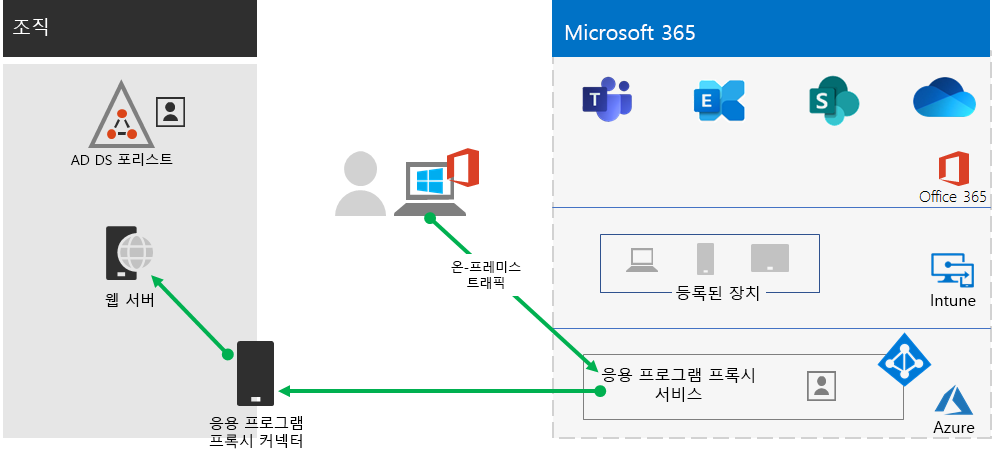
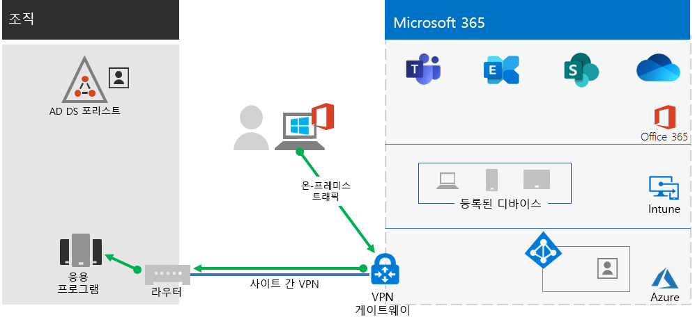
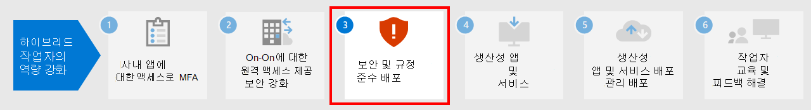

# 2단계: 온-프레미스 앱 및 서비스에 대한 원격 액세스 제공

조직에서 원격 액세스 VPN 솔루션을 사용하는 경우(일반적으로 네트워크 에지의 VPN 서버와 사용자 디바이스에 설치된 VPN 클라이언트), 사용자는 온-프레미스 앱과 서버에 액세스하는 데 원격 액세스 VPN 연결을 사용할 수 있습니다. 하지만 Microsoft 365 클라우드 기반 서비스로의 트래픽을 최적화해야 할 수 있습니다.

사용자가 VPN 솔루션을 사용하지 않는 경우에는 Azure AD(Azure Active Directory) 응용 프로그램 프록시 및 Azure 지점 및 사이트 간(P2S) VPN을 사용하여 모든 앱이 웹 기반 인지에 따라 액세스 권한을 제공할 수 있습니다.

원격 액세스를 위한 기본 구성은 다음과 같습니다.

- 이미 원격 액세스 VPN 솔루션을 사용하고 있습니다.
- 원격 액세스 VPN 솔루션을 사용하지 않고 원격 작업자가 개인용 컴퓨터를 사용하기를 원합니다.
- 원격 액세스 VPN 솔루션을 사용하지 않고 있으며 하이브리드 ID가 있어, 사용자는 온-프레미스 웹 기반 앱으로의 원격 액세스만 필요로 합니다.
- 원격 액세스 VPN 솔루션을 사용하지 않고 있어, 온-프레미스 앱으로의 액세스 권한이 필요하며 앱 중 일부는 웹 기반이 아닙니다.

이 문서에서 설명하는 원격 액세스 구성 옵션을 보려면 이 순서도를 참조하세요.

또한 원격 액세스 연결을 사용하여 [원격 데스크톱](https://support.microsoft.com/help/4028379/windows-10-how-to-use-remote-desktop)을 사용하여 사용자를 온-프레미스 PC에 연결할 수도 있습니다. 예를 들어, 원격 작업자는 원격 데스크톱을 사용하여 Windows, iOS 또는 Android 장치에서 사무실의 PC에 연결할 수 있습니다. 원격으로 연결되면 바로 앞에 앉아있는 것처럼 사용할 수 있습니다.

## Microsoft 365 클라우드 서비스에 대한 원격 액세스 VPN 클라이언트의 성능 최적화

원격 작업자가 기존 VPN 클라이언트를 사용하 여 조직 네트워크에 대한 원격 액세스 권한을 얻는 경우, VPN 클라이언트에 분할 터널링 지원이 되는지 확인합니다.

분할 터널링을 사용하지 않는 경우에는 모든 원격 작업 트래픽이 조직의 에지 장치로 전송되어 처리된 후 인터넷으로 전송되지 않고 VPN 연결을 통해 전송됩니다.

Microsoft 365 트래픽은 조직을 통해 간접 경로를 가져와야 하며 이는 그 후 VPN 클라이언트의 물리적 위치에서 멀리 떨어져 있는 Microsoft 네트워크 진입점으로 전달될 수 있습니다. 이 간접 경로는 네트워크 트래픽에 대기 시간을 더하여 전반적인 성능을 저하시킵니다.

분할 터널링을 사용할 경우, 사용자는 특정 유형의 트래픽을 제외하여 VPN 연결을 통해 조직 네트워크에 보내지 않도록 VPN 클라이언트를 구성할 수 있습니다.

Microsoft 365 클라우드 리소스에 대한 액세스를 최적화하려면 VPN 연결을 통해 범주 **최적화** Microsoft 365 끝점으로의 트래픽을 제외하도록 분할 터널링 VPN 클라이언트를 구성합니다. 자세한 내용은 [Office 365 끝점 범주](../enterprise/microsoft-365-network-connectivity-principles.md#new-office-365-endpoint-categories)를 참조하세요. 최적화 카테고리 끝점의 [이 목록](../enterprise/urls-and-ip-address-ranges.md)을 참조하세요.

다음은 Microsoft 365 클라우드 앱에 대한 대부분의 트래픽이 VPN 연결을 바이패스하는 결과 트래픽 흐름입니다.

이는 VPN 클라이언트가 인터넷을 통해 직접 중요한 Microsoft 365 클라우드 서비스 트래픽을 가장 가까운 진입점으로 Microsoft 네트워크로 전송하고 받도록 해줍니다.

자세한 내용과 지침은 [VPN 분산 터널링을 사용한 원격 근무자의 Office 365 연결 최적화](../enterprise/microsoft-365-vpn-split-tunnel.md)를 참조하세요. 

## 모든 앱이 웹 앱이고 하이브리드 ID가 있는 경우 원격 액세스 배포

원격 작업자가 기존 VPN 클라이언트를 사용하지 않고 온-프레미스 사용자 계정 및 그룹이 Azure AD와 동기화되어 있는 경우, Azure AD 응용 프로그램 프록시를 사용하여 온-프레미스 서버에 호스트되는 웹 기반 응용 프로그램에 대한 안전한 원격 액세스를 제공할 수 있습니다. 웹 기반 응용 프로그램에는 SharePoint 서버 사이트, Outlook Web Access 서버 또는 기타 웹 기반 기간 업무 비즈니스 응용 프로그램이 포함됩니다.

Azure AD 응용 프로그램 프록시의 구성 요소는 다음과 같습니다.

자세한 내용은 이 [Azure AD 응용 프로그램 프록시 개요](/azure/active-directory/manage-apps/application-proxy)를 참조하세요.

> [!NOTE]
> Azure AD 응용 프로그램 프록시는 Microsoft 365 구독에 포함되어 있지 않습니다. 별도의 Azure 구독을 통해 비용을 지불해야 합니다.

## 모든 앱이 웹 앱이 아닌 경우의 원격 액세스 배포

원격 작업자가 기존 VPN 클라이언트를 사용하고 있지 않고 웹 기반이 아닌 앱이 있는 경우, Azure P2S(지점 및 사이트 간) VPN을 사용할 수 있습니다.

P2S VPN 연결은 Azure 가상 네트워크를 통해 원격 작업자의 장치에서 조직 네트워크로의 연결을 안전하게 만듭니다.

자세한 내용은 이 [P2S VPN의 개요](/azure/vpn-gateway/point-to-site-about)를 참조하세요.

> [!NOTE]
> Azure P2S VPN은 Microsoft 365 구독에 포함되어 있지 않습니다. 별도의 Azure 구독을 통해 비용을 지불해야 합니다.

## Azure Virtual Desktop을 배포하여 개인 장치를 사용하는 원격 작업자에게 원격 액세스 기능을 제공

개인 디바이스와 관리되지 않는 디바이스만 사용할 수 있는 원격 작업자를 지원하려면 Azure Virtual Desktop을 사용하여 사용자가 집에서 사용할 가상 데스크톱을 만들고 할당합니다. 가상화된 PC는 조직의 네트워크에 연결된 PC처럼 작동합니다.

자세한 내용은 [Azure Virtual Desktop](/azure/virtual-desktop/overview)의 개요를 참조하세요.

> [!NOTE]
> Azure Virtual Desktop은 Microsoft 365 구독에 포함되어 있지 않습니다. 별도의 Azure 구독을 통해 비용을 지불해야 합니다.

## 원격 데스크톱 서비스 게이트웨이로 원격 데스크톱 서비스 연결 보호

직원이 온-프레미스 네트워크의 Windows 기반 컴퓨터에 연결할 수 있도록 원격 데스크톱 서비스(RDS)를 사용하는 경우, Edge 네트워크에서 Microsoft 원격 데스크톱 서비스 게이트웨이를 사용해야합니다. 게이트웨이는 TLS(Transport Layer Security)를 사용하여 트래픽을 암호화하고 RDS를 호스팅하는 사내 컴퓨터가 인터넷에 직접 노출되는 것을 방지합니다.

자세한 내용은 [이 문서](https://www.microsoft.com/security/blog/2020/04/16/security-guidance-remote-desktop-adoption/)를 참조하세요.

## 원격 액세스를 위한 관리자 기술 리소스

- [원격 직원에 맞게 Office 365 트래픽을 빠르게 최적화하고 인프라의 부하를 줄이는 방법](https://techcommunity.microsoft.com/t5/office-365-blog/how-to-quickly-optimize-office-365-traffic-for-remote-staff-amp/ba-p/1214571)
- [VPN 분할 터널링을 사용하여 원격 사용자의 Office 365 연결 최적화](../enterprise/microsoft-365-vpn-split-tunnel.md)

## 2단계의 결과

원격 작업자를 위한 원격 액세스 솔루션을 배포한 후에는 다음을 수행합니다.

| 원격 액세스 구성 | 결과 |
|:-------|:-----|
| 원격 액세스 VPN 솔루션이 가동 중입니다 | 분할 터널링 및 Microsoft 365 끝점의 범주 최적화에 대한 원격 액세스 VPN 클라이언트를 구성했습니다. |
| 원격 액세스 VPN 솔루션을 사용하지 않으며 사용자는 온-프레미스 웹 기반 앱으로의 원격 액세스만 필요로 합니다. | Azure 응용 프로그램 프록시를 구성했습니다. |
| 원격 액세스 VPN 솔루션을 사용하지 않으며 온-프레미스 앱으로의 액세스 권한이 필요하며, 앱 중 일부는 웹 기반이 아닙니다. | Azure P2S VPN을 구성했습니다. |
| 원격 작업자는 집에서 개인 장치를 사용하고 있습니다. | Azure Virtual Desktop을 구성했습니다. |
| 원격 작업자가 온-프레미스 시스템으로의 RDS 연결을 사용하고 있습니다 | Edge 네트워크에 원격 데스크톱 서비스 게이트웨이를 배포했습니다. |
|||

## 다음 단계

[3단계](empower-people-to-work-remotely-security-compliance.md)를 계속 진행해 Microsoft 365 보안 및 규정 준수 서비스를 배포하여 앱, 데이터 및 장치를 보호하세요.
