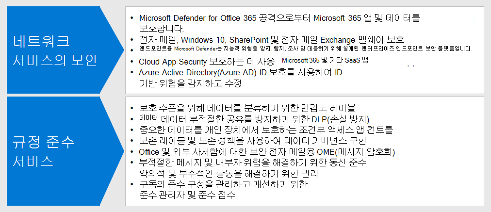
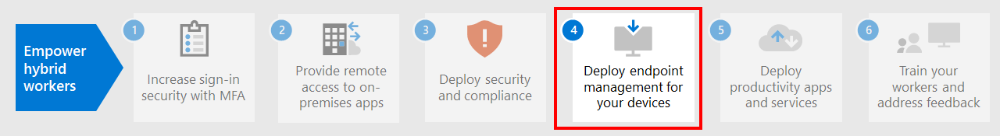

# 3단계: 하이브리드 작업자를 위한 보안 및 규정 준수 구현

사무실에 들어오지 않거나 매우 드물게 출근하는 하이브리드 작업자의 경우 보안 및 규정 준수는 전체 솔루션의 중요한 부분입니다. 모든 커뮤니케이션은 조직 인트라넷에 국한되지 않고 인터넷을 통해 이루어집니다.

사이버 보안 위험을 줄이고 내부 정책 및 데이터 규정을 준수하는 동시에 생산성을 유지하기 위해 귀하와 귀사의 직원이 할 수 있는 일이 있습니다.

원격 작업에는 다음과 같은 보안 및 규정 준수 요소가 필요합니다.

- Microsoft Teams와 같이 하이브리드 작업자가 사용하는 생산성 애플리케이션에 대한 액세스 제어
- 채팅 대화 또는 공유 파일과 같이 하이브리드 작업자가 만들고 사용하는 데이터에 대한 액세스 및 보호를 제어
- 악성 프로그램 및 기타 유형의 사이버 공격으로부터 Windows 10 장치를 보호
- 민감도 및 보호 수준에 대한 일관된 레이블을 사용하여 전자 메일, 파일 및 사이트 보호
- 정보유출 방지
- 지역 데이터 규정을 준수

다음은 하이브리드 작업자에 대한 보안 및 규정 준수 서비스를 제공하는 Microsoft 365의 기능입니다.

## 보안

Microsoft 365의 이러한 보안 기능으로 애플리케이션과 데이터를 보호합니다.

|기능 또는 특징|필요한 이유|라이선싱|
|---|---|---|
|Office 365용 Microsoft Defender|전자 메일 메시지, 사무실 문서 및 협업 도구와 같은 Microsoft 365 앱과 데이터를 공격으로부터 보호합니다. 
 Office365용 Microsoft Defender는 보안 위험을 감지, 조사 및 조치하기 위해 앱에서 보내는 신호를 수집 및 분석하고 전자 메일 메시지, 링크(URL) 및 협업 도구로 인해 발생하는 악의적인 위협으로부터 조직을 보호합니다. 또한 표준적이고 엄격한 보안 자세를 위한 자동화된 테넌트 구성 평가 및 구성 도구 기능도 제공합니다.|Microsoft 365 E3 혹은 E5|
|악성 프로그램 차단|Windows Defender 바이러스 백신 및 Device Guard는 장치 기반 맬웨어 방지 기능을 제공합니다. 
 SharePoint Online에서는 알려진 악성 프로그램이 있는지 파일 업로드를 자동으로 검색합니다. 
 EOP(Exchange Online Protection)는 클라우드 사서함을 보호합니다.|Microsoft 365 E3 혹은 E5|
|엔드포인트용 Microsoft Defender|사이버 위협 및 데이터 침해로부터 조직의 장치를 보호하고 고급 위협에 대해 감지, 조사 및 대응합니다.|Microsoft 365 E5|
|클라우드 앱 보안|Microsoft 365 및 기타 SaaS 앱 모두 클라우드 기반 서비스를 공격으로부터 보호합니다.|Microsoft 365 E5 또는 개별 클라우드 앱 보안 라이선를 선택합니다.|
|Azure AD ID 보호|ID 기반 리스크의 감지 및 해결 작업을 자동화합니다. 
위험 기반 조건부 액세스 정책을 만들어 위험 로그인에 대한 MFA(다단계 인증)를 요구합니다.|Azure AD Premium P2 라이선스를 포함한 Microsoft 365 E5 또는 E3|
||||

첫 번째 단계는 [Microsoft Secure Score](/microsoft-365/security/defender/microsoft-secure-score)에 대해 알아보고 사용하는 것입니다.

자세한 내용은 [보안 팀이 재택 근무를 지원하는 상위 12가지 작업](../security/top-security-tasks-for-remote-work.md)을 참조하세요.

Microsoft 365의 보안에 대한 자세한 내용은 [Microsoft 365 보안 설명서](/microsoft-365/security)를 참조하세요.

## 규정 준수

Microsoft 365의 이러한 규정 준수 기능을 사용하여 내부 정책 또는 규정 요구 사항을 준수합니다.

|기능 또는 특징|필요한 이유|라이선싱|
|---|---|---|
|민감도 레이블|전자 메일, 파일 또는 사이트에 다양한 수준의 보호 기능을 갖춘 레이블을 배치하여 사용자의 생산성과 협업 능력을 저해하지 않고 조직의 데이터를 분류하고 보호합니다.|Microsoft 365 E3 혹은 E5|
|데이터 손실 방지(DLP).|개인 정보가 포함된 데이터 공유와 같은 위험하거나 부주의하거나 부적절한 공유를 내외부적으로 탐지, 경고 및 차단합니다.|Microsoft 365 E3 혹은 E5|
|조건부 액세스 앱 컨트롤.|중요한 데이터가 사용자의 개인 기기에 다운로드되지 않도록 합니다.|Microsoft 365 E3 혹은 E5|
|데이터 보존 레이블 및 정책.|조직의 정책 또는 데이터 규정을 준수하기 위해 고객의 개인 데이터 스토리지에 대한 데이터 및 요구사항을 보관하는 기간과 같은 정보 거버넌스 제어를 구현합니다.|Microsoft 365 E3 혹은 E5|
|OME(Office 메시지 암호화)|고객의 개인 데이터와 같이 규제 데이터가 들어 있는 조직 내외부의 사용자 간에 암호화된 전자 메일 메시지를 주고 받습니다.|Microsoft 365 E3 혹은 E5|
|규정 관리자|Microsoft 서비스 신뢰 포털에서 이 워크플로우 기반 위험 평가 도구를 사용하여 Microsoft 클라우드 서비스와 관련된 규정 준수 활동을 관리합니다.|Microsoft 365 E3 혹은 E5|
|규정 관리자|Microsoft 365 규정 준수 센터에서 현재 규정 준수 구성의 전체 점수와 이를 개선하기 위한 권장 사항을 확인합니다.|Microsoft 365 E3 혹은 E5|
|커뮤니케이션 규정 준수|조직에 부적합한 메시지를 탐지하고, 캡쳐하여, 수정하는 작업을 수행합니다.|규정 준수 혹은 내부자 위험 관리 추가 기능을 사용하는 Microsoft 365 E5 또는 Microsoft 365 E3|
|내부자 위험 관리|조직의 악의적이고 부주의한 위험을 감지하고, 조사하고 조치를 취합니다. Microsoft 365는 직원들이 관리되지 않는 장치를 사용하는 경우에도 이러한 위험을 감지할 수 있습니다.|규정 준수 혹은 내부자 위험 관리 추가 기능을 사용하는 Microsoft 365 E5 또는 Microsoft 365 E3|
||||

자세한 내용은 [Microsoft 365 규정 준수 시작을 위한 빠른 작업](../compliance/compliance-quick-tasks.md)을 참조하세요.

## 3단계의 결과

하이브리드 작업자의 경우 다음을 구현했습니다.

- 보안
  - 하이브리드 작업자가 통신하고 협업하는 데 사용하는 애플리케이션 및 데이터에 대한 액세스를 제어합니다.
  - 클라우드 서비스 데이터, 전자 메일 및 Windows 10 장치를 위한 악성 프로그램 차단 기능
- 규정 준수
  - 민감도 및 보호 수준에 대한 일관된 라벨링
  - 정보 누출을 방지하기 위한 정책
  - 지역 데이터 규정을 준수

## 다음 단계

디바이스, PC 및 기타 엔드포인트를 관리하려면 [4단계](empower-people-to-work-remotely-manage-endpoints.md)를 계속 진행합니다.
