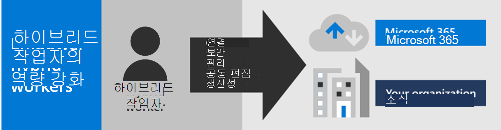
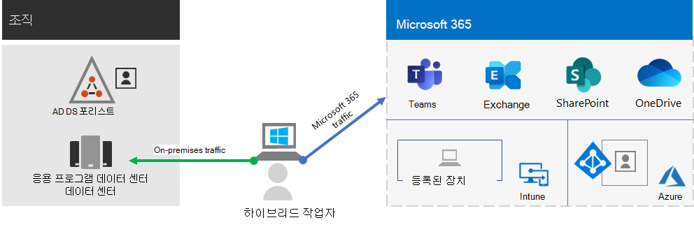
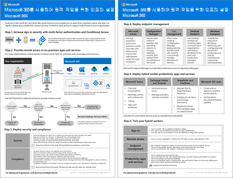

# Microsoft 365를 사용하여 하이브리드 작업을 위한 인프라 설정

직원의 생산성과 공동 작업을 보호하고 최적화하려면 현장 및 원격 직원이 조직의 온-프레미스 및 클라우드 기반 정보, 도구 및 리소스에 쉽고 안전하게 액세스할 수 있도록 해야 합니다. 이 솔루션에서는 작업자가 어디에 있든 최고의 업무를 할 수 있도록 하는 인프라의 주요 계층을 배포하는 단계를 수행합니다.

하이브리드 작업자는 현장 또는 여러 위치에서 원격으로 작업할 수 있습니다. 많은 조직에서 직원들이 기존 사무실에서 근무할 수 있도록 하는 것은 다음과 같은 작업을 수행하는 데 중요합니다.

- 이전을 원하지 않거나 유연한 작업 환경이 필요한 직원을 채용하고 유지하세요.
- 직원의 출퇴근를 줄여 업무 이외에 생산성을 높이고 스트레스 해소 활동을 위한 시간을 늘릴 수 있습니다.
- 사무실 공간을 절약할 수 있습니다.

Microsoft 365에는 하이브리드 직원이 현장이나 원격으로 작업할 수 있도록 도와주는 기능이 있습니다.

> [!NOTE]
> Microsoft 365를 처음 사용하는 경우, [다음 리소스](https://www.microsoft.com/microsoft-365)를 참조하세요.

이 비디오를 시청하고 배포 프로세스에 대한 개요를 확인하세요.
 
 
> [!VIDEO https://www.microsoft.com/videoplayer/embed/RE4F1af]

하이브리드 직원 생산성을 높이기 위해 인트라 사이트 및 클라우드 기반 인프라를 관리하는 IT 전문가를 위해 이 솔루션은 다음과 같은 주요 기능을 제공합니다.

- 연결

  작업자는 전 세계 어디서나 언제든지 다음 항목에 액세스할 수 있습니다.

  - Microsoft 365 구독의 클라우드 기반 서비스 및 데이터

  - 온-프레미스 응용 프로그램 데이터 센터에서 제공하는 그러한 조직 리소스

- 보안

  로그인이 다단계 인증(MFA)으로 보안되며 Microsoft 365 및 Windows 10의 기본 제공 보안 기능은 맬웨어, 악의적인 공격 및 데이터 손실로부터 보호할 수 있습니다.

- 관리

  보안 설정, 허용 앱을 사용해 하이브리드 작업자의 장치를 클라우드에서 관리하고 시스템 상태 규정을 준수할 수 있습니다.

- 공동 작업 및 생산성

  하이브리드 작업자는 다음과 같이 매우 협력적인 방식으로 온-프레미스 환경에서처럼 생산적으로 작업할 수 있습니다.

  - Teams를 통한 온라인 팀 회의 및 채팅

  - SharePoint 및 OneDrive를 통한 전역 접근성과 실시간 공동 작업이 가능한 클라우드 기반 파일 저장소를 위한 공유 작업 영역

  - 작업을 분할하고 완료하기 위한 공유 작업 및 워크플로

원활하게 로그인하려면 온-프레미스 Active Directory 도메인 서비스(AD DS) 사용자 계정을 Azure Active Directory(Azure AD)와 동기화해야 합니다. Windows 10 장치를 보호하려면 Intune에서 장치를 등록해야 합니다. 다음은 인프라의 개괄적인 보기입니다.

하이브리드 작업자를 위한 Microsoft 365의 기능을 사용하려면 다음 Microsoft 365 기능을 사용하세요.

|기능 또는 특징|설명|라이선싱|
|---|---|---|
|보안 기본값을 사용하여 MFA 실행|로그인에 대한 보조 인증을 요구함으로써 손상된 ID와 장치로부터 보호합니다. 보안 기본값은 모든 사용자 계정에 대해 MFA를 요구합니다.|Microsoft 365 E3 혹은 E5|
|조건부 액세스로 MFA 실행|조건부 액세스 정책을 포함한 로그인 속성을 기반으로 하는 MFA가 필요합니다.|Microsoft 365 E3 혹은 E5|
|위험 기반 조건부 액세스로 MFA 실행|Azure AD ID 보호를 포함한 사용자 로그인에 대한 위험을 기반으로 하는 MFA가 필요합니다.|Azure AD Premium P2 라이선스를 포함한 Microsoft 365 E5 또는 E3|
|셀프 서비스 암호 재설정(SSPR)|사용자가 암호 또는 계정을 다시 설정하거나 잠금 해제할 수 있습니다.|Microsoft 365 E3 혹은 E5|
|Azure AD 응용 프로그램 프록시|인트라넷 서버에서 호스트되는 웹 기반 응용 프로그램에 대한 보안 원격 액세스를 제공합니다.|별도의 유료 Azure 구독 필요|
|Azure 지점 및 사이트 간 VPN|Azure 가상 네트워크를 통해 원격 작업자의 장치에서 인트라넷으로의 연결을 안전하게 만듭니다.|별도의 유료 Azure 구독 필요|
|Windows Virtual Desktop|가상 데스크톱이 Azure에서 실행되는 관리되지 않는 개인 장치만 사용할 수 있는 원격 작업자를 지원합니다.|별도의 유료 Azure 구독 필요|
|원격 데스크톱 서비스(RDS)|직원이 인트라넷의 Windows 기반 컴퓨터에 연결하도록 허용합니다.|Microsoft 365 E3 혹은 E5|
|원격 데스크톱 서비스 게이트웨이|통신을 암호화하고 RDS 호스트가 인터넷에 직접 노출되지 않도록 합니다.|별도의 Windows Server 라이선스 필요|
|Microsoft Intune|장치 및 응용 프로그램을 관리합니다.|Microsoft 365 E3 혹은 E5|
|기능이며|장치의 소프트웨어 설치, 업데이트 및 설정 관리|별도의 Configuration Manager 라이선스 필요|
|Desktop Analytics|Windows 클라이언트의 업데이트 준비 상태를 확인합니다.|별도의 Configuration Manager 라이선스 필요|
|Windows Autopilot|새 Windows 10 장치를 업무용으로 사용하도록 설정하고 사전 구성합니다.|Microsoft 365 E3 혹은 E5|
|Microsoft Teams, Exchange Online, SharePoint Online 및 OneDrive, Microsoft 365 앱, Microsoft Power Platform 및 Yammer|만들고, 소통하며, 공동 작업합니다.|Microsoft 365 E3 혹은 E5|
||||

보안 및 규정 준수 기준에 대한 내용은 [원격 작업자에 대한 보안 및 규정 준수 배포](empower-people-to-work-remotely-security-compliance.md)를 참조하세요.

 이 솔루션의 2페이지 요약은 [하이브리드 작업자 지원 포스터](https://download.microsoft.com/download/9/b/b/9bb5fa79-74e9-497b-87c5-4021e53d9fc2/hybrid-worker-infrastructure.pdf)를 참조하세요.

이 포스터를 [PowerPoint](https://download.microsoft.com/download/9/b/b/9bb5fa79-74e9-497b-87c5-4021e53d9fc2/hybrid-worker-infrastructure.pptx) 형식으로 다운로드 할 수 있고 편지형, 법률형, 타블로이드(11 x 17) 크기 용지에 인쇄할 수 있습니다.

## 모든 직원에게 하이브리드 작업 제공

모든 직원이 다음 장치를 사용하여 어디서나 생산성을 유지할 수 있도록 할 수 있습니다.

- 웹을 통해 직접 Microsoft 365 클라우드 앱 및 서비스에 액세스할 수 있는 기능, 보안 및 성능을 갖춘 Surface 노트북 및 Windows 10과 같은 최신 장치

- 빠르게 배포된 [Windows 10 기반 가상 데스크톱](empower-people-to-work-remotely-remote-access.md#deploy-windows-virtual-desktop-to-provide-remote-access-for-remote-workers-using-personal-devices)을 통해 간접적으로 Microsoft 365 클라우드 앱 및 서비스에 액세스할 수 있는 가정에서 사용되는 구형 노트북 또는 데스크톱을 포함한 모든 장치 이 옵션은 고성능, 강력한 보안 및 단순화된 IT 관리를 제공합니다.

## 다음 단계

다음 단계를 사용하여 조직의 서버 및 클라우드 서비스에 대한 액세스를 보호하고 최적화하며 하이브리드 작업자의 생산성을 극대화합니다.

1. [MFA로 로그인 보안 강화](empower-people-to-work-remotely-secure-sign-in.md)
2. [온-프레미스 앱 및 서비스로의 원격 액세스 제공](empower-people-to-work-remotely-remote-access.md)
3. [보안 및 규정 준수 서비스 배포](empower-people-to-work-remotely-security-compliance.md)
4. [장치, PC 및 기타 끝점에 대한 끝점 관리 기능 배포](empower-people-to-work-remotely-manage-endpoints.md)
5. [하이브리드 작업자 생산성 앱 및 서비스 배포](empower-people-to-work-remotely-teams-productivity-apps.md)
6. [작업자 교육 및 사용 피드백 처리](empower-people-to-work-remotely-train-monitor-usage.md)

가상이지만 대표적인 다국적 조직이 하이브리드 작업을 위해 인프라를 구축하는 방법을 보려면 [Contoso의 COVID-19 대응 및 하이브리드 작업을 위한 인프라](contoso-remote-onsite-work.md)를 참조하세요.
