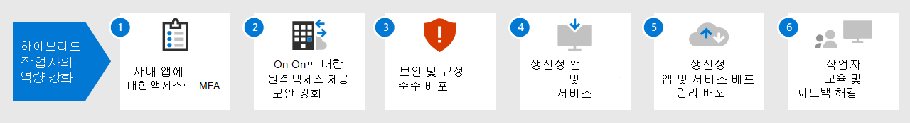

# Microsoft 365를 사용하여 원격 작업자의 역량 강화하기

직원들이 회사의 사내 구축 환경 및 클라우드 기반 정보, 도구 및 리소스에 안전하게 액세스할 수 있도록 해야 합니다. 많은 조직에서 Office를 원활하고 안전하게 사용할 수 있도록 하는 것이 중요합니다.

- 사무실 공간에 저장
- 이동할 의사가 없는 직원을 고용하고 유지할 수 있습니다.
- 직원의 출퇴근를 줄여 업무 이외에 생산성을 높이고 스트레스 해소 활동을 위한 시간을 늘릴 수 있습니다.

원격 작업(teleworking이라고도 함)은 다음과 같은 항목을 포함하는 스펙트럼에 걸쳐 있을 수 있습니다.

- 회의나 클라이언트 회의를 위해 가끔 사무실을 떠나는 직원
- 풀타임 원격으로 작업을 하는 몇몇 직원
- 사무실이 없고 모든 직원이 원격으로 일하는 완전한 원격 조직

원격 작업자는 전 세계 어디서나 언제든지 다음 항목에 액세스할 수 있어야 합니다.

- 온-프레미스 응용 프로그램 데이터 센터에서 제공하는 그러한 조직 리소스
- Teams, Exchange Online, SharePoint 및 OneDrive와 같은 Microsoft 365 구독의 클라우드 기반 서비스 및 데이터

원활하게 로그인하려면 Active Directory 도메인 서비스(AD DS) 사용자 계정을 Azure Active Directory(Azure AD)와 동기화해야 합니다. Windows 10 장치를 보호하려면 Intune에서 장치를 등록해야 합니다. 다음은 인프라의 개괄적인 보기입니다.

COVID-19 위기에 대응하는 등 원격 작업자를 지원하기 위해 Microsoft 365의 기능을 조합하여 원격 작업자는 다음과 같은 매우 협력적인 방식으로 업무를 수행할 수 있습니다.

- 온라인 회의 및 채팅 세션
- 전역 접근성과 실시간 공동 작업을 통해 클라우드 기반 파일 저장소를 위한 공유 작업 영역
- 작업을 분할하고 작업을 완료하기 위한 공유 작업 및 워크플로

강력한 보안을 위해 Microsoft 365에는 다음이 포함됩니다.

- 인증 요구 사항을 적용하고, 고위험 로그인을 감지하여 대응하고, 선택한 앱과 비규격 장치를 차단합니다.
- 클라우드에서 암호화된 연결 및 디지털 자산
- 파일에 대한 작업을 수행할 수 있는 사용자를 정의하는 권한
- Windows 10 장치를 보호하는 포괄적인 보안 기능

원격 작업자에 대한 이러한 조건을 충족하기 위해 다음과 같은 Microsoft 365 기능 및 특징을 사용합니다.

| 기능 또는 특징 | 설명 | 라이선싱 |
|:-------|:-----|:-------|
| 보안 기본값을 사용하여 MFA 실행   | 로그인에 대한 보조 인증을 요구함으로써 손상된 ID와 장치로부터 보호합니다. 보안 기본값은 모든 사용자 계정에 대해 MFA를 요구합니다.   | Microsoft 365 E3 및 E5 |
| 조건부 액세스로 MFA 실행| 조건부 액세스 정책을 포함한 로그인 속성을 기반으로 하는 MFA가 필요합니다.    | Microsoft 365 E3 및 E5 | 
| 위험 기반 조건부 액세스로 MFA 실행   | Azure Advanced Threat Protection을 포함한 사용자 로그인에 대한 위험을 기반으로 하는 MFA가 필요합니다. | Azure AD Premium P2 라이선스를 포함한 Microsoft 365 E5 또는 E3 | 
| 셀프 서비스 암호 재설정(SSPR)    | 사용자가 암호 또는 계정을 다시 설정하거나 잠금 해제할 수 있습니다.  | Microsoft 365 E3 및 E5 |
| Azure AD 응용 프로그램 프록시    | 인트라넷 서버에서 호스트되는 웹 기반 응용 프로그램에 대한 보안 원격 액세스를 제공합니다.   | 별도의 유료 Azure 구독 필요 |
| Azure 지점 및 사이트 간 VPN   | Azure 가상 네트워크를 통해 원격 작업자의 장치에서 인트라넷으로의 연결을 안전하게 만듭니다.   | 별도의 유료 Azure 구독 필요 |
| Windows Virtual Desktop   | 가상 데스크톱이 Azure에서 실행되는 관리되지 않는 개인 장치만 사용할 수 있는 원격 작업자를 지원합니다. | 별도의 유료 Azure 구독 필요 |
| 원격 데스크톱 서비스(RDS) | 직원이 인트라넷의 Windows 기반 컴퓨터에 연결하도록 허용합니다. | Microsoft 365 E3 및 E5 | 
| 원격 데스크톱 서비스 게이트웨이   | 통신을 암호화하고 RDS 호스트가 인터넷에 직접 노출되지 않도록 합니다. | 별도의 Windows Server 라이선스 필요 |
| Microsoft Intune | 장치 및 응용 프로그램을 관리합니다.   | Microsoft 365 E3 및 E5 | 
| Configuration Manager | 장치의 소프트웨어 설치, 업데이트 및 설정 관리 | 별도의 Configuration Manager 라이선스 필요 |
| Desktop Analytics | Windows 클라이언트의 업데이트 준비 상태를 확인합니다.   | 별도의 Configuration Manager 라이선스 필요 |
| Windows Autopilot | 새 Windows 10 장치를 업무용으로 사용하도록 설정하고 사전 구성합니다.   | Microsoft 365 E3 및 E5 |
| Microsoft Teams, Exchange Online, SharePoint Online 및 OneDrive, Microsoft 365 Apps, Microsoft Power Platform, Yammer, Power Apps | 만들고, 소통하며, 공동 작업합니다. | Microsoft 365 E3 및 E5 |
||||

다음 단계를 사용하여 조직의 서버, 데이터 및 클라우드 서비스에 대한 액세스를 보호하고 최적화하며 최대 작업자 생산성을 설정합니다.

1. [MFA로 로그인 보안 강화](empower-people-to-work-remotely-secure-sign-in.md)
2. [온-프레미스 앱 및 서비스로의 원격 액세스 제공](empower-people-to-work-remotely-remote-access.md)
3. [장치, PC 및 기타 끝점에 대한 끝점 관리 기능 배포](empower-people-to-work-remotely-manage-endpoints.md)
4. [원격 작업자 생산성 앱 및 서비스 배포](empower-people-to-work-remotely-teams-productivity-apps.md)
5. [커뮤니케이션 장소 만들기](empower-people-to-work-remotely-communication-venues.md)
6. [원격 작업자 교육 및 사용 피드백 처리](empower-people-to-work-remotely-train-monitor-usage.md)

원격 작업자 지원에 대한 Microsoft의 최신 정보는 [원격 작업 기술 커뮤니티 사이트](https://resources.techcommunity.microsoft.com/enabling-remote-work/)을 참조하세요.
