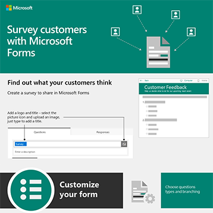

# 사용자를 위한 Microsoft 365 인포그래픽

이러한 정보 그래픽은 Microsoft 365에서 작업 및 공동 작업을 위한 모범 사례를 나타내고 있습니다. 사용자와 공유하여 사용자가 파일에 대한 보안 저장 및 공유를 활용하고 공동 작업 모임을 진행하는 등 다양한 작업을 할 수 있도록 합니다.

[Microsoft 365](https://support.microsoft.com/training) 교육 사이트에서 다운로드 가능한 [Office](https://support.microsoft.com/office/great-ways-to-work-with-office-6fe70269-b9a4-4ef0-a96e-7a5858b3bd5a) 인포그래픽을 더 찾아보실 수 있습니다.

## 보안 팁

팀이 정치적 캠페인과 같은 비즈니스 조직이든 비영리 조직이든 팀 구성원을 위한 보안 팁으로 이 정보 그래픽을 다운로드하세요.

| 항목 | 설명 |
|:-----|:-----|
|   [PDF로 다운로드](../campaigns/downloads/M365CampaignsWhatCanUsersDoToSecure.pdf)  \  [PowerPoint로 다운로드](../campaigns/downloads/M365CampaignsWhatCanUsersDoToSecure.pptx)| 조직의 정보를 안전하게 유지하기 위한 모범 사례를 공유합니다. 이 정보 그래픽은 정교한 해커를 대상으로 하여 정치적 캠페인의 직원을 지원하기 위해 만들어졌습니다. PowerPoint를 사용하여 조직에 맞게 이 인포그래픽을 사용자 지정할 수 있습니다. 관련 문서: [Microsoft 365에 대한](../campaigns/m365-campaigns-users.md) 보안 권장 사항이 사용자에게 미치는 영향|

## 비즈니스 파일 공유

인포그래픽을 다운로드하여 비즈니스 파일을 공유하는 방법에 대한 간략한 개요를 확인할 수 있습니다.
  
| 항목 | 설명 |
|:-----|:-----|
|   [PDF로 다운로드](https://go.microsoft.com/fwlink/?linkid=2079435)  \  [PowerPoint로 다운로드](https://go.microsoft.com/fwlink/?linkid=2079438) | 비즈니스 파일을 공유하고 공동 작업할 때 이러한 모범 사례를 사용하여 정보를 안전하게 보호할 수 있습니다. 관련 문서: [비즈니스 파일 공유 개요](../business-video/overview-file-sharing.md)|

## 온라인 모임 호스트

Microsoft Teams를 통해 온라인 모임에 참가하거나 호스팅하는 방법에 대한 간략한 개요를 확인하려면 인포그래픽을 다운로드하세요.

| 항목 | 설명 |
|:-----|:-----|
|   [PDF로 다운로드](https://go.microsoft.com/fwlink/?linkid=2078712)  \  [PowerPoint로 다운로드](https://go.microsoft.com/fwlink/?linkid=2079515) | Microsoft Teams를 통해 온라인 모임을 호스팅하거나 참가하는 방법을 빠르게 소개합니다. 관련 문서: [비즈니스를 위한 온라인 모임 호스트](../business-video/overview-online-meetings.md)|

## 어디서나 작업

인포그래픽을 다운로드하여 어디에서나 작업하기 위한 팁을 얻습니다.

| 항목 | 설명 |
|:-----|:-----|
|   [PDF로 다운로드](https://go.microsoft.com/fwlink/?linkid=2079451)  \  [PowerPoint로 다운로드](https://go.microsoft.com/fwlink/?linkid=2079455) | 어디에서나 작업할 수 있도록 모바일 장치를 설정하는 방법에 대한 팁을 참조하세요. 관련 문서: [어디에서나 작업](../business-video/work-from-anywhere.md)|

## Forms를 통해 고객 설문 조사

Microsoft Forms를 통해 고객(내부 또는 외부)을 설문 조사하는 방법을 찾아보는 정보 그래픽을 다운로드합니다.

| 항목 | 설명 |
|:-----|:-----|
|   [PDF로 다운로드](https://go.microsoft.com/fwlink/?linkid=2079526)  \  [PowerPoint로 다운로드](https://go.microsoft.com/fwlink/?linkid=2079446) | Microsoft Forms를 사용하여 고객의 생각을 찾을 수 있습니다. 관련 문서: [Microsoft Forms를 통해 정보 수집](https://support.microsoft.com/topic/collect-information-with-microsoft-forms-a55d6e0d-04f6-45b8-b05f-b141b8ecb4d5)|
