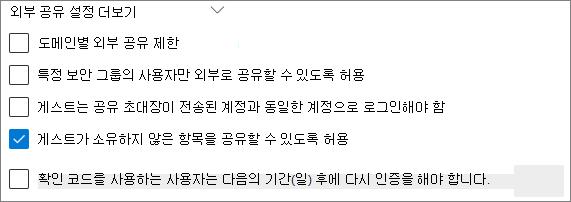

# Microsoft 365 게스트 공유 설정 참조Microsoft 365 guest sharing settings reference

이 문서에서는 Teams, Microsoft 365 그룹, SharePoint 및 OneDrive와 같이 Microsoft 365 작업에서 조직 외부 사용자와 공유하는 데 영향을 줄 수 있는 다양한 설정에 대한 참조를 제공합니다.This article provides a reference for the various settings that can affect sharing with people outside your organization for the Microsoft 365 workloads: Teams, Microsoft 365 Groups, SharePoint, and OneDrive. 이러한 설정은 Azure Active Directory, Microsoft 365, Teams 및 SharePoint 관리 센터에 있습니다.These settings are located in the Azure Active Directory, Microsoft 365, Teams, and SharePoint admin centers.

## Azure Active DirectoryAzure Active Directory

**관리자 역할:** 전역 관리자 **Admin role:** Global administrator

Azure Active Directory는 Microsoft 365에서 사용하는 디렉터리 서비스입니다.Azure Active Directory is the directory service used by Microsoft 365. Azure Active Directory 조직 관계 설정은 Teams, Microsoft 365 그룹, SharePoint 및 OneDrive의 공유에 직접적인 영향을 미칩니다.The Azure Active Directory Organizational relationships settings directly affect sharing in Teams, Microsoft 365 Groups, SharePoint, and OneDrive.

> [!NOTE]
> 이 설정은 [Azure Active Directory B2B와 Sharepoint 및 OneDrive 통합(미리 보기)](/sharepoint/sharepoint-azureb2b-integration-preview)이 구성된 경우에만 Sharepoint에 영향을 줍니다.These settings only affect SharePoint when [SharePoint and OneDrive integration with Azure AD B2B](/sharepoint/sharepoint-azureb2b-integration-preview) has been configured. 아래 표는 이 구성을 가정합니다.The table below assumes that this has been configured.

### 외부 공동 작업 설정External collaboration settings

**탐색:** [Azure Active Directory 관리 센터](https://aad.portal.azure.com) > Azure Active Directory > 외부 ID > 외부 공동 작업 설정**Navigation:** [Azure Active Directory admin center](https://aad.portal.azure.com) > Azure Active Directory > External Identities > External collaboration settings

| 설정Setting | 기본값Default | 설명Description |
|:-----|:-----|:-----|
|게스트 사용자 액세스Guest user access|게스트 사용자는 디렉터리 개체의 속성 및 구성원 자격에 대해 제한된 액세스 권한을 가집니다Guest users have limited access to properties and memberships of directory objects|[Azure Active Directory에서 게스트가 갖는 사용 권한을](/azure/active-directory/fundamentals/users-default-permissions) 결정합니다.Determines the [permissions that guests have in Azure Active Directory](/azure/active-directory/fundamentals/users-default-permissions).|
|게스트 초대 설정Guest invite settings|조직의 모든 사용자가 게스트 및 비관리자를 포함한 게스트 사용자를 초대할 수 있습니다Anyone in the organization can invite guest users including guests and non-admins|게스트, 구성원 및 관리자가 게스트를 조직에 초대할 수 있는지 여부를 결정합니다.Determines whether guests, members, and admins can invite guests to the organization.   이 설정은 Teams 및 SharePoint와 같은 Microsoft 365 공유 환경에 영향을 줍니다.This setting affects  Microsoft 365 sharing experiences such as Teams and SharePoint.|
|사용자 흐름을 통해 게스트 셀프 서비스 가입 사용Enable guest self-service sign up via user flows|아니요No|사용자가 만든 앱에 다른 사람이 가입하고 새 게스트 계정을 만들 수 있는 사용자 흐름을 만들 수 있는지 여부를 결정합니다.Determines if you can create user flows that allow someone to sign up for an app that you created and create a new guest account.|
|공동 작업 제한 사항Collaboration restrictions|모든 도메인에 초대를 보낼 수 있도록 허용Allow invitations to be sent to any domain|이 설정을 사용하면 공유에 허용되거나 차단된 도메인 목록을 지정할 수 있습니다.This setting allows you to specify a list of allowed or blocked domains for sharing. 허용 도메인이 지정되면 해당 도메인에만 공유 초대를 보낼 수 있습니다.When allowed domains are specified, then sharing invitations can only be sent to those domains. 거부된 도메인을 지정하면 공유 초대장을 해당 도메인으로 보낼 수 없습니다.When denied domains are specified, then sharing invitations cannot be sent to those domains.   이 설정은 Teamsdhk SharePoint와 같은 Microsoft 365 공유 환경에 영향을 줍니다.This setting affects  Microsoft 365 sharing experiences such as Teams and SharePoint. SharePoint 또는 Teams의 도메인 필터링을 사용하여 더 세분화된 수준으로 도메인을 허용하거나 차단할 수 있습니다.You can allow or block domains at a more granular level by using domain filtering in SharePoint or Teams.|

이러한 설정은 사용자가 디렉터리에 초대되는 방식에 영향을 줍니다.These settings affect how users are invited to the directory. 이미 디렉토리에 있는 게스트와의 공유에는 영향을 주지 않습니다.They do not affect sharing with guests who are already in the directory.

## Microsoft 365Microsoft 365

**관리자 역할:** 전역 관리자 **Admin role:** Global administrator

Microsoft 365 관리 센터에는 공유 및 Microsoft 365 그룹에 대한 조직 수준 설정이 있습니다.The Microsoft 365 admin center has organization-level settings for sharing and for Microsoft 365 Groups.

### 공유Sharing

**탐색:** [Microsoft 365 관리 센터](https://admin.microsoft.com) > 설정 > 조직 설정 > 보안 및 개인 정보 보호 탭 > 공유**Navigation:** [Microsoft 365 admin center](https://admin.microsoft.com) > Settings > Org Settings > Security & privacy tab > Sharing

| 설정Setting | 기본값Default | 설명Description |
|:-----|:-----|:-----|
|사용자가 조직에 새 게스트를 추가하도록 허용Let users add new guests to the organization|켜짐On|**예** 로 설정된 경우 Azure AD 구성원이 Azure AD를 통해 게스트를 초대할 수 있습니다. **아니요** 로 설정된 경우 할 수 없습니다.When set to **Yes**, Azure AD members can invite guests via Azure AD; when set to **No**, they cannot. **예** 로 설정된 경우 Microsoft 365 그룹 구성원이 게스트를 소유자 승인으로 초대할 수 있습니다. **아니요** 로 설정된 경우 Microsoft 365 그룹 구성원은 소유자 승인으로 게스트를 초대할 수 있지만, 소유자는 승인하기 위해 전역 관리자여야 합니다.When set to **Yes**, Microsoft 365 Group members can invite guests with owner approval; when set to **No**, Microsoft 365 Group members can invite guests with owner approval but owners must be global administrators to approve.   **구성원이 게스트를 초대할 수 있음** 은 Microsoft 365에서 사이트 또는 그룹 구성원이 아니라 Azure AD의 구성원(게스트와 반대되는)을 언급함을 유의합니다.Note that **Members can invite** refers to members in Azure AD (as opposed to guests) and not to site or group members in  Microsoft 365.   Azure Active Directory 조직 관계 설정에서 **구성원이 게스트를 초대할 수 있음** 설정과 동일합니다.This is identical to the **Members can invite** setting in Azure Active Directory Organizational relationships settings.|

### Microsoft 365 그룹Microsoft 365 Groups

**탐색:** [Microsoft 365 관리 센터](https://admin.microsoft.com) > 설정 > 설정 > Microsoft 365 그룹**Navigation:** [Microsoft 365 admin center](https://admin.microsoft.com) > Settings > Settings > Microsoft 365 Groups

| 설정Setting | 기본값Default | 설명Description |
|:-----|:-----|:-----|
|조직 외부의 그룹 구성원이 그룹 콘텐츠에 액세스하도록 허용Let group members outside your organization access group content|켜짐On|**켜짐** 으로 설정되면 게스트가 그룹 콘텐츠에 액세스할 수 있습니다. **해제** 로 설정하면 할 수 없습니다.When set to **On**, guests can access groups content; when set to **Off**, they can't. 게스트가 Microsoft 365 그룹 또는 Teams와 상호 작용하는 모든 시나리오의 경우 이 설정을 **켜짐** 으로 지정해야 합니다.This setting should be **On** for any scenario where guests are interacting with Microsoft 365 Groups or Teams.|
|그룹 소유자가 조직 외부의 사람을 그룹에 추가하도록 허용Let group owners add people outside your organization to groups|켜짐On|**켜짐** 으로 설정되면 Microsoft 365 그룹 또는 Teams 소유자는 새 게스트를 그룹에 초대할 수 있습니다.When **On**, Owners of Microsoft 365 Groups or Teams can invite new guests to the group. 이 기능을 **해제** 하면 소유자는 이미 디렉토리에 있는 게스트만 초대할 수 있습니다.When **Off**, owners can only invite guests who are already in the directory.|

이러한 설정은 조직 수준에 있습니다.These settings are at the organization level. PowerShell을 사용하여 그룹 수준에서 이러한 설정을 변경하는 방법에 대한 자세한 내용은 [특정 그룹에 대한 설정 만들기](/azure/active-directory/users-groups-roles/groups-settings-cmdlets#create-settings-for-a-specific-group)를 참조하세요.See [Create settings for a specific group](/azure/active-directory/users-groups-roles/groups-settings-cmdlets#create-settings-for-a-specific-group) for information about how to change these settings at the group level by using PowerShell.

## TeamsTeams

다른 게스트 설정을 사용하려면 Teams 마스터 게스트 액세스 스위치, **Teams에서 게스트 액세스 허용** 이 **켜짐** 상태에 있어야 합니다.The Teams master guest access switch, **Allow guest access in Teams**, must be **On** for the other guest settings to be available.

**관리자 역할:** Teams 서비스 관리자**Admin role:** Teams service administrator

### 게스트 액세스Guest access

**탐색:** [Teams 관리 센터](https://admin.teams.microsoft.com) > 조직 전체 설정 > 게스트 액세스**Navigation:** [Teams admin center](https://admin.teams.microsoft.com) > Org-wide settings > Guest access

| 설정Setting | 기본값Default | 설명Description |
|:-----|:-----|:-----|
|Teams에서 게스트 액세스 허용Allow guest access in Teams|해제Off|Teams 전체에 대한 게스트 액세스를 설정하거나 해제합니다.Turns guest access on or off for Teams overall. 이 설정을 변경하는 데 24시간이 걸릴 수 있습니다.This setting can take 24 hours to take effect once changed.|

### 게스트 통화Guest calling

**탐색:** [Teams 관리 센터](https://admin.teams.microsoft.com) > 조직 전체 설정 > 게스트 액세스**Navigation:** [Teams admin center](https://admin.teams.microsoft.com) > Org-wide settings > Guest access

| 설정Setting | 기본값Default | 설명Description |
|:-----|:-----|:-----|
|개인 전화 걸기Make private calls|켜짐On|**켜짐** 으로 설정하면 게스트가 Teams에서 피어 투 피어 통화를 할 수 있습니다. **해제** 되어 있을 때는 할 수 없습니다.When **On**, guests can make peer-to-peer calls in Teams; when **Off**, they can't.|

### 게스트 모임Guest meeting

**탐색:** [Teams 관리 센터](https://admin.teams.microsoft.com) > 조직 전체 설정 > 게스트 액세스**Navigation:** [Teams admin center](https://admin.teams.microsoft.com) > Org-wide settings > Guest access

| 설정Setting | 기본값Default | 설명Description |
|:-----|:-----|:-----|
|IP 비디오 허용Allow IP video|켜짐On|**켜짐** 으로 설정하면 게스트는 통화 및 회의에서 비디오를 사용할 수 있습니다. **해제** 되어 있을 때는 할 수 없습니다.When **On**, guests can use video in their calls and meetings; when **Off**, they can't.|
|화면 공유 모드Screen sharing mode|전체 화면Entire screen|**사용 안 함** 으로 설정되면 게스트는 Teams에서 화면을 공유할 수 없습니다.When **Disabled**, guests can't share their screens in Teams. **단일 응용 프로그램** 으로 설정되면 게스트는 화면에서 하나의 응용 프로그램만 공유할 수 있습니다.When set to **Single application**, guests can only share a single application on their screen. **전체 화면** 으로 설정되면 게스트가 프로그램 또는 전체 화면을 공유하도록 선택할 수 있습니다.When set to **Entire screen**, guests can choose to share an application or their entire screen.|
|모임 시작 허용Allow Meet Now|켜짐On|**켜짐** 으로 설정하면 게스트는 Teams에서 모임 시작 기능을 사용할 수 있습니다. **해제** 되어 있을 때는 할 수 없습니다.When **On**, guests can use the Meet Now feature in Teams; when **Off**, they can't.|

### 게스트 메시징Guest messaging

**탐색:** [Teams 관리 센터](https://admin.teams.microsoft.com) > 조직 전체 설정 > 게스트 액세스**Navigation:** [Teams admin center](https://admin.teams.microsoft.com) > Org-wide settings > Guest access

| 설정Setting | 기본값Default | 설명Description |
|:-----|:-----|:-----|
|보낸 메시지 편집Edit sent messages|켜짐On|**켜짐** 으로 설정되면 게스트는 이전에 보낸 메시지를 편집할 수 있습니다. **해제** 되어 있을 때는 할 수 없습니다.When **On**, guests can edit messages they previously sent; when **Off**, they can't.|
|보낸 메시지 삭제Delete sent messages|켜짐On|**켜짐** 으로 설정되면 게스트는 이전에 보낸 메시지를 삭제할 수 있습니다. **해제** 되어 있을 때는 할 수 없습니다.When **On**, guests can delete messages they previously sent; when **Off**, they can't.|
|채팅Chat|켜짐On|**켜짐** 으로 설정하면 게스트는 Teams에서 채팅을 사용할 수 있습니다. **해제** 되어 있을 때는 할 수 없습니다.When **On**, guests can use chat in Teams; when **Off**, they can't.|
|대화에서 Giphy 사용Use Giphys in conversations|켜짐On|**켜짐** 으로 설정하면 게스트가 Giphys를 대화에서 사용할 수 있습니다. **해제** 되어 있을 때는 할 수 없습니다.When **On**, guests can use Giphys in conversations; when **Off**, they can't.|
|Giphy 콘텐츠 등급Giphy content rating|보통Moderate|**모든 콘텐츠를 허용** 하도록 설정하면 게스트는 콘텐츠 등급과 상관없이 모든 Giphy를 채팅에 삽입할 수 있습니다.When set to **Allow all content**, guests will can insert all Giphys in chats, regardless of the content rating. **보통** 으로 설정하면 게스트는 채팅에 Giphy를 삽입할 수 있지만 성인용 콘텐츠는 보통으로 제한됩니다.When set to **Moderate** guests can insert Giphys in chats, but will be moderately restricted from adult content. **엄격** 으로 설정하면 게스트는 채팅에 Giphy를 삽입할 수 있지만 성인용 콘텐츠 삽입이 제한됩니다.When set to **Strict** guests can insert Giphys in chats, but will be restricted from inserting adult content.|
|대화에서 Memes 사용Use Memes in conversations|켜짐On|**켜짐** 으로 설정하면 게스트는 memes를 대화에서 사용할 수 있습니다. **해제** 되어 있을 때는 사용할 수 없습니다.When **On**, guests can use memes in conversations; when **Off**, they can't.|
|대화에 사용자 스티커User stickers in conversations|켜짐On|**켜짐** 으로 설정하면 게스트는 스티커를 대화에서 사용할 수 있습니다. **해제** 되어 있을 때는 사용할 수 없습니다.When **On**, guests can use stickers in conversations; when **Off**, they can't.|
|몰입형 리더가 메시지를 볼 수 있도록 허용Allow immersive reader for viewing messages|켜짐On|**켜짐** 으로 설정하면 게스트는 몰입형 리더에서 메시지를 볼 수 있습니다. **해제** 되어 있을 때는 사용할 수 없습니다.When **On**, guests can view messages in Immersive Reader; when **Off**, they can't.|

## SharePoint 및 OneDrive(조직 수준)SharePoint and OneDrive (organization-level)

**관리자 역할:** SharePoint 관리자**Admin role:** SharePoint administrator

이러한 설정은 조직의 모든 사이트에 영향을 줍니다.These settings affect all of the sites in the organization. Microsoft 365 그룹 또는 Teams에 직접 영향을 주지는 않지만, 사용자 환경 문제를 피하기 위해 Microsoft 365 그룹 및 Teams의 설정을 사용하여 이 설정을 조정하는 것이 좋습니다.They do not affect Microsoft 365 Groups or Teams directly, however we recommend that you align these settings with the settings for Microsoft 365 Groups and Teams to avoid user experience issues. (예를 들어 게스트 공유는 Teams에서 허용되지만 SharePoint에서는 허용되지 않는 경우 Teams 파일이 SharePoint에 저장되므로 Teams의 게스트는 파일 탭에 액세스할 수 없습니다.)(For example, if guest sharing is allowed in Teams but not SharePoint, then guests in Teams will not have access to the Files tab because Teams files are stored in SharePoint.)

### SharePoint 및 OneDrive에서 공유 설정SharePoint and OneDrive sharing settings

OneDrive는 SharePoint 내의 사이트 계층 구조이므로 조직 수준 공유 설정은 다른 SharePoint 사이트와 마찬가지로 OneDrive에 직접 영향을 줍니다.Because OneDrive is a hierarchy of sites within SharePoint, the organization-level sharing settings directly affect OneDrive just as they do other SharePoint sites.

**탐색:** SharePoint 관리 센터 > 공유**Navigation:** SharePoint admin center > Sharing

| 설정Setting | 기본값Default | 설명Description |
|:-----|:-----|:-----|
|SharePointSharePoint|누구나Anyone|SharePoint 사이트에 허용되는 최대 허용 공유 권한을 지정합니다.Specifies the most permissive sharing permissions allowed for SharePoint sites.|
|OneDriveOneDrive|누구나Anyone|OneDrive 사이트에 허용되는 최대 허용 공유 권한을 지정합니다.Specifies the most permissive sharing permissions allowed for OneDrive sites. 이 설정은 SharePoint 설정보다 더 허용되지 않습니다.This setting cannot be more permissive than the SharePoint setting.|

### SharePoint 및 OneDrive에서 고급 공유 설정SharePoint and OneDrive advanced sharing settings

**탐색:** SharePoint 관리 센터 > 공유**Navigation:** SharePoint admin center > Sharing

| 설정Setting | 기본값Default | 설명Description |
|:-----|:-----|:-----|
|도메인별 외부 공유 제한Limit external sharing by domain|해제Off|이 설정을 사용하면 공유에 허용되거나 차단된 도메인 목록을 지정할 수 있습니다.This setting allows you to specify a list of allowed or blocked domains for sharing. 허용 도메인이 지정되면 해당 도메인에만 공유 초대를 보낼 수 있습니다.When allowed domains are specified, then sharing invitations can only be sent to those domains. 거부된 도메인을 지정하면 공유 초대장을 해당 도메인으로 보낼 수 없습니다.When denied domains are specified, then sharing invitations cannot be sent to those domains.   이 설정은 조직의 모든 SharePoint 및 OneDrive 사이트에 영향을 줍니다.This setting affects all SharePoint and OneDrive sites in the organization.|
|게스트는 공유 초대장이 전송된 계정과 동일한 계정으로 로그인해야 함Guests must sign in using the same account to which sharing invitations are sent|해제Off|게스트가 초대장과 다른 전자 메일 주소를 사용하여 사이트 공유 초대장을 사용할 수 없도록 합니다.Prevents guests from redeeming site sharing invitations using a different email address than the invitation was sent to.  [Azure AD B2B와 SharePoint 및 OneDrive의 통합(미리 보기)](/sharepoint/sharepoint-azureb2b-integration-preview)은 초대를 받은 전자 메일 주소를 기준으로 모든 게스트를 디렉토리에 추가하기 때문에 이 설정을 사용하지 않습니다.[SharePoint and OneDrive integration with Azure AD B2B (Preview)](/sharepoint/sharepoint-azureb2b-integration-preview) does not use this setting because all guests are added to the directory based on the email address that the invitation was sent to. 대체 전자 메일 주소를 사용하여 사이트에 액세스할 수 없습니다.Alternate email addresses cannot be used to access the site.|
|게스트가 소유하지 않은 항목을 공유할 수 있도록 허용Allow guests to share items they don't own|켜짐On|**켜짐** 을 설정되면 게스트는 다른 사용자나 게스트와 소유하지 않는 항목을 공유할 수 있습니다. **해제** 된 경우에는 할 수 없습니다.When **On**, guests can share items that they don't own with other users or guests; when **Off** they cannot. 게스트는 항상 모든 권한을 보유한 항목을 공유할 수 있습니다.Guests can always share items for which they have full control.|

### SharePoint 및 OneDrive 파일 및 폴더 링크 설정SharePoint and OneDrive file and folder link settings

SharePoint 및 OneDrive에서 파일 및 폴더를 공유하는 경우 공유받는 사람에게 파일 또는 폴더에 대한 직접 액세스 권한이 부여되지 않고 파일 또는 폴더에 대한 사용 권한이 있는 링크가 전송됩니다.When files and folders are shared in SharePoint and OneDrive, sharing recipients are sent a link with permissions to the file or folder rather than being granted direct access to the file or folder themselves. 여러 유형의 링크를 사용할 수 있으며, 사용자가 파일이나 폴더를 공유할 때 사용자에게 표시되는 기본 링크 유형을 선택할 수 있습니다.Several types of links are available, and you can choose the default link type presented to users when they share a file or folder. *모든 사용자* 링크에 대한 사용 권한 및 만료 옵션을 설정할 수도 있습니다.You can also set permissions and expiration options for *Anyone* links.

**탐색:** SharePoint 관리 센터 > 공유**Navigation:** SharePoint admin center > Sharing

| 설정Setting | 기본값Default | 설명Description |
|:-----|:-----|:-----|
|파일 및 폴더 링크File and folder links|링크가 있는 모든 사용자Anyone with the link|사용자가 파일이나 폴더를 공유할 때 기본적으로 표시되는 공유 링크를 지정합니다.Specifies which sharing link is shown by default when a user shares a file or folder. 사용자가 원하는 경우 공유하기 전에 옵션을 변경할 수 있습니다.Users can change the option before sharing if they want. 기본값이 **링크가 있는 모든 사용자** 로 설정되어 있고 지정된 사이트에 대해 *모든 사용자* 공유를 허용하지 않으면 **조직의 사용자만** 해당 사이트의 기본값으로 표시됩니다.If the default is set to **Anyone with the link** and *Anyone* sharing is not allowed for a given site, then **Only people in your organization** will be shown as the default for that site.|
|이 링크는 며칠 이내에 만료되어야 합니다.These links must expire within this many days|해제(만료 없음)Off (no expiration)|*모든 사용자* 링크를 만든 후 만료될 때까지 남은 일수를 지정합니다.Specifies the number of days after an *Anyone* link is created that it expires. 만료된 링크는 갱신할 수 없습니다.Expired links cannot be renewed. 만료 이후 계속 공유해야 하는 경우 새 링크를 만듭니다.Create a new link if you need to continue sharing past the expiration.|
|파일 사용 권한File permissions|보기 및 편집View and edit|사용자가 *모든 사용자* 링크를 만들 때 사용할 수 있는 파일 사용 권한 수준을 지정합니다.Specifies the file permission levels available to users when creating an *Anyone* link. **보기** 를 선택하면 사용자는 보기 권한이 있는 *모든 사용자* 파일 링크만 만들 수 있습니다.If **View** is selected, then users can only create *Anyone* file links with view permissions. **보기 및 편집** 이 선택되면 사용자는 링크를 만들 때 보기와 보기 및 편집 권한을 선택할 수 있습니다.If **View, and edit** is selected, then users can choose between view and view and edit permissions when they create the link.|
|폴더 권한Folder permissions|보기, 편집 및 업로드View, edit, and upload|사용자가 *모든 사용자* 링크를 만들 때 사용할 수 있는 폴더 사용 권한 수준을 지정합니다.Specifies the folder permission levels available to users when creating an *Anyone* link. **보기** 를 선택하면 사용자는 보기 권한이 있는 *모든 사용자* 폴더 링크만 만들 수 있습니다.If **View** is selected, then users can only create *Anyone* folder links with view permissions. **보기, 편집 및 업로드** 가 선택되면 사용자는 링크를 만들 때 보기와 보기 및 편집 권한을 선택할 수 있습니다.If **View, edit, and upload** is selected, then users can choose between view and view, edit, and upload permissions when they creat the link.|

### SharePoint 및 OneDrive에서 보안 그룹 설정SharePoint and OneDrive security group settings

SharePoint 및 OneDrive에서 게스트와 공유할 수 있는 사용자를 제한 하려면 지정된 보안 그룹에 있는 사용자와의 공유를 제한하는 것이 좋습니다.If you want to limit who can share with guests in SharePoint and OneDrive, you can do so by limiting sharing to people in specified security groups. 이러한 설정은 Microsoft 365 그룹 또는 Teams를 통한 공유에는 영향을 주지 않습니다.These settings do not affect sharing via Microsoft 365 Groups or Teams. 그룹 또는 팀을 통해 초대한 게스트는 관련 사이트에도 액세스할 수 있지만, 문서 및 폴더 공유는 지정된 보안 그룹의 사용자만 수행할 수 있습니다.Guests invited via a group or team would also have access to the associated site, though document and folder sharing could only be done by people in the specified security groups.

**탐색:** SharePoint 관리 센터 > 공유 > 특정 보안 그룹으로 외부 공유를 제한합니다.**Navigation:** SharePoint admin center > Sharing > Limit external sharing to specific security groups

| 설정Setting | 기본값Default | 설명Description |
|:-----|:-----|:-----|
|선택된 보안 그룹에 있는 사용자만 인증된 외부 사용자와 공유하도록 허용Let only users in selected security groups share with authenticated external users|해제Off|**켜짐** 이 설정되면 지정된 보안 그룹에 속한 사용자만 외부 사용자와 공유할 수 있습니다.When **On**, only the people in the specified security groups can share with people outside the organization. *특정 사용자* 링크만 사용할 수 있습니다.Only *Specific people* links are available. **선택한 보안 그룹에 있는 사용자만 인증된 외부 사용자와 공유하고 익명 링크를 사용** 하도록 **설정** 하지 않은 경우 *모든 사용자* 공유가 효과적으로 해제됩니다.*Anyone* sharing is effectively disabled unless **Let only users in selected security groups share with authenticated external users and using anonymous links** is also **On**|
|선택된 보안 그룹에 있는 사용자들만 인증된 외부 사용자들과 공유하고 익명의 링크를 사용하도록 허용Let only users in selected security groups share with authenticated external users and using anonymous links|해제Off|**켜짐** 이 설정되면 지정된 보안 그룹에 속한 사용자만 게스트와 공유할 수 있습니다.When **On**, only the people in the specified security groups can share with guests. *모든 사용자* 와 *특정 사용자* 링크를 사용할 수 있습니다.Both *Anyone* and *Specific people* links are available.|

이 두 가지 설정은 동시에 사용할 수 있습니다.Both of these settings can be used at the same time. 사용자가 두 설정에 대해 지정된 보안 그룹에 있는 경우 더 높은 사용 권한 수준이 우선합니다(*모든 사용자* + *특정 사용자*).If a user is in security groups specified for both settings, then the greater permission level prevails (*Anyone* plus *Specific user*). 중첩 된 보안 그룹이 지원 됩니다.Nested security groups are supported.

## SharePoint(사이트 수준)SharePoint (site level)

**관리자 역할:** SharePoint 관리자**Admin role:** SharePoint administrator

이 설정은 SharePoint에 대한 조직 전체 설정의 영향을 받을 수 있기 때문에 조직 수준 설정이 변경되면 사이트에 대한 효과적인 공유 설정이 변경될 수 있습니다.Because these settings are subject to the organization-wide settings for SharePoint, the effective sharing setting for the site may change if the organization-level setting changes. 여기서 설정을 선택하고 조직 수준이 더 제한적인 값으로 설정되는 경우 이 사이트는 더 제한적인 값으로 작동합니다.If you choose a setting here and the organization-level is later set to a more restrictive value, then this site will operate at that more restrictive value. 예를 들어, **모든 사용자** 를 선택하고 나중에 조직 수준 설정을 **신규 및 기존 게스트** 로 설정하는 경우 이 사이트는 새 게스트와 기존 게스트만 사용할 수 있습니다.For example, if you choose **Anyone** and the organization-level setting is later set to **New and existing guests**, then this site will only allow new and existing guests. 그런 다음 조직 수준 설정을 다시 **모든 사용자** 로 설정하면 이 사이트에서 *모든 사용자* 링크를 다시 허용합니다.If the organization-level setting is then set back to **Anyone**, this site would again allow *Anyone* links.

### 사이트 공유Site sharing

SharePoint의 각 사이트에 대한 게스트 공유 권한을 설정할 수 있습니다.You can set guest sharing permissions for each site in SharePoint. 이 설정은 사이트 공유와 파일 및 폴더 공유 둘 다에 적용됩니다.This setting applies to both site sharing and file and folder sharing. (사이트 공유에는 *모든 사용자* 공유는 사용할 수 없습니다.(*Anyone* sharing is not available for site sharing. **모든 사용자** 를 선택하면 사용자는 *모든 사용자* 링크를 사용하여 파일 및 폴더를 공유하고 사이트 자체는 신규 및 기존 게스트와 공유할 수 있습니다.If you choose **Anyone**, users will be able to share files and folders by using *Anyone* links, and the site itself with new and existing guests.)

사이트에 민감도 레이블이 적용된 경우, 해당 레이블이 외부 공유 설정을 컨트롤할 수 있습니다.If the site has a sensitivity label applied, that label may control the external sharing settings. 자세한 내용은 [민감도 레이블을 사용하여 Microsoft Teams, Microsoft 365 그룹 및 SharePoint 사이트에서 콘텐츠 보호](../compliance/sensitivity-labels-teams-groups-sites.md)를 참조하세요.For more information, see [Use sensitivity labels to protect content in Microsoft Teams, Microsoft 365 groups, and SharePoint sites](../compliance/sensitivity-labels-teams-groups-sites.md).

**탐색:** SharePoint 관리 센터 > 활성 사이트 > 사이트 선택 > 정책 탭 > 외부 공유 편집**Navigation:** SharePoint admin center > Active sites > select the site > Policies tab > Edit External sharing

| 설정Setting | 기본값Default | 설명Description |
|:-----|:-----|:-----|
|콘텐츠를 다음과 공유할 수 있습니다.Site content can be shared with|사이트 유형에 따라 다름(아래 표 참조)Varies by site type (see the table below)|이 사이트에 허용되는 외부 공유 유형을 표시합니다.Indicates the type of external sharing allowed for this site. 여기에서 사용할 수있는 옵션은 SharePoint에 대한 조직 수준 공유 설정에 따릅니다.Options available here are subject to the organization-level sharing settings for SharePoint.|

### 사이트 파일 및 폴더 링크 설정Site file and folder link settings

링크 유형 및 사용 권한에 대해 기본값을 설정하고, 각 사이트의 *모든 사용자* 링크에 대해 만료 설정을 설정할 수 있습니다.You can set defaults for link type and permissions, and expiration settings for *Anyone* links for each site. 사이트 수준에서 설정되는 경우, 이 설정이 조직 수준 설정보다 우선합니다.When set at the site level, these settings override the organization-level settings. 조직 수준에서 *모든 사용자* 링크를 사용 하지 않도록 설정한 경우에는 *모든 사용자* 가 사이트 수준에서 사용 가능한 링크 유형이 되지 않습니다.Note that if *Anyone* links are disabled at the organization level, *Anyone* will not be an available link type at the site level.

**탐색:** SharePoint 관리 센터 > 활성 사이트 > 사이트 선택 > 정책 탭 > 외부 공유 편집**Navigation:** SharePoint admin center > Active sites > select the site > Policies tab > Edit External sharing

| 설정Setting | 기본값Default | 설명Description |
|:-----|:-----|:-----|
|도메인별 공유 제한Limit sharing by domain|해제Off|이 설정을 사용하면 공유에 허용되거나 차단된 도메인 목록을 지정할 수 있습니다.This setting allows you to specify a list of allowed or blocked domains for sharing. 허용 도메인이 지정되면 해당 도메인에만 공유 초대를 보낼 수 있습니다.When allowed domains are specified, then sharing invitations can only be sent to those domains. 거부된 도메인을 지정하면 공유 초대장을 해당 도메인으로 보낼 수 없습니다.When denied domains are specified, then sharing invitations cannot be sent to those domains.   이 설정을 사용하여 조직 또는 Azure AD 수준에 설정된 도메인 제한을 재정의할 수 없습니다.This setting cannot be used to override domain restrictions set at the organization or Azure AD level.|
|기본 공유 링크 유형Default sharing link type|조직 수준 설정과 동일Same as organization-level setting|이 설정을 사용하면 이 사이트에서 사용자에게 표시되는 기본 공유 링크를 지정할 수 있습니다.This setting allows you to specify the default sharing link presented to users in this site. *조직 수준 설정과 동일* 옵션이 조직 및 사이트 공유 설정의 조합으로 정의됩니다.The *Same as organization-level setting* option is defined by a combination of organization and site sharing settings.|
|모든 사용자 링크 고급 설정Advanced settings for Anyone links|조직 수준 설정과 동일Same as organization-level setting|이 사이트에서 만료되는 파일에 대한 *모든 사용자* 링크가 만들어진 후 일 수를 지정합니다.Specifies the number of days after an *Anyone* link is created for a file in this site that it expires. 만료된 링크는 갱신할 수 없습니다.Expired links cannot be renewed. 만료 이후 계속 공유해야 하는 경우 새 링크를 만듭니다.Create a new link if you need to continue sharing past the expiration.|
|기본 링크 사용 권한Default link permission|조직 수준 설정과 동일Same as organization-level setting|이 설정을 사용하면 이 사이트에 있는 파일에 대해 만든 공유 링크에 기본 사용 권한(보기 또는 편집)을 지정할 수 있습니다.This setting allows you to specify the default permission (View or Edit) for sharing links created for files in this site.|

### 기본 사이트 공유 설정Default site sharing settings

아래 표에는 각 사이트 유형에 대한 기본 공유 설정이 나와 있습니다.The table below shows the default sharing setting for each site type.

| 사이트 유형Site type | 기본 공유 설정Default sharing setting |
|:-----|:-----|
|ClassicClassic|**조직 내부 사용자만****Only people in your organization**|
|OneDriveOneDrive|**모든 사용자****Anyone**|
|그룹 연결 사이트(Teams 포함)Group-connected sites (including Teams)|**신규 및 기존 게스트** Microsoft 365 그룹 설정 **그룹 소유자가 조직 외부 사람을 그룹에 추가하도록 허용** 이 **켜져** 있는 경우에 해당합니다. 그렇지 않으면 **기존 게스트만** 해당됩니다.**New and existing guests** if the Microsoft 365 Groups setting **Let group owners add people outside the organization to groups** is **On**; otherwise **Existing guests only**|
|통신Communication|**조직 내부 사용자만****Only people in your organization**|
|그룹이 없는 최신 사이트 (#STS3 TeamSite)Modern sites with no group (#STS3 TeamSite)|**조직 내부 사용자만****Only people in your organization**|

> [!NOTE]
> 루트 통신 사이트(Tenant-name.sharepoint.com)에는 **사용자** 의 기본 공유 설정이 있습니다.The root communication site (tenant-name.sharepoint.com) has a default sharing setting of **Anyone**.

## 참고 항목See also

[SharePoint 및 OneDrive 외부 공유 개요SharePoint and OneDrive external sharing overview](/sharepoint/external-sharing-overview)

[Microsoft Teams의 게스트 액세스Guest access in Microsoft Teams](/MicrosoftTeams/guest-access)

[Microsoft 365 그룹에 게스트 추가하기Adding guests to Microsoft 365 Groups](https://support.office.com/article/bfc7a840-868f-4fd6-a390-f347bf51aff6)
