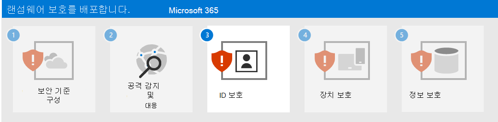

# 2단계. 공격 탐지 및 대응 배포

랜섬웨어 공격 탐지 및 대응을 위해 이러한 도구를 사용하도록 허용, 구성 및 사용합니다.

| 기능 | 설명 | 시작 위치 | 검색 및 응답에 사용하는 방법 |
|:-------|:-----|:-------|:-------|
| [Microsoft 365 Defender](/microsoft-365/security/defender) | 신호를 결합하고 기능을 단일 솔루션으로 오케스트레이션    보안 전문가가 위협 신호를 통합하고 위협의 전체 범위와 영향을 결정할 수 있도록 합니다.    작업을 자동화하여 공격을 방지하거나 중지하고 영향을 받는 사서함, 엔드포인트 및 사용자 ID를 자가 치유합니다. | [시작](/microsoft-365/security/defender/get-started) | [사고 대응](/microsoft-365/security/defender/incidents-overview) |
| [Microsoft Defender for Identity](/defender-for-identity/what-is) |  온-프레미스 AD DS(Active Directory 도메인 서비스) 신호를 사용하여 클라우드 기반 보안 인터페이스를 통해 조직을 겨냥한 지능적 위협, 손상된 ID 및 악의적인 내부자 행동을 식별, 탐지 및 조사합니다 | [개요](/defender-for-identity/what-is) | [Microsoft Defender for Identity 포털에서 작업](/defender-for-identity/workspace-portal) |
| [Office 365용 Microsoft Defender](/microsoft-365/security/office-365-security) | 전자 메일 메시지, 링크(URL), 공동 작업 도구로 가장하는 지능형 악성 위협에 맞서 조직을 안전하게 지키세요.    맬웨어, 피싱, 스푸핑 및 기타 공격 유형으로부터 보호  | [개요](/microsoft-365/security/office-365-security/overview) | [위협 헌팅](/microsoft-365/security/office-365-security/threat-hunting-in-threat-explorer) |
| [엔드포인트용 Microsoft Defender](/microsoft-365/security/defender-endpoint) | 엔드포인트(장치) 전체에 걸쳐 지능적 위협에 대한 탐지 및 대응 지원 | [개요](/microsoft-365/security/defender-endpoint/microsoft-defender-endpoint)  | [엔드포인트 검색 및 대응](/microsoft-365/security/defender-endpoint/overview-endpoint-detection-response) |
| [Azure AD(Azure Active Directory) ID 보호](/azure/active-directory/identity-protection/) | ID 기반 위험 탐지 및 교정 및 해당 리스크 조사 자동화 | [개요](/azure/active-directory/identity-protection/overview-identity-protection) | [위험 조사](/azure/active-directory/identity-protection/howto-identity-protection-investigate-risk) |
| [Microsoft Cloud App Security](/cloud-app-security) | 모든 Microsoft 및 타사 클라우드 서비스의 검색, 조사 및 거버넌스를 위한 클라우드 액세스 보안 브로커입니다. | [개요](/cloud-app-security/what-is-cloud-app-security) | [조사](/cloud-app-security/investigate) |

>[!Note]
>이러한 모든 도구에는 Microsoft 365 E5 또는 Microsoft 365 E3와 Microsoft 365 E5 Security 추가 기능이 필요합니다.
>

다음 도구를 사용하여 랜섬웨어 공격자의 다음과 같은 일반적인 위협을 탐지하고 대응합니다.

- 자격 증명 절도

   - Azure AD ID 보호
   - Microsoft Defender for Identity
   - Office 365용 Microsoft Defender

- 디바이스 손상

   - 엔드포인트용 Microsoft Defender
   - Office 365용 Microsoft Defender

- 권한 상승

   - Azure AD ID 보호
   - Microsoft Cloud App Security

- 악성 앱 동작

   - Microsoft Cloud App Security

- 데이터 반출, 삭제 또는 업로드

   - Office 365용 Microsoft Defender
   - [변칙 검색 정책](/cloud-app-security/anomaly-detection-policy#ransomware-activity)을 사용하는 Microsoft Cloud App Security

다음 툴에서는 Microsoft 365 Defender 및 해당 포털(https://security.microsoft.com))을 공통 위협 수집 및 분석 지점으로 사용합니다.

- Microsoft Defender for Identity
- Office 365용 Microsoft Defender
- 엔드포인트용 Microsoft Defender
- Microsoft Cloud App Security

Microsoft 365 Defender는 보안 분석가가 랜섬웨어 공격 단계를 보다 신속하게 탐지, 조사 및 해결할 수 있도록 위협 신호를 경고 및 연결된 경고로 결합합니다.

[평가판 환경을 설정](/microsoft-365/security/defender/eval-overview)하여 Microsoft 365 Defender의 기능과 기능을 평가할 수 있습니다.

## 결과 구성

다음은 1, 2단계에 대한 테넌트에 대한 랜섬웨어 보호입니다.

## 다음 단계

[3단계](ransomware-protection-microsoft-365-identities.md)를 계속 진행하여 Microsoft 365 테넌트의 ID를 보호합니다.
