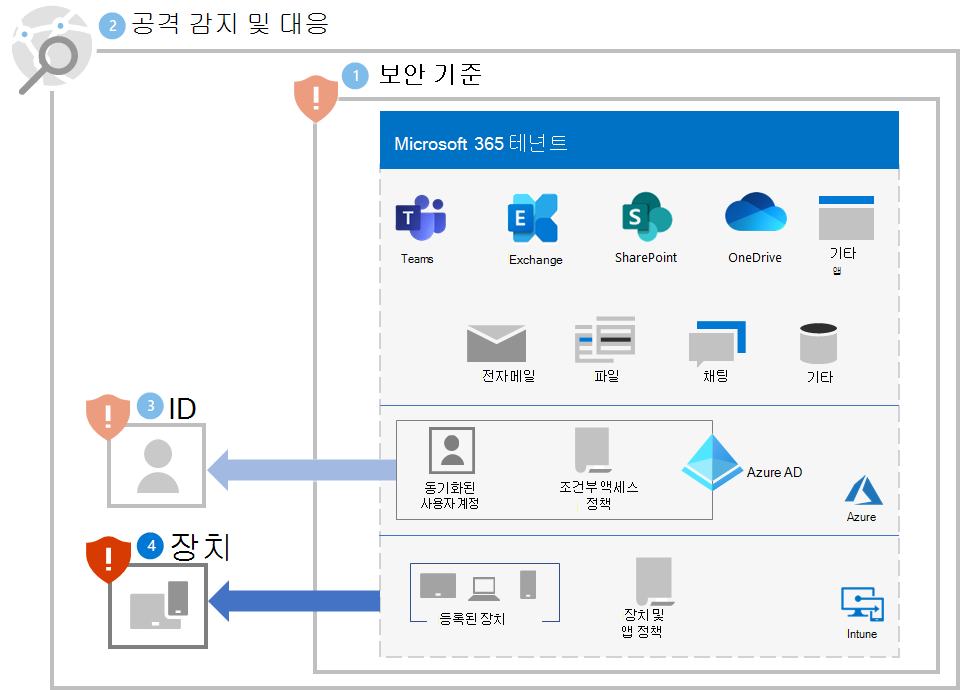
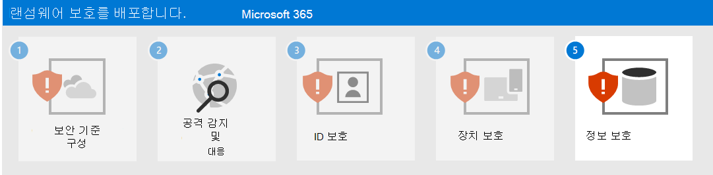

# 4단계. 장치 보호

랜섬웨어 공격의 초기 액세스 부분으로부터 장치를 보호하려면:

- 장치에 대한 모바일 장치 관리(MDM) 및 모바일 애플리케이션 관리(MAM) 공급자로 [Intune](/mem/intune/fundamentals/what-is-intune)을 배포하고 조직 소유 장치를 등록합니다.
- [공통 ID 및 장치 액세스 정책](/microsoft-365/security/office-365-security/identity-access-policies)을 구현하여 사용자 계정 자격 증명과 장치 상태 및 규정 준수 요구사항을 확인합니다.
- 엔드포인트용 Microsoft Defender 및 Microsoft 365 Defender에서 [네트워크 보호](/microsoft-365/security/defender-endpoint/network-protection)를 활성화합니다.
- 차단하거나 경고하도록 Microsoft Defender SmartScreen에서 [사이트 및 다운로드 확인](/windows/security/threat-protection/microsoft-defender-smartscreen/microsoft-defender-smartscreen-available-settings) 및 [앱 및 파일 확인](/windows/security/threat-protection/microsoft-defender-smartscreen/microsoft-defender-smartscreen-available-settings)을 구성합니다.
- 다운로드한 파일 및 첨부파일의 [Microsoft Defender 바이러스 백신 검사](/microsoft-365/security/defender-endpoint/configure-advanced-scan-types-microsoft-defender-antivirus)를 사용하도록 설정합니다.
- 엔드포인트용 Microsoft Defender 및 Microsoft 365 Defender에서 **원격 데스크톱 보안 수준** 을 **TLS** 로 설정합니다.

## Windows 10 장치

Windows 10 장치 공격의 측면 이동 부분으로부터 보호하려면:

- [Microsoft Defender 방화벽을 켭니다](https://support.microsoft.com/windows/turn-microsoft-defender-firewall-on-or-off-ec0844f7-aebd-0583-67fe-601ecf5d774f).
- [Microsoft Defender 바이러스 백신 정의를 업데이트합니다](/en-us/microsoft-365/security/defender-endpoint/manage-updates-baselines-microsoft-defender-antivirus).

공격의 영향을 줄이려면:

- 랜섬웨어에 대해 [고급 보호](/Microsoft-365/security/defender-endpoint/attack-surface-reduction#use-advanced-protection-against-ransomware)를 사용합니다.

보안 방어를 회피하는 공격자로부터 보호하려면:

- Microsoft Defender 바이러스 백신의 [클라우드 제공 보호](/microsoft-365/security/defender-endpoint/enable-cloud-protection-microsoft-defender-antivirus)를 계속 켭니다.
- Microsoft Defender 바이러스 백신 [실시간 동작 모니터링](/microsoft-365/security/defender-endpoint/configure-real-time-protection-microsoft-defender-antivirus)을 켜진 상태로 유지합니다.
- [실시간 보호](/microsoft-365/security/defender-endpoint/configure-real-time-protection-microsoft-defender-antivirus)를 켭니다.
- 보안 설정에 대한 악의적인 변경을 방지하려면 [엔드포인트용 Microsoft Defender에서 변조 방지](/microsoft-365/security/defender-endpoint/prevent-changes-to-security-settings-with-tamper-protection)를 켜세요.

공격의 일부로 코드를 실행하는 공격자로부터 보호하려면:

- [Microsoft Defender 바이러스 백신](/mem/intune/user-help/turn-on-defender-windows)을 켭니다.
- [Office 매크로의 Win32 API 호출을 차단합니다](/microsoft-365/security/defender-endpoint/attack-surface-reduction-rules#block-win32-api-calls-from-office-macros).
- [이 프로세스](https://www.microsoft.com/microsoft-365/blog/2010/02/16/migrating-excel-4-macros-to-vba/)를 사용하여 Excel 4.0 매크로가 필요한 모든 기존 통합 문서를 업데이트된 VBA 매크로 형식으로 마이그레이션합니다.
- [서명되지 않은 매크로 사용을 비활성화합니다](https://support.microsoft.com/topic/enable-or-disable-macros-in-office-files-12b036fd-d140-4e74-b45e-16fed1a7e5c6). 비즈니스에 필요한 모든 내부 매크로가 서명되었는지 확인하고 [신뢰할 수 있는 위치](/deployoffice/security/designate-trusted-locations-for-files-in-office)를 활용하여 알 수 없는 매크로가 사용자 환경에서 실행되지 않도록 합니다.
- [맬웨어 방지 검사 인터페이스](https://www.microsoft.com/security/blog/2021/03/03/xlm-amsi-new-runtime-defense-against-excel-4-0-macro-malware/)(AMSI)에 의한 런타임 매크로 검색이 켜져 있는지 확인하여 악성 XLM 또는 VBA 매크로를 중지합니다. 이 기능(기본적으로 사용 설정됨)은 **매크로 런타임 검색 범위** 에 대한 그룹 정책 설정이 **모든 파일에 대해 사용** 또는 **신뢰도가 낮은 파일에 대해 사용** 로 설정된 경우 활성화됩니다. 최신 그룹 정책 템플릿 파일을 가져옵니다.

## 사용자 및 변경 관리에 대한 영향

이러한 보호를 구현할 때 다음에 대한 변경 관리를 수행하세요.

- [공통 ID 및 장치 액세스 정책](/microsoft-365/security/office-365-security/identity-access-policies)은 규정을 준수하지 않는 장치가 있는 사용자의 액세스를 거부할 수 있습니다.
- 파일을 다운로드하면 다운로드 전에 사용자에게 경고하거나 차단될 수 있습니다.
- 일부 Office, Excel 4.0, XLM 또는 VBA 매크로가 더 이상 실행되지 않을 수 있습니다.

## 결과 구성

다음은 1-4단계에 대한 테넌트에 대한 랜섬웨어 보호입니다.

## 다음 단계

[5단계](ransomware-protection-microsoft-365-information.md)를 계속 진행하여 Microsoft 365 테넌트의 정보를 보호합니다. 
