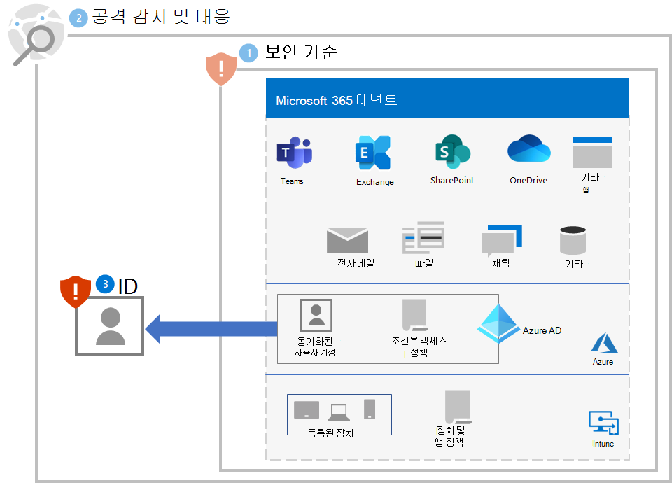
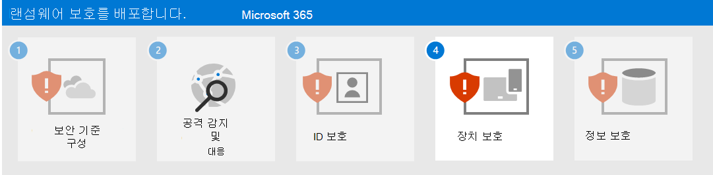

# 3단계. ID 보호

다음 섹션을 사용하여 일반적으로 더 큰 랜섬웨어 공격의 첫 번째 단계인 자격 증명 손상으로부터 조직을 보호합니다.

## 로그인 보안 강화

Azure AD(Azure Active Directory)의 사용자 계정에 [암호 없는 인증](/azure/active-directory/authentication/howto-authentication-passwordless-deployment) 사용

암호 없는 인증으로 전환하는 동안 암호 인증을 여전히 사용하는 사용자 계정에 대해 다음과 같은 모범 사례를 사용하세요.

- [Azure AD 암호 보호](/azure/active-directory/authentication/concept-password-ban-bad)를 사용하여 알려진 약한 암호와 사용자 지정 암호를 차단합니다.
- 알려진 취약한 암호와 사용자 지정 암호 차단을 [Azure AD 암호 보호 기능을 사용하여 온-프레미스 AD DS(Active Directory Domain Services)](/azure/active-directory/authentication/concept-password-ban-bad-on-premises)로 확장합니다.
- 사용자가 [SSPR(셀프 서비스 암호 초기화)](/azure/active-directory/authentication/concept-sspr-howitworks)를 사용하여 자신의 암호를 변경할 수 있도록 허용합니다.

다음으로 [일반 ID와 디바이스 액세스 정책](/microsoft-365/security/office-365-security/identity-access-policies)을 구현합니다. 이러한 정책은 Microsoft 365 클라우드 서비스에 대한 액세스를 위해 더 높은 보안을 제공합니다. 

사용자 로그인의 경우 포함되는 정책은 다음과 같습니다.

- 우선 순위 계정과 최종적으로는 모든 사용자 계정에 대해 MFA를 요구합니다.
- MFA를 사용하려면 위험 수준이 높은 로그인이 필요합니다.
- 위험 수준이 높은 로그인이 있는 위험 수준이 높은 사용자에게 암호를 변경하도록 요구합니다.

## 권한 상승 방지

다음과 같은 모범 사례를 따르세요.

- 로그인에 여전히 암호를 사용하는 사용자 계정에 대해 [로그인 보안 강화](#increase-sign-in-security)에 설명된 대로 [최소 권한](/windows-server/identity/ad-ds/plan/security-best-practices/implementing-least-privilege-administrative-models) 원칙을 구현하고 암호 보호를 사용합니다. 
- 도메인 차원의 관리자 수준 서비스 계정을 사용하지 않도록 합니다. 
- RAT(원격 액세스 트로이 목마) 및 기타 원하지 않는 응용 프로그램의 설치를 제한하도록 로컬 관리 권한을 제한합니다.
- 관리 포털에 대한 액세스를 허용하기 전에 Azure AD 조건부 액세스를 사용하여 사용자와 워크스테이션의 신뢰를 명시적으로 확인합니다. Azure Portal에 대한 [이 예제](/azure/active-directory/conditional-access/howto-conditional-access-policy-azure-management)를 참조하세요.
- 로컬 관리자 암호 관리를 사용하도록 설정합니다.
- 높은 권한이 있는 계정이 로그인하여 자격 증명을 노출하는 위치를 확인합니다. 권한이 높은 계정은 워크스테이션에 있으면 안 됩니다.
- 암호 및 자격 증명의 로컬 저장소를 사용하지 않도록 설정합니다.

## 사용자 및 변경 관리에 대한 영향

조직의 사용자가 다음을 인식하도록 해야 합니다.

- 더 강력한 암호에 대한 새로운 요구 사항입니다.
- MFA의 필요 사용 및 MFA 2차 인증 방법 등록 등 로그인 프로세스의 변경 사항입니다.
- SSPR에서 암호 유지 관리를 사용합니다. 예를 들어 암호 재설정을 위해 기술 지원팀에 대한 호출이 더 이상 발생하지 않습니다.
- 위험하다고 판단되는 로그인에 대해 MFA 또는 암호를 변경해야 한다는 메시지가 표시됩니다.

## 결과 구성

다음은 1-3단계에 대한 테넌트에 대한 랜섬웨어 보호입니다.

## 다음 단계

[4단계](ransomware-protection-microsoft-365-devices.md)를 계속 진행하여 Microsoft 365 테넌트의 디바이스(엔드포인트)를 보호합니다. 
