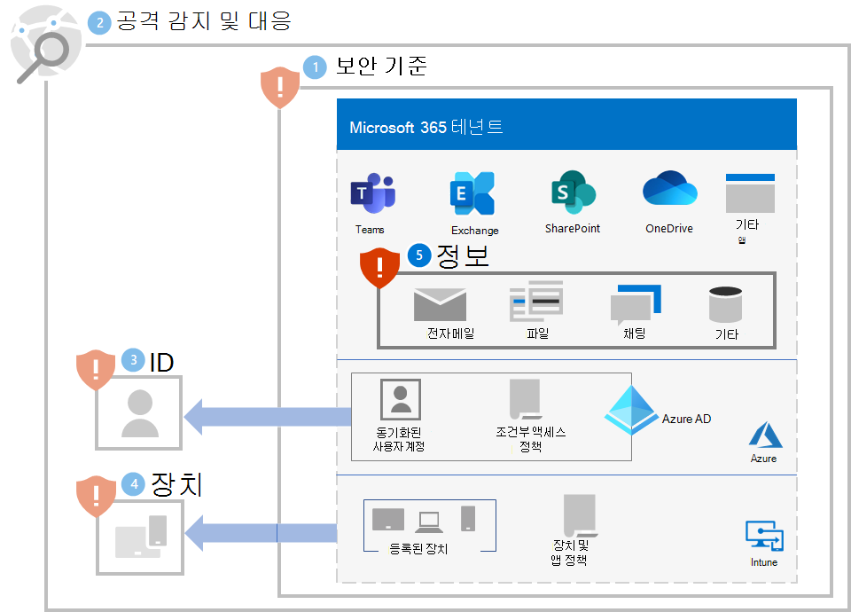

# 5단계. 정보 보호

랜섬웨어 공격자는 파일, 데이터베이스 및 기타 유형의 서버에 있는 온-프레미스 데이터도 조사하므로 데이터를 보호하는 가장 좋은 방법 중 하나는 데이터를 Microsoft 365 테넌트로 마이그레이션하는 것입니다. 그런 다음 [버전 관리, 휴지통, 파일 복원](ransomware-protection-microsoft-365.md#ransomware-mitigation-and-recovery-capabilities-provided-with-microsoft-365)과 같은 기본 제공 완화 및 복구 기능으로 보호할 수 있습니다.

Microsoft 365 테넌트에서 중요한 정보를 추가로 보호하려면 다음을 수행합니다.

- 중요한 정보로 이동합니다.
- 엄격한 권한을 구현하고 광범위한 액세스를 제거합니다(예: 쓰기, 편집 및 삭제 기능을 가진 너무 많은 사용자).
- 중요한 정보를 보호합니다.

>[!Note]
>Microsoft 365 테넌트에서 정보 보호를 위한 자세한 배포 지침은 [데이터 개인 정보 보호 규정 배포](information-protection-deploy.md)를 참조하세요. 데이터 개인 정보 보호 규정을 위한 것이긴 하지만, 대부분의 지침은 랜섬웨어 보호에도 적용됩니다.
>

## 중요한 정보로 이동합니다.

첫 번째 작업은 테넌트에서 중요한 정보의 [유형과 위치를 식별](/microsoft-365/compliance/information-protection#know-your-data)하는 것입니다. 여기에는 다음 유형이 포함될 수 있습니다.

- 중요
- 소유 또는 지적 재산권
- PII(개인 식별 정보)의 보호를 명시하는 규제된 지역 규제입니다.
- IT 복구 계획

각 유형의 중요한 정보에 대해 다음을 확인합니다.

- 조직에 대한 정보 사용
- 랜섬(높음, 중간, 낮음 등)을 위해 보유된 경우 금전적 가치를 나타내는 상대적인 척도입니다.
- 현재 위치(예: OneDrive 또는 SharePoint 폴더) 또는 Microsoft Teams 팀과 같은 협업 장소입니다.
- 다음으로 구성된 현재 권한입니다.

   - 액세스 권한이 있는 사용자 계정

   - 액세스 권한이 있는 각 계정에 허용되는 작업

## 중요한 정보가 있는 위치에 대해 엄격한 권한 구현

Microsoft 365 테넌트 내에서 엄격한 권한을 사용하는 것은 위치 및 통신 장소에 대한 최소 권한의 원칙입니다. Microsoft 365에서는 일반적으로 OneDrive 폴더, SharePoint 사이트 및 폴더 및 팀입니다. 

파일 스토리지 위치나 팀(예: 조직의 모든 사용자의 기본값)을 광범위하게 액세스할 수 있는 팀을 만드는 것이 더 쉽지만, 중요한 정보의 경우 허용된 사용자 계정과 작업은 협업 및 비즈니스 요구사항을 충족하는 데 필요한 최소 설정으로 제한되어야 합니다.

랜섬웨어 공격자가 테넌트에 침투한 후에는 관리자 역할 계정 또는 중요한 정보에 액세스할 수 있는 사용자 계정과 같이 테넌트 전체에서 사용 권한 범위가 넓은 사용자 계정의 자격 증명을 손상시켜 권한을 높이려고 합니다. 

이러한 일반적인 공격자 동작에 따라 공격자에게 다음과 같은 두 가지 난이도가 있습니다.

- **낮음:** 공격자는 테넌트 전체의 광범위한 액세스 권한으로 인해 권한이 낮은 계정을 사용하고 사용자의 중요한 정보를 검색할 수 있습니다.
- **높음:** 공격자는 낮은 권한의 계정을 사용할 수 없으며 엄격한 권한으로 인해 귀하의 중요한 정보를 발견할 수 없습니다. 그들은 중요한 정보가 있는 위치에 액세스할 수 있는 계정의 자격 증명을 확인하고 손상시켜 권한을 에스컬레이션해야 하지만 제한된 작업 집합만 수행할 수 있습니다.

중요한 정보의 경우 난이도를 최대한 높여야 합니다.

다음 단계를 통해 테넌트에서 엄격한 사용 권한을 보장할 수 있습니다.

1. 중요한 정보를 [찾으려는 노력에서 중요한 정보의 위치](#locate-your-sensitive-information)에 대한 권한을 검토하세요. 
2. 공동 작업 및 비즈니스 요구사항을 충족하면서 중요한 정보에 대한 엄격한 권한을 구현하고 영향을 받는 사용자에게 알립니다.
3. 중요한 정보에 대한 향후 위치가 엄격한 권한으로 생성되고 유지 관리되도록 사용자에 대한 변경 관리를 수행합니다.
4. 위치에 중요한 정보가 있는지 감사 및 모니터링하여 광범위한 권한이 부여되지 않는지 확인합니다.

자세한 지침은 [Microsoft 365를 사용하여 안전한 공동 작업 설정 및 Microsoft Teams](setup-secure-collaboration-with-teams.md)를 참조하세요. 민감한 정보에 대한 엄격한 권한을 가진 통신과 공동 작업 장소의 예는 [보안 고립을 가진 팀](/microsoft-365/solutions/secure-teams-security-isolation)입니다.

## 중요한 정보 보호

랜섬웨어 공격자가 액세스할 수 있는 경우 중요한 정보를 보호하려면 다음을 수행합니다.

- 권한이 없는 응용프로그램이 제어된 폴더의 데이터를 수정하기 어렵게 하려면 [제어된 폴더 액세스](/windows/security/threat-protection/microsoft-defender-atp/controlled-folders)를 사용하세요.

- [Microsoft Information Protection](/microsoft-365/compliance/information-protection) 및 민감도 레이블을 사용하여 중요한 정보에 적용합니다. 민감도 레이블은 정의된 사용자 계정 및 허용된 작업을 사용하여 추가 암호화 및 사용 권한에 대해 구성할 수 있습니다. 테넌트에서 배출된 이 유형의 민감도 레이블로 표시된 파일은 레이블에 정의된 사용자 계정에서만 사용할 수 있습니다.

- [Microsoft 365 DLP(데이터 손실 방지)](/microsoft-365/compliance/dlp-learn-about-dlp)를 사용하여 내부 및 외부에서 민감도 레이블을 기반으로 개인 또는 기밀 정보가 포함된 위험하거나 부주의하거나 부적절한 데이터 공유를 탐지, 경고 및 차단합니다.

- [Microsoft Cloud App Security](/cloud-app-security/what-is-cloud-app-security)를 사용하여 파일과 같은 중요한 정보의 다운로드를 차단합니다. 또한 [Cloud App Security 이상 탐지 정책](/cloud-app-security/anomaly-detection-policy#ransomware-activity)을 사용하여 높은 파일 업로드 또는 파일 삭제 작업을 탐지할 수 있습니다.

## 사용자 및 변경 관리에 대한 영향

광범위한 권한에 대한 관리 변경으로 인해 사용자가 액세스를 거부당하거나 일부 작업을 실행할 수 없게 될 수 있습니다.

또한 Microsoft 365 테넌트에서 중요한 정보를 보호하기 위해 사용자에게 다음을 교육합니다.

- 엄격한 권한(액세스에 대한 최소 사용자 계정 집합 및 각 사용자마다 허용되는 최소 작업)으로 통신 및 공동 작업 장소를 만듭니다. 
- 민감한 정보에 적절한 민감도 레이블을 적용합니다.
- 제어된 폴더 액세스를 사용합니다.

## 결과 구성

다음은 1-5단계에 대한 테넌트에 대한 랜섬웨어 보호입니다.

## 추가 랜섬웨어 리소스

Microsoft의 주요 정보:

- [랜섬웨어 위협 증가](https://blogs.microsoft.com/on-the-issues/2021/07/20/the-growing-threat-of-ransomware/), 2021년 7월 20일 Microsoft On the Issue 블로그 게시물
- [사람이 조작하는 랜섬웨어](/security/compass/human-operated-ransomware)
- [랜섬웨어 및 탈취로부터 신속하게 보호](/security/compass/protect-against-ransomware)
- [최신 Microsoft 보안 인텔리전스 보고서](https://www.microsoft.com/securityinsights/)(22-24페이지 참조)
- **랜섬웨어:** Microsoft 365 Defender 포털의 **위협 분석** 노드에 만연하고 지속적인 위협 보고서가 있습니다(이 [라이선스 요구 사항](/microsoft-365/security/defender/prerequisites#licensing-requirements) 참조).

Microsoft 365:

- [Azure 및 Microsoft 365를 사용하여 랜섬웨어 복원력 최대화](https://azure.microsoft.com/resources/maximize-ransomware-resiliency-with-azure-and-microsoft-365/)
- [랜섬웨어 공격으로부터 복구](/microsoft-365/security/office-365-security/recover-from-ransomware)
- [맬웨어 및 랜섬웨어 보호](/compliance/assurance/assurance-malware-and-ransomware-protection)
- [랜섬웨어에서 Windows 10 PC 보호](https://support.microsoft.com//windows/protect-your-pc-from-ransomware-08ed68a7-939f-726c-7e84-a72ba92c01c3)
- [SharePoint Online에서 랜섬웨어 처리](/sharepoint/troubleshoot/security/handling-ransomware-in-sharepoint-online)

Microsoft 365 Defender:

- [고급 헌팅으로 랜섬웨어 찾기](/microsoft-365/security/defender/advanced-hunting-find-ransomware)

Microsoft Azure:

- [랜섬웨어 공격용 Azure 방어](https://azure.microsoft.com/resources/azure-defenses-for-ransomware-attack/)
- [Azure 및 Microsoft 365를 사용하여 랜섬웨어 복원력 최대화](https://azure.microsoft.com/resources/maximize-ransomware-resiliency-with-azure-and-microsoft-365/)
- [랜섬웨어로부터 보호하기 위한 백업 및 복원 계획](/security/compass/backup-plan-to-protect-against-ransomware)
- [Microsoft Azure Backup을 통해 랜섬웨어로부터 보호](https://www.youtube.com/watch?v=VhLOr2_1MCg)(26분 비디오)
- [시스템 ID 손상 복구](/azure/security/fundamentals/recover-from-identity-compromise)
- [Azure Sentinel에서 고급 다단계 공격 탐지](/azure/sentinel/fusion#ransomware)
- [Azure Sentinel의 랜섬웨어 퓨전 탐지](https://techcommunity.microsoft.com/t5/azure-sentinel/what-s-new-fusion-detection-for-ransomware/ba-p/2621373)

Microsoft Cloud App Security:

-  [Cloud App Security에서 이상 탐지 정책 생성](/cloud-app-security/anomaly-detection-policy)

Microsoft 보안 팀 블로그 게시물:

- [랜섬웨어 방지 및 복구를 위한 3단계(2021년 9월)](https://www.microsoft.com/security/blog/2021/09/07/3-steps-to-prevent-and-recover-from-ransomware/)
- [사이버 보안 위험 파악을 통한 탄력성 강화: 제4부—현재 위협 탐색(2021년 5월)](https://www.microsoft.com/security/blog/2021/05/26/becoming-resilient-by-understanding-cybersecurity-risks-part-4-navigating-current-threats/)

  **랜섬웨어** 섹션을 참조하세요.

- [인간 운영 랜섬웨어 공격: 예방 가능한 재해(2020년 3월)](https://www.microsoft.com/security/blog/2020/03/05/human-operated-ransomware-attacks-a-preventable-disaster/)

  실제 공격에 대한 공격 체인 분석을 포함합니다.

- [랜섬웨어 대응—지불 여부(2019년 12월)](https://www.microsoft.com/security/blog/2019/12/16/ransomware-response-to-pay-or-not-to-pay/)
- [Norsk Hydro가 랜섬웨어 공격에 투명하게 대응(2019년 12월)](https://www.microsoft.com/security/blog/2019/12/17/norsk-hydro-ransomware-attack-transparency/)

