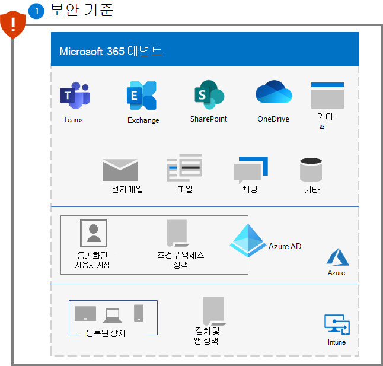
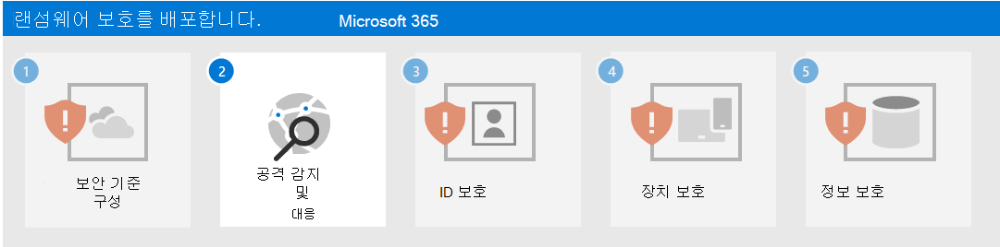

# 1단계. 보안 기준 구성

랜섬웨어 공격자에 대응하는 첫 번째 단계로 다음 Microsoft 정의 보안 기준을 구성해야 합니다.

- [Microsoft 365 보안](#microsoft-365-security-baseline)
- [Exchange 전자 메일 관리](#exchange-email-management-baseline)
- [Windows 장치 및 클라이언트 소프트웨어에 대한 추가 기준](#additional-baselines)

이러한 기준에는 공격자가 잘 알고 있는 구성 설정과 규칙이 포함되어 있으며, 이러한 구성 설정은 빠르게 인식되고 일반적으로 악용됩니다.

## Microsoft 365 보안 기준

먼저 [Microsoft Secure Score](/microsoft-365/security/defender/microsoft-secure-score)를 사용하여 보안 태세를 평가하고 측정하고 지침에 따라 필요에 따라 개선합니다.

다음으로, [공격 노출 영역 감소 규칙](/microsoft-365/security/defender-endpoint/attack-surface-reduction)을 사용하여 의심스러운 활동 및 취약한 콘텐츠를 차단합니다. 이러한 규칙에는 다음과 같은 방지가 포함됩니다.

- 모든 Office 응용 프로그램에서 자녀 프로세스를 만들지 못하도록 차단
- 전자 메일 클라이언트 및 웹메일에서 실행 가능한 콘텐츠
- 배포, 연령 또는 신뢰할 수 있는 목록 기준을 충족하는 경우를 제외하고 실행 가능한 파일 실행
- 잠재적으로 애매한 스크립트 실행
- JavaScript 또는 VBScript의 다운로드된 실행 가능한 콘텐츠 시작
- 실행 파일 콘텐츠를 만드는 Office 응용 프로그램
- 다른 프로세스에 코드를 삽입하는 Office 응용 프로그램
- Office 통신 응용 프로그램의 하위 프로세스 생성
- USB에서 실행되는 신뢰할 수 없는 프로세스 및 서명되지 않은 프로세스
- WMI(Windows Management Interface) 이벤트 구독을 통한 지속성
- Windows 로컬 보안 기관 하위 시스템(lsass.exe)에서 자격 증명 절도 맬웨어
- PSExec 및 WMI 명령에서 발생한 프로세스 생성

## Exchange 전자 메일 관리 기준 

다음과 같은 Exchange 전자 메일 기준 설정을 사용하여 전자 메일 기반 공격으로부터 테넌트에 대한 초기 액세스를 방지할 수 있습니다.

- Microsoft Defender 바이러스 백신 전자 메일 검색을 사용하도록 설정합니다.
- Office 365용 Microsoft Defender를 사용하여 새로운 위협 및 다형성 변형에 대한 [피싱 방지 및 적용 범위를 강화](/microsoft-365/security/office-365-security/anti-phishing-protection)합니다.
- Office 365 전자 메일 필터링 설정을 확인하여 스푸핑된 전자 메일, 스팸 및 악성 프로그램이 있는 전자 메일을 차단하세요. Office 365용 Microsoft Defender를 사용하여 새로운 위협 및 다형성 변형에 대한 피싱 방지 및 적용 범위를 강화합니다. 새로 획득한 위협 인텔리전스에 대한 응답으로 [배달된 메일을 클릭하고](/microsoft-365/security/office-365-security/atp-safe-links) [삭제할 때 링크를 다시 확인하도록](/microsoft-365/security/office-365-security/zero-hour-auto-purge) Office 365용 Microsoft Defender를 구성합니다.
-  [EOP 및 Office 365용 Defender 보안에 대한 최신 권장 설정](/microsoft-365/security/office-365-security/recommended-settings-for-eop-and-office365-atp)을 검토하고 업데이트합니다.
- 새로 획득한 위협 인텔리전스에 대한 응답으로 배달된 메일을 [클릭하고 삭제할 때 링크를 다시 확인하도록](/microsoft-365/security/office-365-security/set-up-safe-links-policies) Office 365용 Microsoft Defender를 구성합니다.

## 추가 기준

다음에 대해 [보안 기준](https://techcommunity.microsoft.com/t5/microsoft-security-baselines/bg-p/Microsoft-Security-Baselines)을 적용합니다.

- Microsoft Windows 10
- 엔터프라이즈용 Microsoft 365 앱
- Microsoft Edge

## 사용자 및 변경 관리에 대한 영향

공격 표면 감소 규칙의 모범 사례로서 위협 및 취약성 관리에서 해당 규칙에 대한 보안 권장 사항을 열어 규칙이 네트워크에 어떤 영향을 미칠 수 있는지 평가합니다. 권장 사항 세부 정보 창에서는 사용자 생산성에 부정적인 영향을 주지 않고 차단 모드에서 규칙을 사용하도록 설정하는 새 정책을 수락할 수 있는 장치 비율을 확인하는 데 사용할 수 있는 사용자 영향에 대해 설명합니다.

또한 Exchange 전자 메일 기준 설정을 사용하면 수신 전자 메일을 차단하고 전자 메일의 전송 또는 전자 메일 내 링크 클릭을 방지할 수 있습니다. 이러한 행동과 이러한 예방 조치가 취해지는 이유에 대해 직원들에게 교육합니다.

## 결과 구성

다음은 이 단계 이후 테넌트에 대한 랜섬웨어 보호입니다.

## 다음 단계

[2단계](ransomware-protection-microsoft-365-attack-detection-response.md)를 계속하여 Microsoft 365 테넌트용 공격 탐지 및 대응 기능을 배포합니다.
