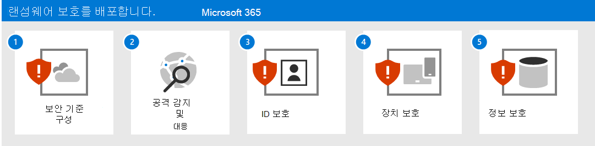
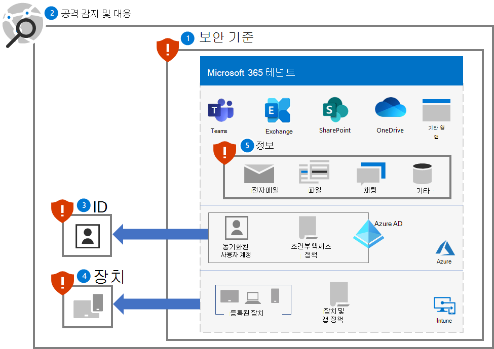
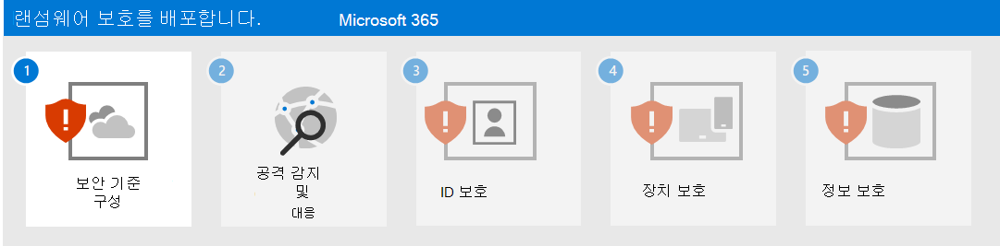

# Microsoft 365 테넌트용 랜섬웨어 보호 배포

랜섬웨어는 파일 및 폴더를 삭제하거나 암호화하여 중요한 데이터에 액세스할 수 없도록 하는 공격 유형입니다. 상용 랜섬웨어는 일반적으로 디바이스를 감염시키는 바이러스처럼 확산되며 맬웨어 수정만 필요합니다. 사람이 운영하는 랜섬웨어는 조직의 온-프레미스 또는 클라우드 IT 인프라에 침투하고, 권한을 상승시키고, 중요한 데이터에 랜섬웨어를 배포하는 사이버 범죄자에 의한 활성 공격의 결과입니다.

공격이 완료되면 공격자는 삭제된 파일, 암호화된 파일의 암호 해독 키 또는 어두운 웹 또는 공용 인터넷에 중요한 데이터를 릴리스하지 않을 것을 약속하는 대신, 공격자에게 돈을 요구합니다. 사람이 운영하는 랜섬웨어를 사용하여 산업 생산에 필요한 것과 같은 중요한 컴퓨터 또는 프로세스를 종료하거나, 랜섬이 지급되고 손상이 수정될 때까지 정상적인 비즈니스 운영이 중단되거나, 조직이 직접 손상을 수정할 수 있습니다.

사람이 운영하는 랜섬웨어 공격은 모든 규모의 기업에 치명적일 수 있으며 정리하기 어려울 수 있으므로 향후 공격으로부터 보호하기 위해 완전한 악의적 사용자 제거가 필요합니다. 상용 랜섬웨어와 달리 사람이 운영하는 랜섬웨어는 초기 랜섬 요청 이후 비즈니스 운영을 계속 위협할 수 있습니다.

>[!Note]
>Microsoft 365 테넌트에서 랜섬웨어 공격은 공격자가 테넌트용 유효한 사용자 계정 자격 증명을 가지고 있으며 사용자 계정에 허용되는 모든 파일 및 리소스에 액세스할 수 있다고 가정합니다. 유효한 사용자 계정 자격 증명이 없는 공격자는 Microsoft 365 기본 및 향상된 암호화로 암호화된 미사용 데이터의 암호를 해독해야 합니다. 자세한 내용은[암호화 및 키 관리 개요](/compliance/assurance/assurance-encryption)를 참조하세요. 
>

Microsoft 제품의 랜섬웨어 보호에 대한 자세한 내용은 이러한 [추가 랜섬웨어 리소스](#additional-ransomware-resources)를 참조하세요.

## 클라우드 보안은 파트너 관계임

Microsoft 클라우드 서비스의 보안은 사용자와 Microsoft 간의 파트너 관계입니다.

- Microsoft 클라우드 서비스는 신뢰와 보안을 기반으로 합니다. Microsoft는 데이터와 응용 프로그램을 보호하는 데 유용한 보안 컨트롤 및 기능을 제공합니다.
- 사용자는 데이터와 ID를 소유하며 데이터 및 ID의 보호, 온-프레미스 리소스의 보안, 사용자가 제어하는 클라우드 구성 요소의 보안은 사용자 책임입니다.

이러한 기능과 책임을 결합하여 랜섬웨어 공격으로부터 최상의 보호를 제공할 수 있습니다.

## Microsoft 365와 제공되는 랜섬웨어 완화 및 복구 기능

Microsoft 365 테넌트를 침투한 랜섬웨어 공격자는 다음을 수행하여 조직의 랜섬웨어를 보유할 수 있습니다.

- 파일 또는 전자 메일 삭제
- 현재 위치의 파일 암호화
- 테넌트 외부에 파일 복사(데이터 반출)

그러나 Microsoft 365 온라인 서비스 랜섬웨어 공격으로부터 고객 데이터를 보호하기 위한 많은 기본 제공 기능과 컨트롤이 있습니다. 다음 섹션에서는 요약을 제공합니다. Microsoft에서 고객 데이터를 보호하는 방법에 대한 자세한 내용 [Microsoft 365 맬웨어 및 랜섬웨어 보호](/compliance/assurance/assurance-malware-and-ransomware-protection)를 참조하세요.

>[!Note]
>Microsoft 365 테넌트에서 랜섬웨어 공격은 공격자가 테넌트용 유효한 사용자 계정 자격 증명을 가지고 있으며 사용자 계정에 허용되는 모든 파일 및 리소스에 액세스할 수 있다고 가정합니다. 유효한 사용자 계정 자격 증명이 없는 공격자는 Microsoft 365 기본 및 향상된 암호화로 암호화된 미사용 데이터의 암호를 해독해야 합니다. 자세한 내용은[암호화 및 키 관리 개요](/compliance/assurance/assurance-encryption)를 참조하세요. 
>

### 파일 또는 전자 메일 삭제

SharePoint 및 비즈니스용 OneDrive 파일은 다음으로 보호됩니다.

- 버전 관리 

   Microsoft 365에서는 기본적으로 최소 500개 버전의 파일을 유지하고 더 많은 파일을 유지하도록 구성할 수 있습니다. 

   보안 및 기술 지원팀 직원의 부담을 최소화하기 위해 [이전 버전의 파일을 을 복원](https://support.microsoft.com/office/restore-a-previous-version-of-an-item-or-file-in-sharepoint-f66dbda0-81f4-4d1e-b08c-793265c58934)하는 방법을 사용자에게 교육합니다.

- 휴지통

   랜섬웨어가 새 암호화된 파일 복사본을 만들고 이전 파일을 삭제하는 경우 고객은 93일 이내에 휴지통에서 파일을 복원할 수 있습니다. 93일 후에도 Microsoft에서 데이터를 복구할 수 있는 14일의 기간이 있습니다. 
  
   보안 및 기술 지원팀 직원의 부담을 최소화하기 위해 [휴지통에서 파일을 복원](https://support.microsoft.com/en-us/office/restore-deleted-items-from-the-site-collection-recycle-bin-5fa924ee-16d7-487b-9a0a-021b9062d14b)하는 방법을 사용자에게 교육합니다.

- [파일 복원](https://techcommunity.microsoft.com/t5/microsoft-onedrive-blog/announcing-new-onedrive-for-business-feature-files-restore/ba-p/147436)

   관리자와 최종 사용자가 지난 30일 동안 특정 시점부터 파일을 복원할 수 있도록 하는 SharePoint 및 OneDrive용 완전한 셀프 서비스 복구 솔루션입니다.

   보안 및 IT 기술 지원팀 직원의 부담을 최소화하기 위해 [SharePoint 및 OneDrive에 대한 보존](/microsoft-365/compliance/retention-policies-sharepoint)에 대해 사용자를 교육합니다.

Microsoft는 OneDrive 및 SharePoint 파일의 경우 대량 공격에 의해 공격을당하는 경우 최대 14일 동안 이전 시점으로 롤백할 수 있습니다.

전자 메일은 다음을 통해 보호됩니다.

- [단일 항목 복구](/exchange/recipients-in-exchange-online/manage-user-mailboxes/enable-or-disable-single-item-recovery) 및 사서함 보존으로, 실수로 또는 악의적인 조기 삭제 시 사서함의 항목을 복구할 수 있습니다. 기본적으로 14일 이내에 삭제된 메일 메시지를 롤백할 수 있으며 최대 30일 동안 구성할 수 있습니다.

- [보존 정책](/exchange/security-and-compliance/messaging-records-management/retention-tags-and-policies)은 구성된 보존 기간 동안 변경할 수 없는 전자 메일 복사본을 보존할 수 있습니다.

### 현재 위치의 파일 암호화

앞에서 설명한 대로 SharePoint 및 비즈니스용 OneDrive 파일은 다음을 사용하여 악의적인 암호화로부터 보호됩니다.

- 버전 관리
- 휴지통
- 자료 보존 라이브러리

자세한 내용은 [Microsoft 365에서 데이터 손상 처리](/compliance/assurance/assurance-dealing-with-data-corruption)를 참조하세요.

### 테넌트 외부에 파일 복사 

다음을 사용하여 랜섬웨어 공격자가 테넌트 외부에 파일을 복사하지 못하도록 방지할 수 있습니다.

- [DLP(데이터 손실 방지)](/microsoft-365/compliance/dlp-learn-about-dlp) 정책

    다음을 포함하는 데이터의 위험, 의도치 않거나 부적절한 공유를 검색, 경고 및 차단합니다.

    - 지역 개인 정보 보호 규정을 준수하기 위한 PII(개인 식별 정보)와 같은 개인 정보입니다.

    - 민감도 레이블을 기반으로 하는 기밀 조직 정보입니다.

- [Microsoft Cloud App Security](/cloud-app-security/what-is-cloud-app-security)

    파일과 같은 중요한 정보의 다운로드를 차단합니다. 

    [Microsoft Cloud App Security 조건부 액세스 앱 제어](/cloud-app-security/tutorial-dlp#how-to-discover-and-protect-sensitive-information-in-your-organization) 세션 정책을 사용하여 사용자와 애플리케이션 간의 정보 흐름을 실시간으로 모니터링할 수도 있습니다.

## 이 솔루션의 기능

이 솔루션은 Microsoft 365 보호 및 완화 기능, 구성 및 지속적인 작업을 배포하여 랜섬웨어 공격자가 Microsoft 365 테넌트에서 중요한 데이터를 사용하여 조직의 랜섬을 보유하는 기능을 최소화하는 단계를 안내합니다.

이 솔루션의 단계는 다음과 같습니다.

1. [보안 기준 구성](ransomware-protection-microsoft-365-security-baselines.md)
2. [공격 탐지 및 대응 배포](ransomware-protection-microsoft-365-attack-detection-response.md)
3. [ID 보호](ransomware-protection-microsoft-365-identities.md)
4. [장치 보호](ransomware-protection-microsoft-365-devices.md) 
5. [정보 보호](ransomware-protection-microsoft-365-information.md)

다음은 Microsoft 365 테넌트용으로 배포된 솔루션의 5단계입니다.

## Microsoft 365 기능 및 기능

랜섬웨어 공격으로부터 Microsoft 365 테넌트를 보호하려면 솔루션의 이러한 단계에 대해 이러한 Microsoft 365 기능과 기능을 사용합니다.

### 1. 보안 기준

| 기능 또는 특징 | 설명 | 도움이 됩니다... | 라이선싱 |
|:-------|:-----|:-------|:-------|
| Microsoft 보안 점수 |  Microsoft 365 테넌트 보안 상태 측정 | 보안 구성을 평가하고 개선 사항을 제안합니다. | E3 또는 Microsoft 365 E5 Microsoft 365 |
| 공격 노출 영역 축소 규칙 | 다양한 구성 설정을 사용하여 사이버 공격에 대한 조직의 취약성을 줄입니다. | 의심스러운 활동 및 취약한 콘텐츠를 차단합니다. | E3 또는 Microsoft 365 E5 Microsoft 365 |
| Exchange 전자 메일 설정 |  전자 메일 기반 공격에 대한 조직의 취약성을 줄이는 서비스를 사용하도록 설정합니다. | 피싱 및 기타 전자 메일 기반 공격을 통해 테넌트 초기 액세스를 방지합니다.  | E3 또는 Microsoft 365 E5 Microsoft 365 |
| 엔터프라이즈용 Microsoft Windows, Microsoft Edge 및 Microsoft 365 앱 설정 | 널리 알려져 있고 잘 테스트된 업계 표준 보안 구성을 제공합니다. | Windows, Edge 및 엔터프라이즈용 Microsoft 365 앱을 통한 공격을 방지합니다. | E3 또는 Microsoft 365 E5 Microsoft 365 |
|

### 2. 검색 및 응답

| 기능 또는 특징 | 설명 | ...검색하고 응답하는 데 도움이 됩니다. | 라이선싱 |
|:-------|:-----|:-------|:-------|
| Microsoft 365 Defender | 신호를 결합하고 기능을 단일 솔루션으로 오케스트레이션    보안 전문가가 위협 신호를 통합하고 위협의 전체 범위와 영향을 결정할 수 있도록 합니다.    작업을 자동화하여 공격을 방지하거나 중지하고 영향을 받는 사서함, 엔드포인트 및 사용자 ID를 자가 치유합니다. | 인시던트- 공격을 구성하는 결합된 경고 및 데이터입니다. | Microsoft 365 E5 보안 추가 기능을 사용하여 E5 또는 Microsoft 365 E3 Microsoft 365 |
| ID용 Microsoft Defender |  온-프레미스 AD DS(Active Directory 도메인 서비스) 신호를 사용하여 클라우드 기반 보안 인터페이스를 통해 조직을 겨냥한 지능적 위협, 손상된 ID 및 악의적인 내부자 행동을 식별, 탐지 및 조사합니다 | AD DS 계정에 대한 자격 증명 손상입니다. | Microsoft 365 E5 보안 추가 기능을 사용하여 E5 또는 Microsoft 365 E3 Microsoft 365 |
| Office 365용 Microsoft Defender | 전자 메일 메시지, 링크(URL), 공동 작업 도구로 가장하는 지능형 악성 위협에 맞서 조직을 안전하게 지키세요.    맬웨어, 피싱, 스푸핑 및 기타 공격 유형으로부터 보호 | 피싱 공격. | Microsoft 365 E5 보안 추가 기능을 사용하여 E5 또는 Microsoft 365 E3 Microsoft 365 |
| 엔드포인트용 Microsoft Defender | 엔드포인트(장치) 전체에 걸쳐 지능적 위협에 대한 탐지 및 대응 지원 | 맬웨어 설치 및 장치 손상. | Microsoft 365 E5 보안 추가 기능을 사용하여 E5 또는 Microsoft 365 E3 Microsoft 365 |
| Azure Active Directory(Azure AD) ID 보호 | ID 기반 위험 탐지 및 교정 및 해당 리스크 조사 자동화 | Azure AD 계정 및 권한 상승에 대한 자격 증명 손상입니다. | Microsoft 365 E5 보안 추가 기능을 사용하여 E5 또는 Microsoft 365 E3 Microsoft 365 |
| Microsoft 클라우드 앱 보안 | 모든 Microsoft 및 타사 클라우드 서비스에서 검색, 조사 및 거버넌스를 위한 클라우드 액세스 보안 브로커 | 횡적 이동 및 데이터 반출. | Microsoft 365 E5 보안 추가 기능을 사용하여 E5 또는 Microsoft 365 E3 Microsoft 365 |
|

### 3. ID

| 기능 또는 특징 | 설명 | ...방지에 도움이 됩니다. | 라이선싱 |
|:-------|:-----|:-------|:-------|
|Azure AD 암호 보호|일반 목록 및 사용자 지정 항목에서 암호를 차단합니다.|클라우드 또는 온-프레미스 사용자 계정 암호 결정|E3 또는 Microsoft 365 E5 Microsoft 365|
|조건부 액세스로 MFA 실행|조건부 액세스 정책을 사용하여 사용자 로그인의 속성을 기반으로 MFA를 요구합니다.|자격 증명 손상 및 액세스.|E3 또는 Microsoft 365 E5 Microsoft 365|
|위험 기반 조건부 액세스로 MFA 실행|Azure AD ID 보호를 사용하여 사용자 로그인의 위험에 따라 MFA 필요 |자격 증명 손상 및 액세스.|Microsoft 365 E5 보안 추가 기능을 사용하여 E5 또는 Microsoft 365 E3 Microsoft 365|
|

### 4. 장치

디바이스 및 앱 관리의 경우:

| 기능 또는 특징 | 설명 | ...방지에 도움이 됩니다. | 라이선싱 |
|:-------|:-----|:-------|:-------|
| Microsoft Intune | 디바이스 및 디바이스에서 실행되는 애플리케이션 관리  | 디바이스 또는 앱 손상 및 액세스. | Microsoft 365 E3 혹은 E5 |
|  |  |  |  |

Windows 10 디바이스의 경우:

| 기능 또는 특징 | 설명 | 도움이 됩니다... | 라이선싱 |
|:-------|:-----|:-------|:-------|
| Microsoft Defender 방화벽 | 호스트 기반 방화벽을 제공합니다.  | 인바운드 원치 않는 네트워크 트래픽에서 공격을 방지합니다. | E3 또는 Microsoft 365 E5 Microsoft 365 |
| Microsoft Defender 바이러스 백신 | 기계 학습, 빅 데이터 분석, 심층 위협 저항 연구 및 Microsoft 클라우드 인프라를 사용하여 디바이스(엔드포인트)의 맬웨어 방지 보호를 제공합니다. | 맬웨어 설치 및 실행을 방지합니다. | E3 또는 Microsoft 365 E5 Microsoft 365 |
| Microsoft Defender SmartScreen | 피싱 또는 맬웨어 웹 사이트 및 응용 프로그램과 잠재적인 악성 파일의 다운로드로부터 보호합니다. | 사이트, 다운로드, 앱 및 파일을 확인할 때 차단하거나 경고합니다. | E3 또는 Microsoft 365 E5 Microsoft 365 |
| 엔드포인트용 Microsoft Defender | 디바이스(엔드포인트)에서 고급 위협을 방지, 검색, 조사 및 대응하는 데 도움이 됩니다. | 네트워크 변조로부터 보호합니다. | Microsoft 365 E5 보안 추가 기능을 사용하여 E5 또는 Microsoft 365 E3 Microsoft 365 |
|  |  |  |  |

### 5. 정보

| 기능 또는 특징 | 설명 | 도움이 됩니다... | 라이선싱 |
|:-------|:-----|:-------|:-------|
| 제어된 폴더 액세스 | 신뢰할 수 있는 알려진 앱 목록으로부터 앱을 확인하여 데이터를 보호합니다. | 파일이 랜섬웨어에 의해 변경되거나 암호화되지 않도록 방지합니다. | E3 또는 Microsoft 365 E5 Microsoft 365 |
| Microsoft 정보 보호 | 랜섬 가능한 정보에 민감도 레이블을 적용할 수 있도록 합니다. | 유출된 정보의 사용을 금지합니다. | E3 또는 Microsoft 365 E5 Microsoft 365 |
| DLP(데이터 손실 방지) | 중요한 데이터를 보호하고 사용자가 부적절하게 공유하지 못하도록 하여 위험을 줄입니다. | 데이터 반출을 방지합니다. | E3 또는 Microsoft 365 E5 Microsoft 365 |
| Microsoft 클라우드 앱 보안 | 검색, 조사 및 거버넌스를 위한 클라우드 액세스 보안 브로커 | 횡적 이동을 감지하고 데이터 반출을 방지합니다. | Microsoft 365 E5 보안 추가 기능을 사용하여 E5 또는 Microsoft 365 E3 Microsoft 365 |
|

## 사용자 및 변경 관리에 대한 영향

추가 보안 기능을 배포하고 Microsoft 365 테넌트의 요구 사항 및 보안 정책을 구현하면 사용자에게 영향을 미칠 수 있습니다. 

예를 들어 사용자가 조직의 모든 사용자에 대한 팀을 더 쉽게 만드는 대신 사용자 계정 목록을 구성원으로 사용하여 특정 용도로 새 팀을 만들어야 하는 새 보안 정책을 적용할 수 있습니다. 이렇게 하면 랜섬웨어 공격자가 공격자의 손상된 사용자 계정에 사용할 수 없는 팀을 탐색하고 후속 공격에서 해당 팀의 리소스를 대상으로 하는 것을 방지할 수 있습니다.

이 기본 솔루션은 필요한 변경 관리를 수행할 수 있도록 새 구성 또는 권장 보안 정책이 사용자에게 영향을 줄 수 있는 시기를 식별합니다.

## 다음 단계

다음 단계를 사용하여 Microsoft 365 테넌트를 위한 포괄적인 보호를 배포합니다.

1. [보안 기준 구성](ransomware-protection-microsoft-365-security-baselines.md)
2. [공격 탐지 및 대응 배포](ransomware-protection-microsoft-365-attack-detection-response.md)
3. [ID 보호](ransomware-protection-microsoft-365-identities.md)
4. [장치 보호](ransomware-protection-microsoft-365-devices.md) 
5. [정보 보호](ransomware-protection-microsoft-365-information.md)

## 추가 랜섬웨어 리소스

Microsoft의 주요 정보:

- [랜섬웨어 위협 증가](https://blogs.microsoft.com/on-the-issues/2021/07/20/the-growing-threat-of-ransomware/), 2021년 7월 20일 Microsoft On the Issue 블로그 게시물
- [사람이 조작하는 랜섬웨어](/security/compass/human-operated-ransomware)
- [랜섬웨어 및 탈취로부터 신속하게 보호](/security/compass/protect-against-ransomware)
- [최신 Microsoft 보안 인텔리전스 보고서](https://www.microsoft.com/securityinsights/)(22-24페이지 참조)
- **랜섬웨어:** Microsoft 365 Defender 포털의 **위협 분석** 노드에 만연하고 지속적인 위협 보고서가 있습니다(이 [라이선스 요구 사항](/microsoft-365/security/defender/prerequisites#licensing-requirements) 참조).

Microsoft 365:

- [랜섬웨어 공격으로부터 복구](/microsoft-365/security/office-365-security/recover-from-ransomware)
- [맬웨어 및 랜섬웨어 보호](/compliance/assurance/assurance-malware-and-ransomware-protection)
- [랜섬웨어에서 Windows 10 PC 보호](https://support.microsoft.com//windows/protect-your-pc-from-ransomware-08ed68a7-939f-726c-7e84-a72ba92c01c3)
- [SharePoint Online에서 랜섬웨어 처리](/sharepoint/troubleshoot/security/handling-ransomware-in-sharepoint-online)

Microsoft 365 Defender:

- [고급 헌팅으로 랜섬웨어 찾기](/microsoft-365/security/defender/advanced-hunting-find-ransomware)

Microsoft Azure:

- [랜섬웨어 공격용 Azure 방어](https://azure.microsoft.com/resources/azure-defenses-for-ransomware-attack/)
- [랜섬웨어로부터 보호하기 위한 백업 및 복원 계획](/security/compass/backup-plan-to-protect-against-ransomware)
- [Microsoft Azure Backup을 통해 랜섬웨어로부터 보호](https://www.youtube.com/watch?v=VhLOr2_1MCg)(26분 비디오)
- [시스템 ID 손상 복구](/azure/security/fundamentals/recover-from-identity-compromise)
- [Azure Sentinel에서 고급 다단계 공격 탐지](/azure/sentinel/fusion#ransomware)
- [Azure Sentinel의 랜섬웨어 퓨전 탐지](https://techcommunity.microsoft.com/t5/azure-sentinel/what-s-new-fusion-detection-for-ransomware/ba-p/2621373)

Microsoft Cloud App Security:

-  [Cloud App Security에서 이상 탐지 정책 생성](/cloud-app-security/anomaly-detection-policy)

Microsoft 보안 팀 블로그 게시물:

- [랜섬웨어 방지 및 복구를 위한 3단계(2021년 9월)](https://www.microsoft.com/security/blog/2021/09/07/3-steps-to-prevent-and-recover-from-ransomware/)
- [사이버 보안 위험 파악을 통한 탄력성 강화: 제4부—현재 위협 탐색(2021년 5월)](https://www.microsoft.com/security/blog/2021/05/26/becoming-resilient-by-understanding-cybersecurity-risks-part-4-navigating-current-threats/)

  **랜섬웨어** 섹션을 참조하세요.

- [인간 운영 랜섬웨어 공격: 예방 가능한 재해(2020년 3월)](https://www.microsoft.com/security/blog/2020/03/05/human-operated-ransomware-attacks-a-preventable-disaster/)

  실제 공격에 대한 공격 체인 분석을 포함합니다.

- [랜섬웨어 대응—지불 여부(2019년 12월)](https://www.microsoft.com/security/blog/2019/12/16/ransomware-response-to-pay-or-not-to-pay/)
- [Norsk Hydro가 랜섬웨어 공격에 투명하게 대응(2019년 12월)](https://www.microsoft.com/security/blog/2019/12/17/norsk-hydro-ransomware-attack-transparency/)

