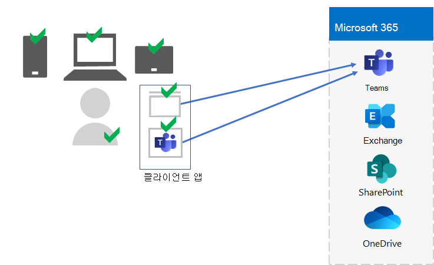

# 5단계. 엔터프라이즈 테넌트에 대한 Microsoft 365 및 앱 관리

Microsoft 365 엔터프라이즈용 앱에는 MDM(모바일 장치 관리) 및 MAM(모바일 응용 프로그램 관리)을 사용하여 조직 내의 해당 장치에서 장치를 관리하고 앱을 사용하는 데 도움이 되는 기능이 포함되어 있습니다. iOS, Android, macOS 및 Windows 장치를 관리하여 데이터를 비롯한 조직의 리소스에 대한 액세스를 보호할 수 있습니다. 예를 들어 조직 외부의 사용자에게 전자 메일이 전송되지 않도록 방지하거나 조직의 데이터를 직장의 개인 장치에서 개인 데이터와 격리할 수 있습니다.

다음은 사용자, 장치 및 로컬 및 클라우드 생산성 앱(예: Microsoft Teams)의 유효성 검사 및 관리 예 Microsoft Teams.

조직의 리소스를 보호하고 보호할 수 있도록 엔터프라이즈용 Microsoft 365 장치 및 앱에 대한 액세스를 관리하는 데 도움이 되는 기능이 포함되어 있습니다. 장치 관리에는 두 가지 옵션이 있습니다.

- Microsoft Intune 위한 포괄적인 장치 및 앱 관리 솔루션입니다.
- 조직에서 장치를 관리하기 위해 모든 Microsoft 365 포함된 Intune 서비스의 하위 집합인 기본 Mobility and Security 자세한 내용은 [Capabilities of Basic Mobility and Security을 참조하십시오.](../admin/basic-mobility-security/capabilities.md)

If you have Microsoft 365 E3 or E5, you should use Intune.

## Microsoft Intune

MDM [Microsoft Intune](/mem/intune/fundamentals/planning-guide) MAM을 사용하여 조직에 대한 액세스를 관리하는 데 사용할 수 있습니다. MDM은 사용자가 Intune에서 장치를 "등록"하는 경우입니다. 장치가 등록된 후 관리되는 장치로, 조직의 정책, 규칙 및 설정을 받을 수 있습니다. 예를 들어 특정 앱을 설치하고, 암호 정책을 만들고, VPN 연결을 설치하는 등 여러 가지를 할 수 있습니다.

개인 장치를 소유한 사용자는 장치를 등록하거나 Intune 및 조직의 정책에 따라 관리하지 않을 수 있습니다. 그러나 여전히 조직의 리소스와 데이터를 보호해야 합니다. 이 시나리오에서는 MAM을 사용하여 앱을 보호할 수 있습니다. 예를 들어 사용자가 디바이스에서 PIN에 액세스할 때 PIN을 입력하도록 요구하는 MAM 정책을 SharePoint 수 있습니다.

개인 장치 및 조직 소유 장치를 관리하는 방법도 결정할 수 있습니다. 디바이스 사용에 따라 장치를 다르게 처리해야 할 수 있습니다.

## ID 및 장치 액세스 구성

Microsoft는 안전하고 생산적인  인력을 확보하기 위해 ID 및 장치 액세스에 대한 구성 집합을 제공합니다. 이러한 구성에는 다음이 포함됩니다.

- Azure AD 조건부 액세스 정책
- Microsoft Intune 및 앱 보호 정책 준수
- Azure AD ID 보호 사용자 위험 정책
- 클라우드 앱의 추가 정책

다음은 사용자, 장치 및 로컬 및 클라우드 생산성 앱(예: 로컬 및 클라우드 생산성 앱)의 사용에 대한 유효성을 검사하고 제한하기 위해 이러한 설정 및 정책을 적용하는 Microsoft Teams.

장치 액세스 및 앱 관리의 경우 다음 문서의 구성을 사용합니다.

- [필수 구성 요소](../security/office-365-security/identity-access-prerequisites.md)
- [일반 ID 및 장치 액세스 정책](../security/office-365-security/identity-access-policies.md)

## 5단계의 결과

Microsoft 365 테넌트에 대한 장치 및 앱 관리의 경우 사용자, 장치 및 로컬 및 클라우드 생산성 앱의 사용에 대한 유효성을 검사하고 제한하기 위한 Intune 설정 및 정책을 결정해야 합니다.

다음은 새 요소가 강조 표시된 Intune 장치 및 앱 관리가 있는 테넌트의 예입니다.

이 그림에서 테넌트에는 다음이 있습니다.

- Intune에 등록된 조직 소유 장치.
- 등록된 디바이스 및 개인 장치에 대한 Intune 장치 및 앱 정책

## 장치 및 앱 관리를 위한 지속적인 유지 관리

지속적인 기준에 따라 다음을 해야 할 수 있습니다. 

- 장치 등록을 관리합니다.
- 추가 앱, 장치 및 보안 요구 사항에 대한 설정 및 정책을 변경합니다.