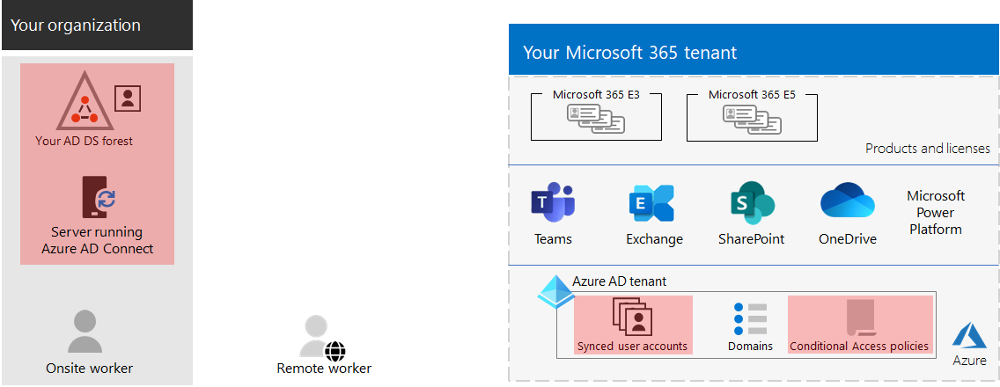
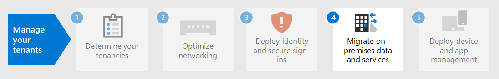

# 3단계. 엔터프라이즈 테넌트의 Microsoft 365 ID

Microsoft 365 테넌트에는 로그인에 대한 ID 및 인증을 Azure Active Directory(Azure AD) 테넌트가 포함되어 있습니다. ID 인프라를 올바르게 구성하는 것은 조직에 대한 사용자 액세스 및 Microsoft 365 관리하는 데 중요합니다.

## 클라우드 전용과 하이브리드 비교

다음은 두 가지 유형의 ID 모델과 가장 잘 맞는 이점입니다.

| 모델 | 설명 | 사용자 Microsoft 365 인증하는 방법 | 최적 시나리오 | 가장 큰 혜택 |
|:-------|:-----|:-----|:-----|:-----|
| 클라우드 전용 | 사용자 계정은 사용자 테넌트의 Azure AD 테넌트에만 Microsoft 365 있습니다. | 테넌트의 Azure AD Microsoft 365 클라우드 ID 계정으로 인증을 수행 합니다. | 사내 AD DS가 필요하지 않은 조직. | 사용하기 간편합니다. 추가 디렉터리 도구 또는 서버는 필요하지 않습니다. |
| 하이브리드 |  사용자 계정이 AD DS(Active Directory 도메인 서비스)에 있으며 복사본은 Microsoft 365 테넌트의 Azure AD 테넌트에도 있습니다. Azure AD 커넥트 AD DS 변경 내용을 Azure AD 테넌트와 동기화하기 위해 사내 서버에서 실행됩니다. Azure AD의 사용자 계정에 이미 해시된 AD DS 사용자 계정 암호의 해시된 버전이 포함되어 있을 수도 있습니다. | 테넌트의 Azure AD Microsoft 365 인증 프로세스를 처리하거나 사용자를 다른 ID 공급자로 리디렉션합니다. | AD DS 또는 다른 ID 공급자를 사용하는 조직 | 사용자는 사내 또는 클라우드 기반 리소스에 액세스할 때 동일한 자격 증명을 사용할 수 있습니다. |
||||||

다음은 클라우드 전용 ID의 기본 구성 요소입니다.

이 그림에서 사내 및 원격 사용자는 해당 테넌트의 Azure AD 테넌트에 있는 계정으로 Microsoft 365 로그인합니다.

다음은 하이브리드 ID의 기본 구성 요소입니다.

이 그림에서, 사내 및 원격 사용자는 자신의 Microsoft 365 AD DS에서 복사된 Azure AD 테넌트의 계정을 사용하여 자신의 Microsoft 365 테넌트에 로그인합니다.

## 프레미스 AD DS 동기화

비즈니스 요구 사항 및 기술 요구 사항에 따라 하이브리드 ID 모델 및 디렉터리 동기화는 비즈니스 요구 사항을 채택하는 엔터프라이즈 고객에게 가장 Microsoft 365. 디렉터리 동기화를 사용하면 AD DS의 ID를 관리할 수 있으며 사용자 계정, 그룹 및 연락처에 대한 모든 업데이트가 Microsoft 365 테넌트의 Azure AD 테넌트와 동기화됩니다.

> [!NOTE]
> AD DS 사용자 계정이 처음으로 동기화되는 경우 사용자에게 Microsoft 365 라이선스가 자동으로 할당되지 Microsoft 365 서비스와 같은 서비스에 액세스할 수 없습니다. 먼저 사용 위치를 할당해야 합니다. 그런 다음 그룹 구성원 자격을 통해 개별적으로 또는 동적으로 이러한 사용자 계정에 라이선스를 할당합니다.

다음은 하이브리드 ID 모델을 사용할 때의 두 가지 인증 유형입니다.

| 인증 유형 | 설명 |
|:-------|:-----|
| 관리되는 인증 | Azure AD는 로컬에 저장된 해시된 버전의 암호를 사용하여 인증 프로세스를 처리하거나, 자격 증명을 사내 소프트웨어 에이전트로 전송하여 인증 프로세스를 처리합니다.      관리되는 인증에는 PHS(암호 해시 동기화) 및 PTA(통과 인증)의 두 가지 유형이 있습니다. PHS를 사용하여 Azure AD는 인증 자체를 수행합니다. PTA를 사용하는 경우 Azure AD에는 AD DS가 인증을 수행하게 됩니다. |
| 페더레이션 인증 | Azure AD는 인증을 요청하는 클라이언트 컴퓨터를 다른 ID 공급자로 리디렉션합니다. |
|  |  |

자세한 [내용은 올바른](/azure/active-directory/hybrid/choose-ad-authn) 인증 방법 선택을 참조합니다.

## 강력한 로그인 강요

사용자 로그인의 보안을 강화하기 위해 다음 표의 기능을 사용 합니다.

| 기능 | 설명 | 추가 정보 | 라이선스 요구사항 |
|:-------|:-----|:-----|:-----|:-----|
| 비즈니스용 Windows Hello | 다른 장치에서 로그인할 때 암호를 강력한 2단계 인증으로 Windows 대체합니다. 2단계 인증 요소는 장치에 연결된 새로운 유형의 사용자 자격 증명과 생체 인식 또는 PIN입니다. | [비즈니스용 Windows Hello 개요](/windows/security/identity-protection/hello-for-business/hello-overview) | Microsoft 365 E3 혹은 E5 |
| Azure AD 암호 보호 | 알려진 약한 암호와 해당 변형을 검색하고 차단하며 조직에 특정한 약한 용어를 추가로 차단할 수도 있습니다. | [Azure AD 암호 보호 구성](/azure/active-directory/authentication/concept-password-ban-bad) | Microsoft 365 E3 혹은 E5 |
| MFA(다단계 인증) 사용 | MFA를 사용하려면 사용자 로그인 시 사용자 계정 암호 이상의 추가 확인(예: 스마트폰 앱으로 확인 또는 스마트폰으로 전송된 문자 메시지)이 적용될 수 있습니다. 사용자가 [MFA를](https://support.microsoft.com/office/set-up-multi-factor-authentication-in-microsoft-365-business-a32541df-079c-420d-9395-9d59354f7225) 설정하는 방법에 대한 지침은 이 비디오를 참조하세요. | [엔터프라이즈용 Microsoft 365 MFA](../enterprise/microsoft-365-secure-sign-in.md#mfa) | Microsoft 365 E3 혹은 E5 |
| ID 및 장치 액세스 구성 | 설정 요청이 허용될지 여부 및 조건에 따라 부여할지 여부를 결정하는 조건부 액세스, Intune 및 Azure AD ID 보호 정책과 결합된 권장 선행 조건 기능 및 해당 설정으로 구성된 정책 및 정책입니다.  | [ID 및 장치 액세스 구성](../security/office-365-security/microsoft-365-policies-configurations.md) | Microsoft 365 E3 혹은 E5 |
| Azure AD ID 보호 | 공격자가 조직의 클라우드 서비스 및 데이터에 액세스하기 위해 사용자의 계정 이름과 암호를 확인하는 자격 증명 손상으로부터 보호합니다. | [Azure AD ID 보호](/azure/active-directory/active-directory-identityprotection) | Microsoft 365 E5 Microsoft 365 E3 위협 방지 추가 & 있는 사용자 또는 사용자 |
|  |  |  |

## 3단계의 결과

Microsoft 365 테넌트의 ID에 대해 다음을 결정했습니다.

- 사용할 ID 모델입니다.
- 강력한 사용자 및 장치 액세스를 적용하는 방법

다음은 새 하이브리드 ID 요소가 강조 표시된 테넌트의 예입니다.

이 그림에서 테넌트에는 다음이 있습니다.

- DirSync 서버 및 Azure AD 서버를 사용하여 Azure AD 테넌트와 동기화되는 AD DS 커넥트.
- AD DS 포리스트의 AD DS 사용자 계정 및 기타 개체의 복사본입니다.
- 사용자 계정을 기반으로 보안 사용자 로그인 및 액세스를 적용하는 조건부 액세스 정책 집합입니다.

## ID에 대한 지속적인 유지 관리

지속적인 기준에 따라 다음을 해야 할 수 있습니다.

- 사용자 계정 및 그룹을 추가하거나 수정합니다. 클라우드 전용 ID의 경우 클라우드 기반 사용자 및 그룹을 Azure AD 도구(예: Microsoft 365 관리 센터 또는 PowerShell)로 유지 관리합니다. 하이브리드 ID의 경우 AD DS 도구를 사용하여 사내 사용자 및 그룹을 유지 관리합니다.
- 로그인 보안 요구 사항을 적용하기 위해 ID 및 장치 액세스 구성을 추가하거나 수정합니다.

## 다음 단계

마이그레이션을 [계속](tenant-management-migration.md) 진행하여 Office 서버와 데이터를 마이그레이션할 Microsoft 365.