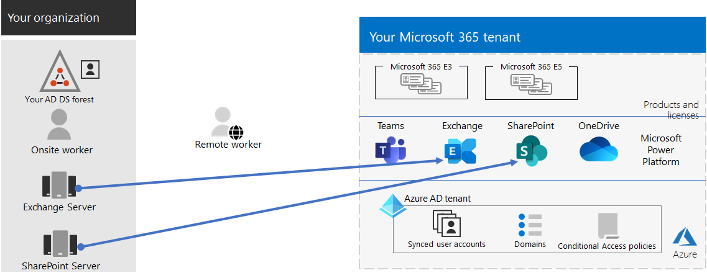
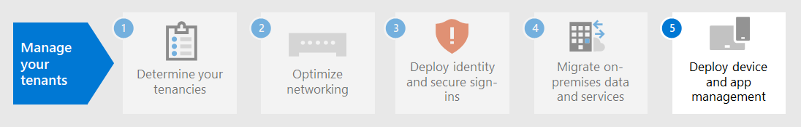

# 4단계. 엔터프라이즈 테넌트에 Microsoft 365 마이그레이션

대부분의 엔터프라이즈 조직에는 여러 릴리스의 운영 체제, 클라이언트 소프트웨어 및 서버 소프트웨어가 포함된 다른 환경이 있습니다. Microsoft 365 엔터프라이즈용 버전에는 IT 인프라의 주요 구성 요소 중 가장 안전한 버전이 포함되어 있습니다. 클라우드 기술을 활용하도록 설계된 생산성 기능도 포함되어 있습니다.

엔터프라이즈 통합 제품군에 대한 Microsoft 365 비즈니스 가치를 극대화하려면 이러한 릴리스를 마이그레이션하는 전략을 계획하고 구현하기 시작해야 합니다.

| 시작 | 받는 사람 |
|:-------|:-----|
| Windows 7 및 Windows 8.1 | Windows 10 Enterprise |
| Office 장치에 설치된 클라이언트 제품 관리 | 엔터프라이즈용 Microsoft 365 앱 |
| Office 서버에 설치된 서버 제품 | 해당 동등한 클라우드 기반 서비스는 Microsoft 365 |
|  |  |

## 마이그레이션을 Windows 10

엔터프라이즈 Microsoft 365 라이선스에 대한 각 라이선스에는 라이선스가 Windows 10 Enterprise. 7 또는 Windows 또는 Windows 8.1 장치를 마이그레이션하려면 바로 업그레이드를 실행할 수 있습니다. *2020년 1월 14일* Windows 7에 대한 지원이 종료됩니다. 

전체 업그레이드 이후의 업그레이드를 Windows 10 Enterprise 추가 방법은 Windows 10 [배포 시나리오를 참조합니다.](/windows/deployment/windows-10-deployment-scenarios) 직접 [Windows 10 배포를 계획](/windows/deployment/planning/)할 수도 있습니다.

## 마이그레이션을 엔터프라이즈용 Microsoft 365 앱

Microsoft 365 엔터프라이즈용 엔터프라이즈용 Microsoft 365 앱 Microsoft 클라우드에서 설치 및 업데이트되는 Office 클라이언트 제품 버전(Word, PowerPoint, Excel 및 Outlook)을 포함합니다. 자세한 내용은 에 대한 정보를 [엔터프라이즈용 Microsoft 365 앱.](/deployoffice/about-microsoft-365-apps)

2019 또는 Office 컴퓨터를 최신으로 유지하는 대신 다음 단계를 수행합니다.

1. 사용자에 대한 Microsoft 365 라이선스를 구입하고 할당합니다.
2. 컴퓨터에서 Office 2013 또는 Office 2016을 제거합니다.
3. 개별적으로 엔터프라이즈용 Microsoft 365 앱 IT 롤아웃 중에 설치합니다. 자세한 내용은 [Microsoft 365 앱용 배포 가이드](/deployoffice/deployment-guide-microsoft-365-apps)를 참조하세요.

엔터프라이즈용 Microsoft 365 앱 새로운 기능 업데이트를 자동으로 설치하고 보안 및 생산성을 높이기 위해 Microsoft 365 클라우드 기반 서비스를 활용할 수 있습니다.

## 프레미스 서버 및 데이터를 프레미스 서버로 Microsoft 365

Microsoft 365 엔터프라이즈용 버전에는 웹 브라우저 및 Outlook 클라이언트와 같은 Office 서버 소프트웨어의 일부와 동일한 도구 중 일부를 사용하는 클라우드 기반 버전의 Office 서버 서비스가 포함되어 있습니다. 이러한 클라우드 기반 서비스는 보안 및 새 기능을 위해 자동으로 업데이트됩니다. 마이그레이션 후 IT 부서에서 사내 서버를 유지 관리하고 업데이트하는 데 걸리는 시간을 절약할 수 있습니다.

특정 작업 부하에 대한 사용자 및 데이터를 마이그레이션하는 Microsoft 365 리소스를 사용합니다.

- [사서함을 프레미스 사서함에서 Exchange Server Exchange Online](/exchange/hybrid-deployment/move-mailboxes)
- [SharePoint Server에서 SharePoint Online으로 SharePoint 마이그레이션](/sharepointmigration/migrate-to-sharepoint-online)
- [비즈니스용 Skype Online으로 Microsoft Teams](/microsoftteams/migration-interop-guidance-for-teams-with-skype)

## 전체 조직 전환

전체 조직을 엔터프라이즈용 조직의 제품 및 서비스로 이동하는 Microsoft 365 전환 포스터를 다운로드합니다.

이 두 페이지 포스터는 기존 인프라를 신속하게 인벤터리하는 방법입니다. 엔터프라이즈용 2016에서 제품 또는 서비스로 이동하기 위한 지침을 Microsoft 365 데 사용할 수 있습니다. 이 Windows 및 Office 및 기타 인프라 및 보안 요소(예: 장치 관리, ID 및 위협 방지, 정보 보호 및 규정 준수)를 보여줍니다.

## 4단계의 결과

테넌트의 Microsoft 365 경우 다음을 결정했습니다.

- 7 또는 Windows 실행되는 Windows 8.1 장치 및 장치로 업데이트할 Windows 10 Enterprise.
- 클라이언트 앱을 실행 중인 Office 및 엔터프라이즈용 앱으로 업데이트할 Microsoft 365 계획입니다.
- 어떤 Office 서버 서비스를 해당 서버 Microsoft 365 마이그레이션해야 하는지와 해당 서비스 및 해당 데이터를 마이그레이션할 계획입니다.

다음은 전체 마이그레이션이 완료된 테넌트의 예입니다.

이 그림에서 조직은 다음을 하게 됩니다.

- 해당 사서함의 Exchange Server 마이그레이션한 Exchange Online.
- 서버 사이트 및 SharePoint 프레미스 SharePoint 마이그레이션했습니다Microsoft 365.

## 마이그레이션을 위한 지속적인 유지 관리

지속적인 기준에 따라 다음을 해야 할 수 있습니다.

- 사서함 마이그레이션의 Exchange 따라 조직에 Exchange Online 롤아웃을 계속 진행합니다.
- 사이트 마이그레이션의 상태와 SharePoint 조직에 SharePoint Microsoft 365 롤아웃을 계속합니다.

## 다음 단계

장치 및 [앱 관리를 계속하여](tenant-management-device-management.md) 장치 및 앱 관리를 배포합니다.