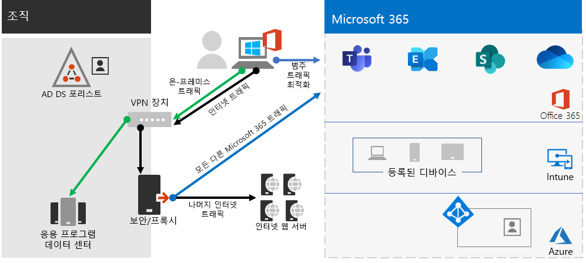
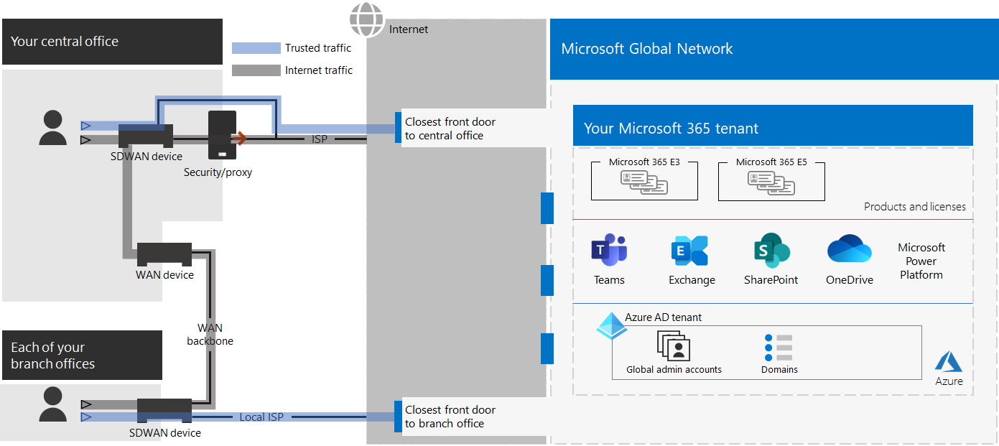

# 2단계. 엔터프라이즈 테넌트에 Microsoft 365 최적의 네트워킹

Microsoft 365 엔터프라이즈용 앱에는 Teams 및 Exchange Online, Microsoft Intune 등의 클라우드 생산성 앱과 여러 ID 및 보안 서비스가 Microsoft Azure. 이러한 모든 클라우드 기반 서비스는 인터넷의 모든 위치에 있는 클라이언트 장치의 연결 보안, 성능 및 안정성을 기반으로 합니다. 

테넌트에 대한 네트워크 액세스를 최적화하려면 다음을 해야 합니다.

- Microsoft 전역 네트워크에 가장 가까운 위치와의 경로를 최적화합니다.
- 원격 액세스 VPN 솔루션을 사용하는 원격 사용자를 위해 Microsoft 전역 네트워크에 대한 액세스를 최적화합니다.
- 네트워크 Insights 사용하여 사무실 위치의 네트워크 경계를 디자인합니다.
- 사용자 지정을 통해 사이트 SharePoint 호스트되는 특정 자산에 대한 액세스를 Office 365 CDN.
- 끝점 목록이 있는 신뢰할 수 있는 트래픽에 Microsoft 365 처리를 무시하도록 프록시 및 네트워크 에지 장치를 구성하고 변경이 적용될 때 목록 업데이트를 자동화합니다.

## Enterprise 작업자 지원

엔터프라이즈 네트워크의 경우 클라이언트와 가장 가까운 네트워크 끝점 간에 최고 성능의 네트워크 액세스를 사용하도록 설정하여 최종 Microsoft 365 최적화해야 합니다. 최종 사용자 환경의 품질은 사용자가 사용하는 응용 프로그램의 성능 및 응답 성능과 직접적인 관련이 있습니다. 예를 들어 Microsoft Teams 전화 통화, 회의 및 공유 화면 공동 작업을 할 수 있도록 짧은 대기 시간을 사용할 수 있습니다.

네트워크 디자인의 기본 목표는 클라이언트 장치에서 Microsoft 전역 네트워크로의 RTT(왕복 시간)를 줄이면서 대기 시간이 짧은 모든 Microsoft의 데이터 센터를 전 세계에 분산된 낮은 대기 시간, 고가용성 클라우드 응용 프로그램 진입점과 상호 연결하는 Microsoft의 공용 네트워크 백본으로의 RTT(왕복 시간)를 최소화하는 것입니다.

다음은 기존 엔터프라이즈 네트워크의 예입니다.

이 그림에서 지점은 WAN(Wide Area Network) 장치 및 WAN 백본을 통해 중앙 사무실에 연결합니다. 인터넷 액세스는 중앙 사무실의 네트워크 에지 및 ISP(인터넷 서비스 공급자)의 보안 또는 프록시 장치를 통해 액세스합니다. 인터넷에서 Microsoft 전역 네트워크에는 전 세계 지역에 일련의 정문이 있습니다. 조직은 또한 트래픽에 대한 추가 패킷 처리 및 보안을 위해 중간 위치를 사용할 수 있습니다. 조직의 Microsoft 365 테넌트는 Microsoft 전역 네트워크 내에 있습니다.

클라우드 서비스에 대한 이 구성의 Microsoft 365:

- 지사 사용자의 경우 트래픽이 로컬이 아닌 정문으로 전송되고 대기 시간이 증가합니다.
- 중간 위치에 트래픽을 보내면 신뢰할 수 있는 트래픽에 대해 중복된 패킷 처리를 수행하여 대기 시간이 증가하는 네트워크 헤어피가 생성됩니다.
- 네트워크 에지 장치는 신뢰할 수 있는 트래픽에 대해 원치 않는 중복 패킷 처리를 수행하여 대기 시간을 증가합니다.

네트워크 Microsoft 365 최적화하는 것은 복잡할 필요가 없습니다. 다음과 같은 몇 가지 주요 원칙에 따라 최상의 성능을 얻을 수 있습니다.

- Microsoft Microsoft 365 트러스트된 트래픽인 네트워크 트래픽을 식별합니다.
- 사용자가 연결되는 각 위치에서 인터넷으로의 Microsoft 365 네트워크 트래픽의 로컬 분기 Microsoft 365.
- 네트워크 헤어피를 피합니다.
- 트래픽이 Microsoft 365 및 패킷 검사 장치를 무시하도록 허용합니다.

이러한 원칙을 구현하면 엔터프라이즈 네트워크에 최적화된 엔터프라이즈 네트워크가 Microsoft 365.

이 그림에서 지사는 신뢰할 수 있는 Microsoft 365 트래픽을 지역적으로 가장 가까운 프런트 도어로 보내는 소프트웨어 정의 WAN 장치(SDWAN) 장치를 통해 자체 인터넷에 연결합니다. 중앙 사무실에서 신뢰할 수 있는 Microsoft 365 트래픽이 보안 또는 프록시 장치를 우회하고 중간 장치는 더 이상 사용되지 않습니다.

다음은 최적화된 구성으로 기존 엔터프라이즈 네트워크의 대기 시간 문제를 해결하는 방법입니다.

- 신뢰할 수 있는 Microsoft 365 트래픽은 WAN 백본을 건너뛰고 모든 사무실의 로컬 프런트 도어로 전송되어 대기 시간이 줄어 니다.
- 신뢰할 수 있는 트래픽에 대해 중복 패킷 처리를 수행하는 네트워크 헤어 Microsoft 365 건너뜁니다. 이 경우 대기 시간이 감소합니다.
- 신뢰할 수 있는 트래픽에 대해 원치 않는 중복 패킷 처리를 수행하는 네트워크 에지 Microsoft 365 건너뜁니다.

자세한 내용은 Microsoft 365 [네트워크 연결 개요를 참조하세요.](../enterprise/microsoft-365-networking-overview.md)

## 원격 작업자

원격 작업자가 기존 VPN 클라이언트를 사용하 여 조직 네트워크에 대한 원격 액세스 권한을 얻는 경우, VPN 클라이언트에 분할 터널링 지원이 되는지 확인합니다. 분할 터널링을 사용하지 않는 경우에는 모든 원격 작업 트래픽이 조직의 에지 장치로 전송되어 처리된 후 인터넷으로 전송되지 않고 VPN 연결을 통해 전송됩니다. 예를 들면 다음과 같습니다.

이 그림에서 Microsoft 365 트래픽은 VPN 클라이언트의 물리적 위치에서 멀리 떨어져 있는 Microsoft 전역 네트워크 정문으로 전달될 수 있는 조직을 통한 간접 경로를 취해야 합니다. 이 간접 경로는 네트워크 트래픽에 대기 시간을 더하여 전반적인 성능을 저하시킵니다. 

분할 터널링을 사용할 경우, 사용자는 특정 유형의 트래픽을 제외하여 VPN 연결을 통해 조직 네트워크에 보내지 않도록 VPN 클라이언트를 구성할 수 있습니다.

Microsoft 365 클라우드 리소스에 대한 액세스를 최적화하려면 VPN 연결을 통해 범주 **최적화** Microsoft 365 끝점으로의 트래픽을 제외하도록 분할 터널링 VPN 클라이언트를 구성합니다. 자세한 내용은 [끝점 범주](../enterprise/microsoft-365-network-connectivity-principles.md#new-office-365-endpoint-categories) Office 365 분할  터널링에 대한 최적화 범주 끝점 목록을 참조하세요.

다음은 클라우드 앱에 대한 대부분의 트래픽이 VPN 연결을 우회하는 분할 터널링에 Microsoft 365 흐름입니다.

이 그림에서 VPN 클라이언트는 인터넷을 통해 직접 Microsoft 365 Microsoft 전역 네트워크로 가장 가까운 정문으로 중요한 클라우드 서비스 트래픽을 보내고 수신합니다.

자세한 내용과 지침은 [VPN 분산 터널링을 사용한 원격 근무자의 Office 365 연결 최적화](../enterprise/microsoft-365-vpn-split-tunnel.md)를 참조하세요. 

## 네트워크 Insights 사용(미리 보기)

네트워크 인사이트는 사무실 위치의 네트워크 경계를 디자인하는 데 도움이 되는 Microsoft 365 테넌트에서 수집된 성능 메트릭입니다. 각 인사이트는 사내 사용자가 테넌트에 액세스하는 각 지리적 위치에 대해 지정된 문제의 성능 특성에 대한 실시간 세부 정보를 제공합니다.

테넌트에 대해 표시될 수 있는 두 가지 테넌트 수준 네트워크 인사이트가 있습니다.

- [Exchange 문제로 영향을 미치는 샘플링된 연결 수](../enterprise/office-365-network-mac-perf-insights.md#exchange-sampled-connections-impacted-by-connectivity-issues)
- [SharePoint 문제로 영향을 미치는 샘플링된 연결 수](../enterprise/office-365-network-mac-perf-insights.md#sharepoint-sampled-connections-impacted-by-connectivity-issues)

다음은 각 사무실 위치에 대한 특정 네트워크 정보입니다.

- [백hauled 네트워크 유선](../enterprise/office-365-network-mac-perf-insights.md#backhauled-network-egress)
- [가까운 고객을 위해 검색된 성능 향상](../enterprise/office-365-network-mac-perf-insights.md#better-performance-detected-for-customers-near-you)
- [최적이 아닌 서비스 Exchange Online 프론트 도어 사용](../enterprise/office-365-network-mac-perf-insights.md#use-of-a-non-optimal-exchange-online-service-front-door)
- [최적화되지 않은 온라인 SharePoint 프론트 도어 사용](../enterprise/office-365-network-mac-perf-insights.md#use-of-a-non-optimal-sharepoint-online-service-front-door)
- [정문에서 낮은 SharePoint 다운로드](../enterprise/office-365-network-mac-perf-insights.md#low-download-speed-from-sharepoint-front-door)
- [중국 사용자 최적의 네트워크 유출](../enterprise/office-365-network-mac-perf-insights.md#china-user-optimal-network-egress)

> [!IMPORTANT]
> Microsoft 365 관리 센터의 네트워크 정보, 성능 권장 사항 및 평가는 현재 미리 보기 상태입니다. 기능 미리 보기 프로그램에 Microsoft 365 테넌트에만 사용할 수 있습니다.

자세한 내용은 네트워크 Microsoft 365 [를 Insights.](../enterprise/office-365-network-mac-perf-insights.md)

## SharePoint 성능 Office 365 CDN

클라우드 기반 Content Delivery Network(CDN)를 사용하면 로드 시간을 줄이고 대역폭을 절약하고 응답 속도를 단축할 수 있습니다. 이 CDN 그래픽 또는 비디오 파일과 같은 정적 자산을 요청하는 브라우저에 더 가깝게 캐싱하여 성능을 향상시키는 것이 다운로드 속도를 높이고 대기 시간을 줄이는 데 도움이 됩니다. SharePoint Microsoft 365 E3 및 E5에 포함된 기본 제공 Office 365 Content Delivery Network(CDN)를 사용하여 정적 자산을 호스트하여 SharePoint 성능을 제공할 수 있습니다.

Office 365 CDN은 여러 위치, 즉 _출발지_ 에 정적 자산을 호스트하고 글로벌 고속 네트워크에서 제공할 수 있는 여러 CDN으로 구성됩니다. 원본, 비공개 원본 또는 Office 365 CDN 콘텐츠의 종류에 따라 둘  다를 추가할  수 있습니다.

배포 및 구성하면 Office 365 CDN 원본에서 자산을 업로드하고 인터넷을 통해 사용자에게 빠르게 액세스할 수 있습니다.

자세한 내용은 [Use the Office 365 CDN with SharePoint Online을 참조하십시오.](../enterprise/use-microsoft-365-cdn-with-spo.md)

## 자동화된 끝점 목록

프레미스 클라이언트, 에지 장치 및 클라우드 기반 패킷 분석 서비스가 신뢰할 수 있는 Microsoft 365 트래픽 처리를 건너뛰도록 설정하려면 Microsoft 365 서비스에 해당하는 끝점 집합(IP 주소 범위 및 DNS 이름)으로 구성해야 합니다. 이러한 끝점은 방화벽 및 기타 에지 보안 장치에서 수동으로 구성할 수 있으며, 클라이언트 컴퓨터의 PAC 파일로는 팩스를 무시하거나 지사에서 SD-WAN 장치를 구성할 수 있습니다. 그러나 끝점은 시간이 지날 때 변경되어 이러한 위치에서 끝점 목록을 수동으로 수동으로 유지 관리해야 합니다.

클라이언트 PAC 파일 및 네트워크 장치에서 Microsoft 365 끝점에 대한 목록 및 변경 관리를 자동화하려면 OFFICE 365 IP 주소 및 URL REST 기반 웹 서비스를 [사용합니다.](../enterprise/microsoft-365-ip-web-service.md) 이 서비스를 사용하면 네트워크 트래픽을 보다 Microsoft 365 식별하고 차별화할 수 있어 최신 변경 내용을 보다 쉽게 평가, 구성 및 최신으로 유지 할 수 있습니다.

PowerShell, Python 또는 기타 언어를 사용하여 시간이 지날 때 끝점에 대한 변경 내용을 결정하고 PAC 파일 및 에지 네트워크 장치를 구성할 수 있습니다.

기본 프로세스는 다음입니다.

1. OFFICE 365 IP 주소 및 URL 웹 서비스 및 선택한 구성 메커니즘을 사용하여 현재 MICROSOFT 365 끝점 집합으로 PAC 파일 및 네트워크 장치를 구성합니다.
2. 매일 다시 실행하여 끝점의 변경 내용을 확인하거나 알림 방법을 사용합니다.
3. 변경 내용이 검색되면 클라이언트 컴퓨터의 PAC 파일을 다시 생성하고 다시 재배포하고 네트워크 장치를 변경합니다.

자세한 내용은 IP 주소 Office 365 웹 서비스 [를 참조하세요.](../enterprise/microsoft-365-ip-web-service.md)

## 2단계의 결과

최적의 Microsoft 365 테넌트의 경우 다음을 결정했습니다.

- 모든 지점에 인터넷 연결을 추가하고 네트워크 헤어피를 제거하여 사내 사용자의 네트워크 성능을 최적화하는 방법
- 지속적인 업데이트를 포함하여 클라이언트 기반 PAC 파일 및 네트워크 장치 및 서비스에 대해 자동화된 신뢰할 수 있는 끝점 목록을 구현하는 방법(엔터프라이즈 네트워크에 가장 적합)
- 원격 작업자의 액세스를 지원하기 위해 사내 리소스에 대한 액세스 권한을 지원하는 방법
- 네트워크 응용 Insights
- 배포 방법 Office 365 CDN.

다음은 최적의 네트워킹을 통해 엔터프라이즈 조직 및 해당 테넌트의 예입니다.

[이 이미지의 더 큰 버전 참조](https://github.com/MicrosoftDocs/microsoft-365-docs/raw/public/microsoft-365/media/tenant-management-overview/tenant-management-tenant-build-step2.png)

이 그림에서는 이 엔터프라이즈 조직의 테넌트에 다음이 있습니다.

- 신뢰할 수 있는 네트워크 트래픽을 로컬 프런트 도어로 전달하는 SDWAN Microsoft 365 각 지점에 대한 로컬 인터넷 액세스입니다.
- 네트워크 헤어피 없음
- 신뢰할 수 있는 트래픽을 로컬 Microsoft 365 전달하는 중앙 사무실 보안 및 프록시 에지 장치

## 최적의 네트워킹을 위한 지속적인 유지 관리

지속적인 기준에 따라 다음을 해야 할 수 있습니다.

- 끝점의 변경 내용을 위해 에지 장치 및 배포된 PAC 파일을 업데이트하거나 자동화된 프로세스가 제대로 작동하는지 확인합니다.
- 2016에서 자산을 Office 365 CDN.
- 끝점 변경에 대해 VPN 클라이언트의 분할 터널링 구성을 업데이트합니다.

## 다음 단계

ID를 [계속](tenant-management-identity.md) 유지하여 사내 계정 및 그룹을 동기화하고 보안 사용자 로그인을 적용합니다.
