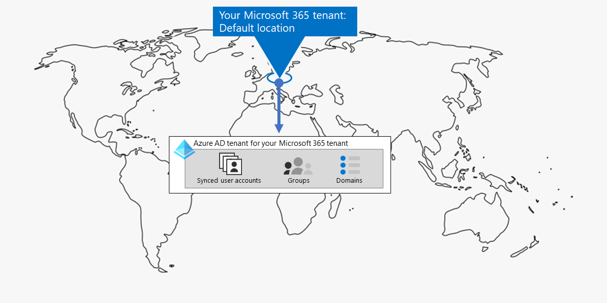

# 엔터프라이즈용 테넌트 Microsoft 365 테넌트 관리

클라우드 컴퓨팅을 사용하여 조직의 디지털 혁신 경로를 만들려면 작업자가 생산성, 공동 작업, 성능, 개인 정보 보호, 규정 준수 및 보안에 대해 사용할 수 있는 확고한 기반을 마련해야 합니다.

Microsoft 365 테넌트의 올바른 구성은 이러한 기반을 제공하며, 직원들은 업무를 완료하는 데 집중하고 IT 부서는 추가 비즈니스 가치를 제공하는 종단 대 솔루션에 집중할 수 있도록 합니다.

이 솔루션에서는 다음 단계에서 해당 기초를 구성합니다.

1. 테넌트 확인
2. 네트워킹 최적화
3. ID 동기화 및 보안 로그인 적용
4. Windows, Office 및 Office 서버 및 데이터 마이그레이션
5. 장치 및 앱 관리 배포

그러나 먼저 테넌트가 무엇일지와 확고한 기반을 제공하는 테넌트의 모양을 이해해보는 것이 가장 먼저입니다.

## 정의된 Microsoft 365 테넌트

Microsoft 365 테넌트는 Microsoft 365 및 유럽 또는 북미와 같은 특정 기본 위치에 저장된 조직 데이터의 전용 인스턴스입니다. 이 위치는 조직에 대한 테넌트를 만들 때 지정됩니다. 각 Microsoft 365 테넌트는 고유하며 다른 모든 테넌트와는 Microsoft 365 분리됩니다. Microsoft에서 하나 Microsoft 365(예: Microsoft 365 E3 또는 E5 및 각 제품에 대한 라이선스 집합)를 구매할 때 테넌트가 생성됩니다.

또한 Microsoft 365 테넌트에는 사용자 계정Azure Active Directory 그룹 및 기타 개체에 대한 Azure AD 전용 인스턴스인 Azure AD(Azure AD) 테넌트도 포함됩니다. 각 Azure AD 테넌트는 다른 모든 Azure AD 테넌트와는 고유하며 고유합니다. 조직에 Azure 구독으로 설정할 수 있는 여러 Azure AD 테넌트가 있을 수 Microsoft 365 테넌트는 테넌트 생성 시 만들어진 Azure AD 테넌트 하나만 사용할 수 있습니다.

예를 들면 다음과 같습니다.

*테넌트 관리는* 테넌트의 계획, 배포 및 Microsoft 365 작업입니다.

## 잘 디자인된 운영 테넌트의 특성

테넌트에 대한 올바른 이름과 위치 이외에 계획, 배포 및 관리해야 하는 추가 요소가 있습니다. 이를 통해 Microsoft Teams 및 앱과 같은 클라우드 생산성 앱에 대한 Microsoft Teams Exchange Online 효과적이고, 안전하며, 효율적으로 작업할 수 &mdash; &mdash; 있습니다.

요소는 다음과 같습니다.

- 올바른 제품(구독) 및 라이선스 집합이 있습니다.
  - 제품 집합은 비즈니스, IT 및 보안 요구와 일치합니다.
  - 직원에게 적절한 수의 라이선스가 있으며 직원의 예상 인원이 변경됩니다.
- 네트워킹의 경우:
  - 올바른 DNS 도메인 이름을 구성한 경우
  - 엔터프라이즈 네트워크의 경우, Microsoft 네트워크에 대한 네트워크 트래픽을 사설 작업자를 위해 최적화해야 합니다.
  - VPN 클라이언트를 사용하는 원격 작업자를 위해 네트워크 트래픽을 최적화해야 합니다.
- AD DS(Active Directory 도메인 서비스) 계정, 그룹 및 기타 개체를 동기화했습니다.
  - Azure AD 테넌트 계정은 전자 메일 주소에 Exchange Online DNS 도메인이 있는 사서함에 매핑됩니다.
  - 사용자 계정에 올바른 구매 제품(예: Microsoft 365 E3 또는 E5)에서 올바른 라이선스가 할당되어 있습니다.
- 강력한 ID 및 액세스 관리를 구성했습니다.
  - 암호 없는 또는 MFA(다단계 인증)를 사용하여 보안 사용자 로그인이 필요합니다.
  - 더 높은 수준의 보안을 위해 로그인 요구 사항 및 제한을 적용하는 조건부 액세스 정책이 있습니다.
- Office 서버와 해당 데이터가 클라우드 앱으로 마이그레이션되거나 하이브리드 구성에서 사용 중인 경우
- Intune 또는 기본 이동성 및 보안이 기본 제공된 디바이스 관리를 Microsoft 365.
  - 조직 소유 장치가 등록되고 관리됩니다.
  - 개인 디바이스용 앱은 관리됩니다.

다음은 이러한 요소가 모두 Microsoft 365 테넌트의 예입니다.

이 그림에서 Microsoft 365 테넌트에는 다음이 포함됩니다.

- Microsoft 365 E3 및 E5용 제품 및 라이선스
- Microsoft 365 앱을 설치합니다.
- 등록된 장치 및 장치 및 응용 프로그램 정책이 있는 Intune
- 사용자 계정(그룹 및 기타 디렉터리 개체가 표시되지 않습니다), 도메인 및 조건부 액세스 정책이 동기화된 Azure AD 테넌트입니다.

## 엔터프라이즈용 테넌트 Microsoft 365 테넌트 기능

다음 섹션 및 표에는 이 솔루션의 단계에 대한 주요 기능 및 라이선스가 나열되어 있습니다.

### 테넌트

|기능 또는 특징|설명|라이선싱|
|---|---|---|
|여러 테넌트|각 Microsoft 365 테넌트는 고유하며 다른 모든 테넌트와는 Microsoft 365 분리됩니다. 테넌트가 여러 개인 경우 테넌트 관리 및 사용자에게 서비스를 제공하는 경우 제한 사항 및 추가 고려 사항이 있습니다.|Microsoft 365 E3 혹은 E5|
|교차 테넌트 사서함 마이그레이션|테넌트 관리자는 테넌트 간에 사서함을 이동할 수 있습니다(인프라 종속성은 최소로 유지). 이렇게 하여 사서함을 오프보드하고 온보드할 필요가 없습니다.|Microsoft 365 E3 혹은 E5|
|Multi-Geo|테넌트는 데이터 보관 요구 사항을 충족하기 위해 선택한 다른 데이터 센터 지리적 위치에 보관된 데이터를 저장할 수 있습니다.|Microsoft 365 E3 혹은 E5|
|핵심 데이터를 새 데이터 센터 지역으로 이동|Microsoft가 추가 용량 및 계산 리소스를 위해 새 데이터 센터 지역을 추가하면 핵심 고객 데이터에 대한 지역 내 데이터 레지스터에 대한 데이터 센터 지리적 이동을 요청할 수 있습니다.|Microsoft 365 E3 혹은 E5|
||||

### 네트워킹

|기능 또는 특징|설명|라이선싱|
|---|---|---|
|네트워크 Insights|사무실 위치의 네트워크 경계를 Microsoft 365 수 있도록 테넌트에서 수집한 네트워크 성능 메트릭입니다.|Microsoft 365 E3 혹은 E5|
|끝점 업데이트 자동화|클라이언트 PAC 파일 및 네트워크 장치 및 Microsoft 365 끝점에 대한 구성 및 지속적인 업데이트를 자동화합니다.|Microsoft 365 E3 혹은 E5|
||||

### ID

|기능 또는 특징|설명|라이선싱|
|---|---|---|
|Azure AD 테넌트와 AD DS(Active Directory 도메인 서비스) 동기화|사용자 계정, 그룹 및 기타 개체에 대해 사내 ID 공급자를 활용합니다.|Microsoft 365 E3 혹은 E5|
|보안 기본값을 사용하여 MFA 실행|로그인에 대한 보조 인증을 요구함으로써 손상된 ID와 장치로부터 보호합니다. 보안 기본값은 모든 사용자 계정에 대해 MFA를 요구합니다.|Microsoft 365 E3 혹은 E5|
|조건부 액세스로 MFA 실행|조건부 액세스 정책을 통해 로그인의 특성에 따라 MFA를 요구합니다.|Microsoft 365 E3 혹은 E5|
|위험 기반 조건부 액세스로 MFA 실행|ID용 Microsoft Defender와 함께 사용자 로그인의 위험을 기반으로 하는 MFA가 필요합니다.|Azure AD Premium P2 라이선스를 포함한 Microsoft 365 E5 또는 E3|
|셀프 서비스 암호 재설정(SSPR)|사용자가 암호 또는 계정을 다시 설정하거나 잠금 해제할 수 있습니다.|Microsoft 365 E3 혹은 E5|
||||

### 마이그레이션

|기능 또는 특징|설명|라이선싱|
|---|---|---|
|Windows 10으로 마이그레이션|7 또는 Windows 실행되는 장치를 Windows 8.1 Windows 10 Enterprise.|Windows 10 Enterprise 또는 E5에 포함된 Microsoft 365 E3 라이선스|
|마이그레이션을 엔터프라이즈용 Microsoft 365 앱|Word 및 Office 같은 클라이언트 PowerPoint 새 기능으로 업데이트된 클라우드에서 설치된 버전으로 마이그레이션합니다.|Microsoft 365 E3 혹은 E5|
|프레미스 서버 및 데이터를 마이그레이션할 Microsoft 365|Exchange 사서함, SharePoint 사이트 및 비즈니스용 Skype 클라우드 서비스로 Microsoft 365 마이그레이션합니다.|Microsoft 365 E3 혹은 E5|
||||

### 장치 및 앱 관리

|기능 또는 특징|설명|라이선싱|
|---|---|---|
|Microsoft Intune|MDM(모바일 장치 관리) 및 MAM(모바일 응용 프로그램 관리)을 제공하는 클라우드 기반 서비스로 휴대폰, 태블릿 및 노트북을 포함하여 조직의 응용 프로그램 및 장치를 사용하는 방법을 제어합니다.|Microsoft 365 E3 혹은 E5|
|기본 모바일 및 보안|이 기본 제공 서비스를 사용하여 iPhone, iPad, Androids 및 Windows 휴대폰과 같은 사용자의 모바일 장치를 보호하고 관리합니다.|Microsoft 365 E3 혹은 E5|
||||

## 다음 단계

다음 단계에 따라 테넌트의 Microsoft 365 관리합니다.

1. [테넌트 확인](tenant-management-tenants.md)
2. [네트워킹 최적화](tenant-management-networking.md)
3. [ID 동기화 및 보안 로그인 적용](tenant-management-identity.md)
4. [서버 및 데이터로 Office 마이그레이션](tenant-management-migration.md)
5. [장치 및 앱 관리 배포](tenant-management-device-management.md)

각 단계에서는 배포 옵션, 결과 요약 및 지속적인 유지 관리 작업에 대해 설명합니다.

대표적이지만 대표적인 다국적 조직이 해당 테넌트의 요소를 배포한 방법을 이해하기 Microsoft 365 [Contoso 사례](../enterprise/contoso-case-study.md)연구를 참조합니다.
