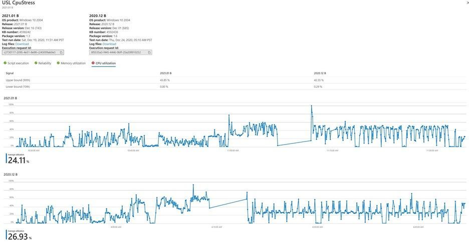

# 지능형 CPU 회귀 분석

CPU 사용률은 응용 프로그램이 운영 체제 업데이트의 영향을 받는지 여부를 나타낼 수 있습니다. 

테스트 기반 Microsoft 365 소프트웨어 개발자는 응용 프로그램이 예정된 OS(운영 체제) 업데이트의 다른 버전에서 실행될 때 발생하는 CPU 성능 회귀에 대한 Windows 정보를 제공합니다. 

이러한 CPU 회귀를 통해 개발자는 OS 업데이트가 광범위하게 배포되기 전에 응용 프로그램 문제(및 잠재적인 오류)를 감지하고 해결하여 최종 사용자에게 좋지 않은 환경을 방지할 수 있습니다.

### CPU 회귀 분석의 작동 방식 ###

테스트 기본 사용자는 연결된 테스트 스크립트와 함께 응용 프로그램의 이진 파일을 단일 .zip 파일로 업로드하고 Azure의 테스트 기준 포털에서 응용 프로그램을 테스트할 Windows OS 버전을 선택할 수 있습니다. 

그런 다음 테스트 기본 서비스가 테스트 스크립트를 실행하고 CPU 회귀 **분석을 실행합니다.** 

이 서비스는 대상 OS에 대한 업데이트의 사전 릴리스 버전에 있는 응용 프로그램의 CPU 사용률이 릴리스된 OS 버전의 CPU 사용률에 해당하는지 검사합니다. 

두 버전의 OS에서 실행되는 프로세스가 서로 다른 OS 버전으로 인해 정확히 일치하지 않을 수도 있기 때문에 CPU 사용률은 100% 같은 비교가 아니며, 그러나 Test Base에서 수행한 분석은 응용 프로그램의 CPU 사용률이 예정된 OS 업데이트 및 특히 이전 테스트 실행에서 회귀된 프로세스의 영향을 확인할 수 있습니다.

아래 스냅숏에는 동일한 응용 프로그램에 대해 CPU 사용률을 비교하는 두 개의 OS 릴리스가 있습니다. 
-   CPU 사용률 탭은 각각 90번째 및 10번째 백분위수에서 두 릴리스의 사용률의 상한 및 하한을 보여줍니다. 
-   그래프에는 평균 사용률과 함께 일련의 CPU 사용률이 표시됩니다. 

이제 고객은 이 기능을 사용하여 응용 프로그램의 CPU 사용률이 OS 업데이트 및 특히 이전 실행에서 회귀한 프로세스를 확인할 수 있습니다.

### 관련 프로세스 식별 ###

여기에서는 응용 프로그램에서 회귀된 프로세스를 식별하는 방법을 논의합니다. 

성능 회귀를 분석하려면 테스트 실행 중에 가상 머신에서 실행되는 모든 프로세스에 대해 다양한 종류의 성능 카운터를 추적해야 합니다. 

이러한 분석은 주어진 응용 프로그램에 대한 많은 프로세스에 대한 많은 변수를 캡처합니다. 모든 프로세스가 실행 또는 응용 프로그램과 연결되어 있지는 않습니다. 이 과제를 해결하기 위해 확률 및 정보 이론을 사용하는 상호 정보 순위 알고리즘을 적용하여 주어진 응용 프로그램에 가장 관련된 프로세스를 알아내야 합니다. 

응용 프로그램은 한 가지 유형의 임의 변수로 간주될 수 있습니다. 프로세스는 다른 종류의 임의 변수로 간주됩니다. 두 개의 무작위 변수의 연결은 연관성에 대한 조건부 확률을 사용하여 측정됩니다. 

그런 다음 프로세스는 각 응용 프로그램에 대한 해당 순서대로 표시됩니다. 또한 CPU 회귀 분석에 대한 관련 프로세스와 함께 기본적으로 모니터링할 수 있는 프로세스의 하위 집합을 즐겨찾을 수 있습니다. 회귀가 감지되면 성능 분석기 도구 Windows 다운로드하고 CPU 성능 회귀의 원인을 분석할 수 있습니다. 

Windows 성능 분석기는 입력으로 ETL(이벤트 추적 로그)을 사용하며, 이러한 .etl 파일은 포털에서 테스트 실행을 위해 다운로드할 수 있는 로그 파일에서 사용할 수 있습니다. CPU 성능 디버깅에 대한 자세한 내용은 성능 분석기 Windows 참조하세요.

