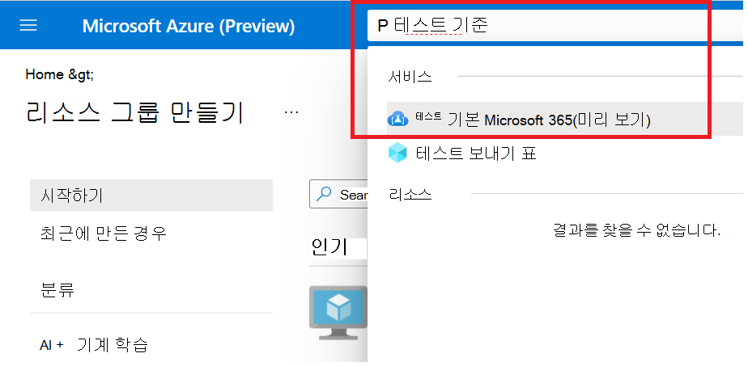
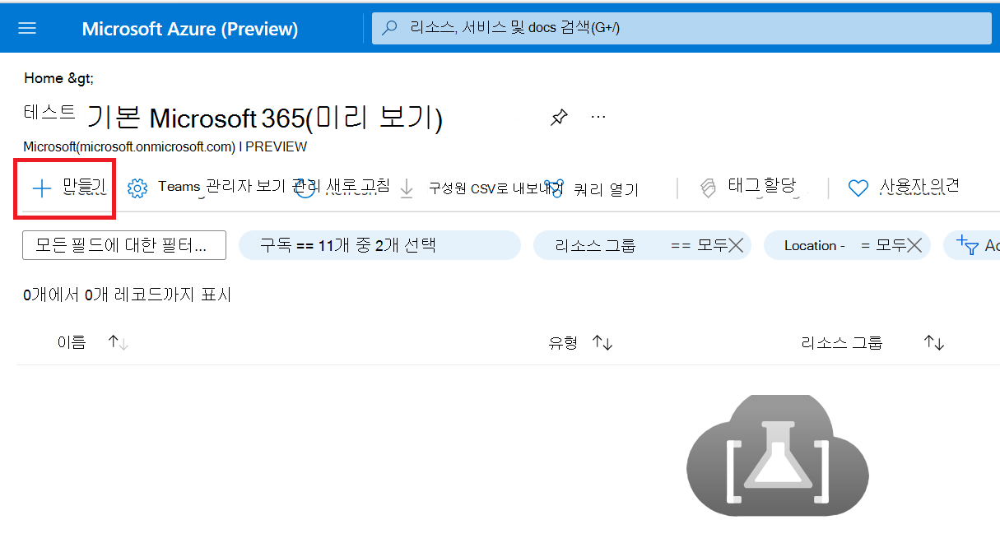
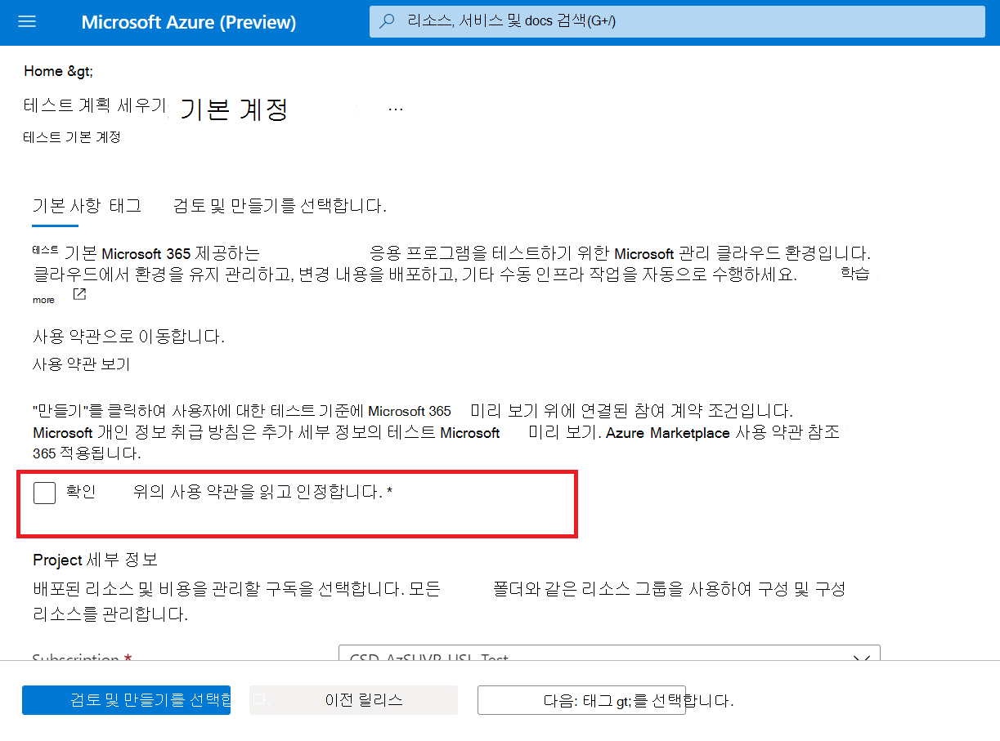
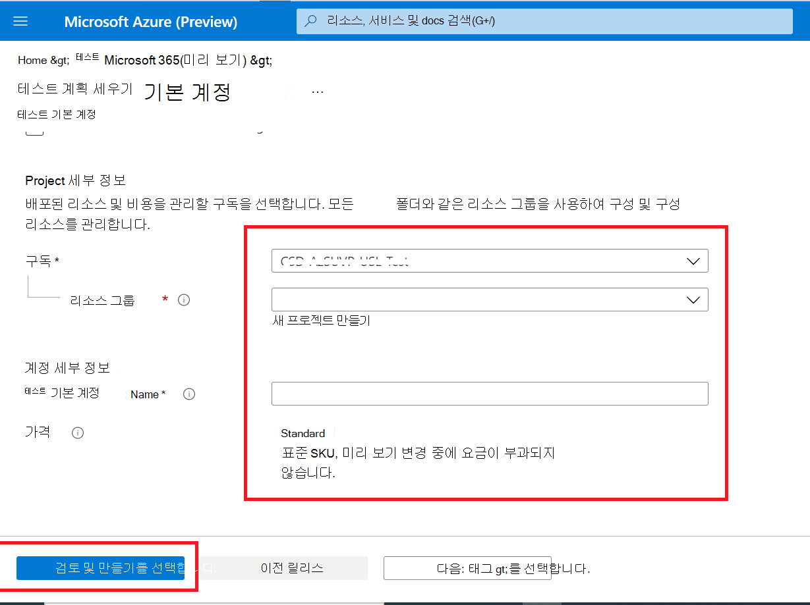

# <a name="step-1-create-a-test-base-account"></a>1단계: 테스트 기준 계정 만들기

Azure 구독이 없는 경우 시작하기 전에 무료 [계정을](https://azure.microsoft.com/free/) 만드하세요.

## <a name="enter-details-for-test-base-account"></a>테스트 기본 계정에 대한 세부 정보 입력
 
1. Azure **Portal에서 '테스트 기준'을** 검색합니다.



2. **'추가'를 클릭하여** 테스트 기준 계정을 만들 수 있습니다.



3.  그런 다음 확인란을 선택하여 에 ```Terms of Use``` 대한 만족도를 확인할 수 ```Terms of Use``` 있습니다.



4.  다음 요구 사항에 따라 올바른 정보를 입력합니다. 
    -   구독: 리소스 그룹
    -   인스턴스 세부 정보: 이름.

**현재 테스트 기준은 표준 가격 계층만 지원됩니다.**



5.  마지막으로 를 클릭하여 새로 만든 계정의 유효성을 ```Review + Create``` 검사하고 사용하도록 설정할 수 있습니다.

## <a name="next-steps"></a>다음 단계

Step 2: Learn how upload your package(2단계: 패키지 업로드 방법)를 시작하려면 다음 **문서로 진행하세요.**
> [!div class="nextstepaction"]
> [다음 단계](uploadApplication.md)

<!---
Add button for next page
-->
