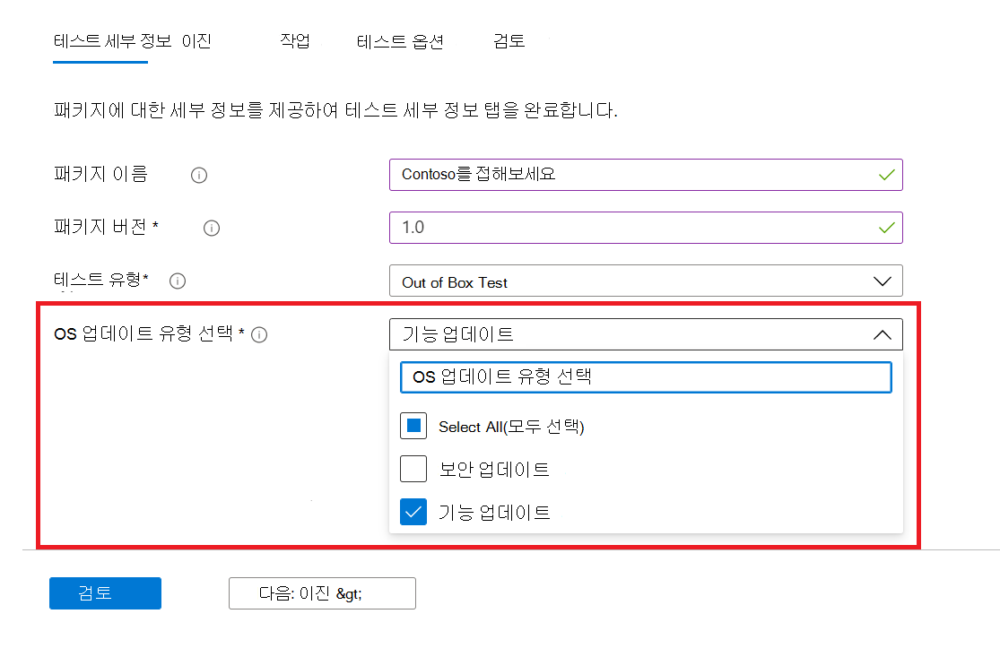
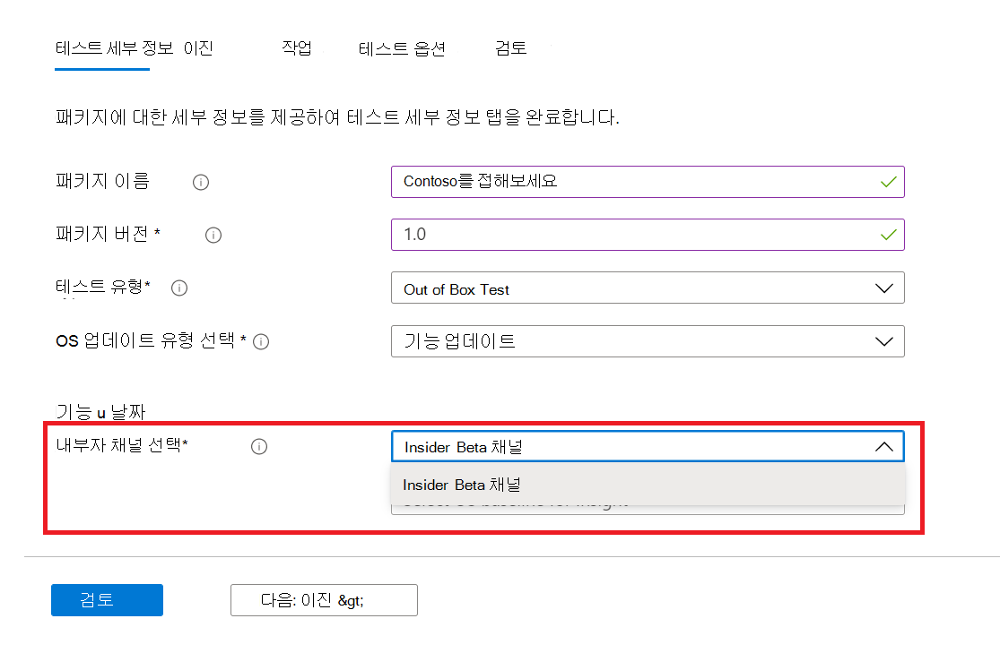
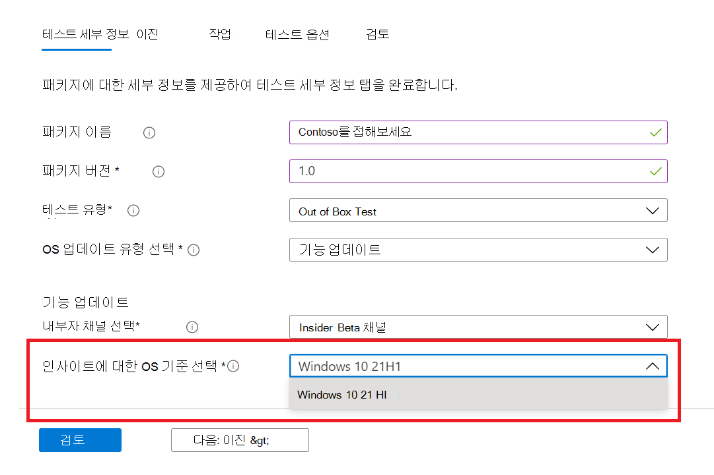

# <a name="windows-feature-update-validation"></a>Windows 기능 업데이트 유효성 검사

새로운 Windows 10 기능의 유효성을 검사할 환경을 유지 관리하지 않고도 다음 Windows 10 또는 Windows 11 릴리스에서 응용 프로그램을 수행하는 방법에 대한 Windows 필요하세요? 

Azure 환경에서 Windows 프로그램 빌드에 대해 유효성 검사 테스트를 실행하고 싶나요?

 M365용 테스트 베이스의 기능 업데이트 유효성 검사를 통해 이러한 모든 기능을 달성하는 데 도움이 될 수 있습니다!

아래 단계별 개요를 확인하여 M365 서비스 테스트 기준에서 이 새로운 기능에 액세스하는 방법을 알아보세요.

M365용 테스트 베이스에서 시작하려면 셀프 서비스 온보더링 포털을 통해 응용 프로그램(및 관련 ```Feature update validation``` 파일)을 업로드합니다. 

아래에 강조 표시된 단계는 테스트 세부 정보를 입력할 **때 수행해야 하는 단계입니다.**

1. OS **업데이트 유형으로** 기능 업데이트를 선택합니다.



2. 응용 Windows 유효성을 검사할 내부자 채널을 선택하십시오.  



3. 테스트의 기준으로 Windows 10 또는 Windows 11의 출시를 선택하고 패키지를 성공적으로 온보드하는 데 필요한 다른 세부 정보를 제공합니다.



4. 미리 릴리스된 응용 프로그램 기능 업데이트에 대한 응용 프로그램 유효성 검사 Windows 10 확인을 위해 를 ```Feature Updates Test Results``` 방문하세요.


## <a name="next-steps"></a>다음 단계

다음 문서로 진행하여 메모리 회귀 분석 이해를 시작하세요.
> [!div class="nextstepaction"]
> [다음 단계](memory.md)

<!---
Add button for next page
-->
