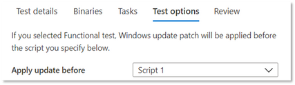

# <a name="functional-testing"></a>기능 테스트

소프트웨어 공급업체는 이제 M365용 셀프 서비스 테스트 베이스 포털을 통해 원하는 테스트 프레임워크를 사용하여 사용자 지정 기능 테스트를 수행할 수 있습니다. 

서비스를 처음 출시할 때 표준화된 스크립팅을 통해 구동되는 미리 정의된 테스트 집합인 기본 제공 테스트를 제공했습니다. 그러나 많은 ISV(Independent Software Vendor)에 대해 전체 테스트 범위를 달성할 수 없습니다. 

따라서 사용자 의견에 따라 당사는 자동화된 기능 테스트를 업로드하는 기능을 ISV에 제공합니다.

이 기능을 사용 하 고 다음 단계를 수행 합니다.

1. 업로드(이진, 종속성 및 스크립트)를 단일 패키지로 .zip 합니다.
2. 다양한 실행 지점에서 테스트 VM(가상 컴퓨터)을 다시부팅할지 선택해야 합니다.
3. 스크립트에 사용할 수 있는 옵션을 관리합니다.
4. 실행 중 VM에서 Windows 업데이트를 적용할 시기를 선택 합니다.

위의 단계에 대한 자세한 설명은 아래에서 강조 표시됩니다.

**업로드 테스트 패키지 구성**

시작하려면 업로드 페이지로 이동하여 Azure에서 M365 업로드 테스트 기준 포털의 왼쪽 탐색 메뉴에 있는 응용 프로그램 카탈로그 아래에서 새 응용 프로그램을 선택합니다. 이 경우

탭 1 - 기본 정보를 입력합니다. 응용 프로그램의 이름과 버전을 제공합니다. 테스트 유형 옵션에서 를 ```Functional tests``` 선택합니다. 

*OOB(Out-of-Box) 옵션은 기본적으로 필요합니다.*


탭 2 - 업로드 전체 테스트(이진, 종속성, 스크립트 등)를 업로드하여 패키지의 구성 요소를 업로드합니다. 

자세한 aka.ms/usl-package-outline 정보를 참조합니다. 참고: 첫 실행 테스트 스크립트와 기능 테스트 콘텐츠는 모두 동일한 zip 파일에 배치해야 합니다. 현재 파일 크기는 2GB로 제한됩니다.

탭 3 - 기본 및 기능 테스트 작업을 구성합니다. 여기서 응용 프로그램을 설치, 실행, 닫기 및 제거하는 PowerShell 스크립트에 대한 경로와 모든 사용자 지정 스크립트에 대한 경로를 선택하고 기능 테스트를 수행하도록 합니다. **(참고: 응용 프로그램을 제거하기 위해 스크립트는 선택 사항입니다.**

현재 기능 테스트를 위해 1~8개 스크립트를 업로드할 수 있습니다. (더 많은 스크립트가 필요한 경우 이 게시물에 대해 설명하세요!)


(선택 사항) 설치 후 다시 시작을 구성합니다. 일부 응용 프로그램은 설치 후 다시 시작해야 합니다. 

해당 스크립트를 실행한 후 다시 시작을 수행하려면 작업 탭에서 특정 ```Reboot After Execution``` Script를 선택합니다.

탭 4 - Windows 업데이트가 설치되는 경우 선택: 원하는 스크립트를 Windows 업데이트 패치를 적용합니다. 실제 응용 프로그램 사용 Windows 모방하기 위해 응용 프로그램을 설치한 후 업데이트를 설치하는 것이 좋습니다.



탭 5 - 패키지를 검토하고 생성합니다. 위에 나열된 단계를 완료한 후 업로드 프로세스를 ```Create``` 완료하려면 을 선택합니다.

패키지를 만든 후 패키지의 확인 상태를 확인할 수 있습니다.

응용 프로그램을 설치, 시작, 닫기 및 제거하기 위해 초기 테스트를 실행합니다. 이를 통해 패키지가 오류 없는 서비스에 설치할 수 있는지 확인할 수 있습니다.

확인 프로세스는 최대 24시간이 걸릴 수 있습니다. 확인이 완료되면 메뉴에서 상태를 확인할 수 있습니다. 이 상태는 다음 두 항목 중 ```Manage packages``` 하나일 수 있습니다.

1. 확인 성공: 선택한 OS 빌드에 대한 Windows 시험판 업데이트에 대해 패키지가 자동으로 테스트됩니다.
또는
2. 확인 실패: 실패 이유를 조사하고 문제를 해결한 후 패키지를 다시 업로드해야 합니다.

또한 Azure Portal의 알림 아이콘을 통해 두 결과 중 하나에 대한 알림을 하게 됩니다.
