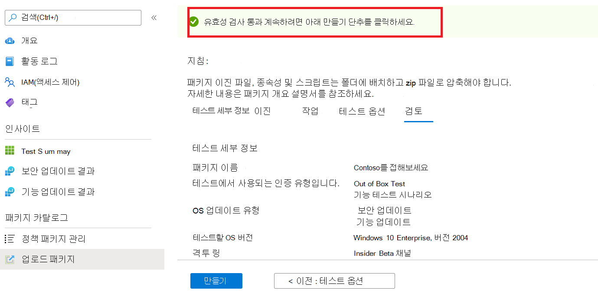
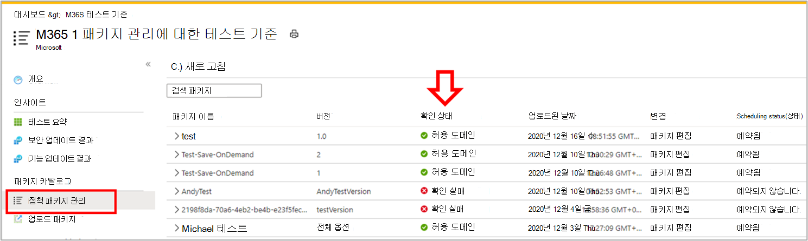

# <a name="step-6-review-your-selections-to-create-your-package"></a><span data-ttu-id="5089b-103">6단계: 선택을 검토하여 패키지를 만들 수 있습니다.</span><span class="sxs-lookup"><span data-stu-id="5089b-103">Step 6: Review your selections to create your package.</span></span>

1.  <span data-ttu-id="5089b-104">이 탭에서 서비스에서는 테스트 세부 정보를 표시하고 빠른 완성도 검사를 실행합니다.</span><span class="sxs-lookup"><span data-stu-id="5089b-104">On this tab, the service displays your test details and runs a quick completeness check.</span></span> 

    <span data-ttu-id="5089b-105">A ```Validation passed``` 또는 ```Validation failed``` 메시지는 다음 단계로 진행할 수 있는지 여부를 보여줍니다.</span><span class="sxs-lookup"><span data-stu-id="5089b-105">A ```Validation passed``` or ```Validation failed``` message shows whether you can proceed to next steps or not.</span></span>

2.  <span data-ttu-id="5089b-106">테스트 세부 정보를 검토하고 충족하면 단추를 ```Create``` 클릭합니다.</span><span class="sxs-lookup"><span data-stu-id="5089b-106">Review your test details and if satisfied, click on the ```Create``` button.</span></span> 



3.  <span data-ttu-id="5089b-108">이렇게 하면 패키지가 테스트 기준 환경에 온보드됩니다.</span><span class="sxs-lookup"><span data-stu-id="5089b-108">This will onboard your package to the Test Base environment.</span></span> <span data-ttu-id="5089b-109">패키지가 성공적으로 만들어진 경우 Azure에서 패키지를 성공적으로 실행할 수 있는지 여부를 확인하는 자동화된 테스트가 트리거됩니다.</span><span class="sxs-lookup"><span data-stu-id="5089b-109">If your package is successfully created, an automated test which verifys whether your package can be successfully executed on Azure will be triggered.</span></span>


> [!Note]
> <span data-ttu-id="5089b-111">Azure Portal에서 패키지 확인의 성공 또는 실패를 알리는 알림을 받을 수 있습니다.</span><span class="sxs-lookup"><span data-stu-id="5089b-111">You will get a notification from the Azure portal to notify you on the success or failure of the package verification.</span></span> 
>
> <span data-ttu-id="5089b-112">프로세스는 최대 24시간이 걸릴 수 있으므로 웹 페이지가 활성화되지 않은 경우 웹 페이지 시간 제한이 있을 수 있으므로 이 주문형 실행이 완료된 것을 알리지 않습니다.</span><span class="sxs-lookup"><span data-stu-id="5089b-112">Please note that the process can take up to 24 hours, so it is likely your webpage will timeout if you are not active on it and hence, the notification will not inform you of the completion of this on-demand run.</span></span> 

  - <span data-ttu-id="5089b-113">이러한 상황이 발생하면 탭에서 패키지의 상태를 볼 수 ```Manage packages``` 있습니다.</span><span class="sxs-lookup"><span data-stu-id="5089b-113">Peradventure this happens, you can view the status of your package on the ```Manage packages``` tab.</span></span>



  - <span data-ttu-id="5089b-115">테스트의 경우 예약된 간격으로 및 페이지를 통해 결과를 확인할 수 있으며 업로드한 후 며칠 후에 ```Test Summary``` ```Security Updates Results``` ```Feature Updates Results``` 시작되는 경우가 종종 있습니다.</span><span class="sxs-lookup"><span data-stu-id="5089b-115">For succesful tests, their results can be seen via the ```Test Summary```, ```Security Updates Results``` and ```Feature Updates Results``` pages at scheduled intervals, often starting a few days after your upload.</span></span>
  
  - <span data-ttu-id="5089b-116">테스트에 실패한 동안 새 패키지를 업로드해야 합니다.</span><span class="sxs-lookup"><span data-stu-id="5089b-116">While failed tests, require you to upload a new package.</span></span> 
  
    <span data-ttu-id="5089b-117">의 및 페이지에서 추가 분석을 ```test logs``` 위해 를 ```Security update results``` 다운로드할 수 ```Feature updates results``` 있습니다.</span><span class="sxs-lookup"><span data-stu-id="5089b-117">You can download the ```test logs``` for further analysis from the ‘```Security update results``` and ```Feature updates results``` pages.</span></span>

  - <span data-ttu-id="5089b-118">반복적인 테스트 오류가 발생하는 경우 오류에 대한 세부 testbasepreview@microsoft.com 문의하세요.</span><span class="sxs-lookup"><span data-stu-id="5089b-118">If you experience repeated test failures, please reach out to testbasepreview@microsoft.com with details of your error.</span></span> 

## <a name="next-steps"></a><span data-ttu-id="5089b-119">다음 단계</span><span class="sxs-lookup"><span data-stu-id="5089b-119">Next steps</span></span>

<span data-ttu-id="5089b-120">아래 링크를 통해 콘텐츠 지침을 검색합니다.</span><span class="sxs-lookup"><span data-stu-id="5089b-120">Discover our Content Guidelines via the link below.</span></span>
> [!div class="nextstepaction"]
> [<span data-ttu-id="5089b-121">다음 단계</span><span class="sxs-lookup"><span data-stu-id="5089b-121">Next step</span></span>](contentguideline.md)
