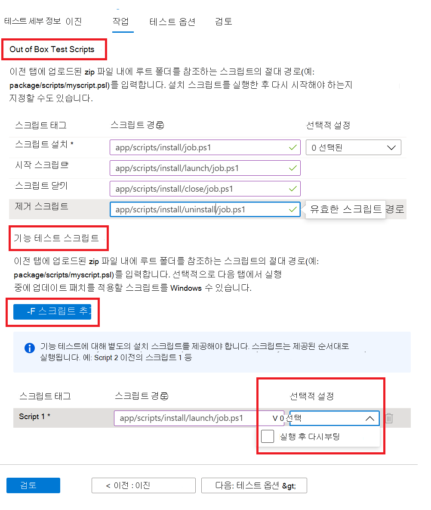

# <a name="step-4-the-tasks-tab"></a>4단계: 작업 탭

작업 탭에서 업로드한 zip 폴더의 이진 탭에 있는 테스트 스크립트의 경로를 제공해야 합니다.

  - **Out of Box Test Scripts:** 설치, 시작, 닫기 및 제거 스크립트에 대한 상대 경로를 입력합니다. 설치 스크립트에 대한 추가 설정을 선택할 수도 있습니다.
  - **기능 테스트 스크립트:** 업로드된 각 기능 테스트 스크립트에 대한 상대 경로를 입력합니다. 단추를 사용하여 추가 기능 테스트 스크립트를 추가할 수 ```Add Script``` 있습니다. 최소 하나의 (1) 스크립트가 필요하며 최대 8개의 기능 테스트 스크립트를 추가할 수 있습니다. 
  
    스크립트는 업로드 순서대로 실행되고 특정 스크립트에서 오류가 발생하면 후속 스크립트 실행이 중지됩니다.
    또한 제공된 각 스크립트에 대해 추가 설정을 선택할 수도 있습니다.

## <a name="set-script-path"></a>스크립트 경로 설정



폴더 구조에 상대 경로를 제공하는 방법의 샘플은 아래와 같습니다.

_**Zip_file_uploaded**_
~~~
├── file1.exe

├── ScriptX.ps1

├── folder1

│   ├── file3.exe

│   ├── script.ps1
~~~
  - **ScriptX.ps1** 있습니다. _ScriptX.ps1_ 경로로 사용할 수 있습니다.
  - **Script.ps1** _폴더1/script.ps1_ 경로로 지정됩니다.


## <a name="next-steps"></a>다음 단계

다음 문서에서 테스트 옵션 탭의 세부 정보 보기 
> [!div class="nextstepaction"]
> [다음 단계](testoptions.md)
