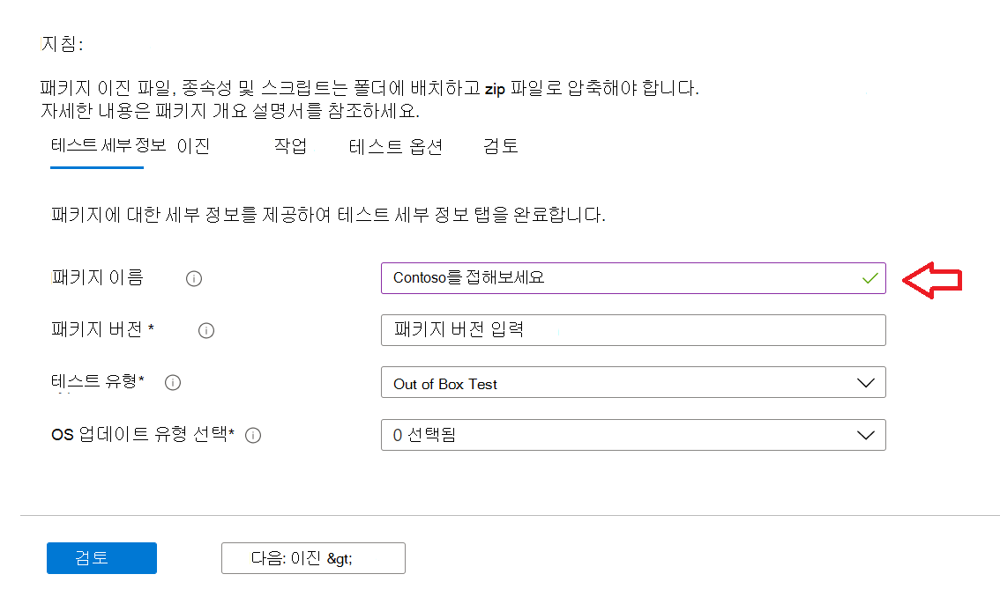
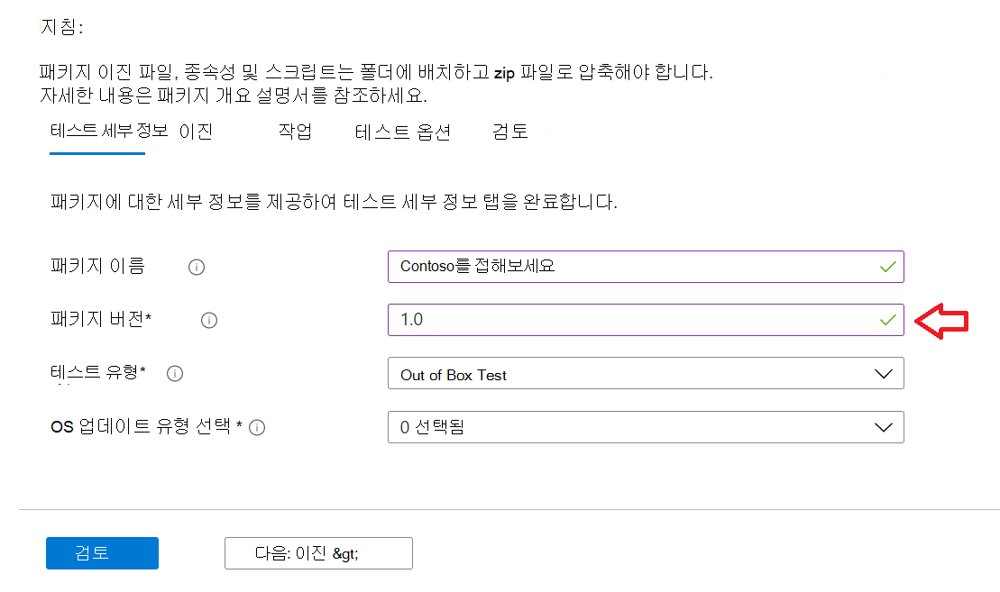
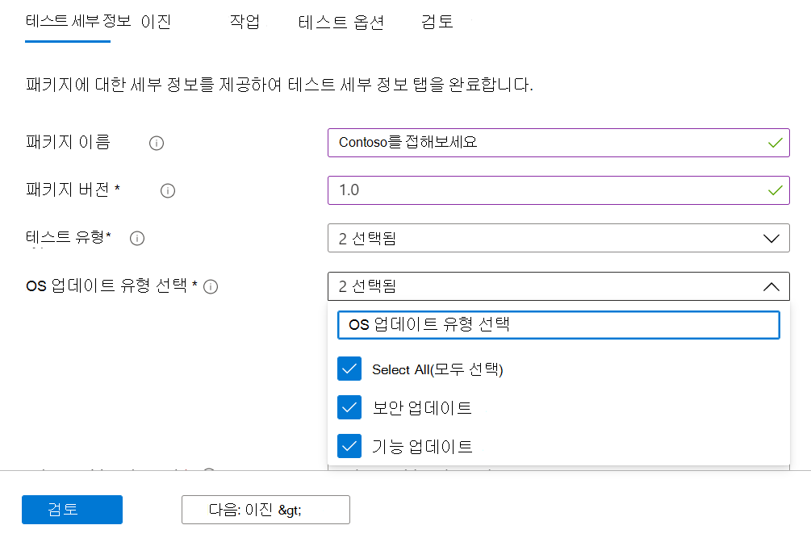
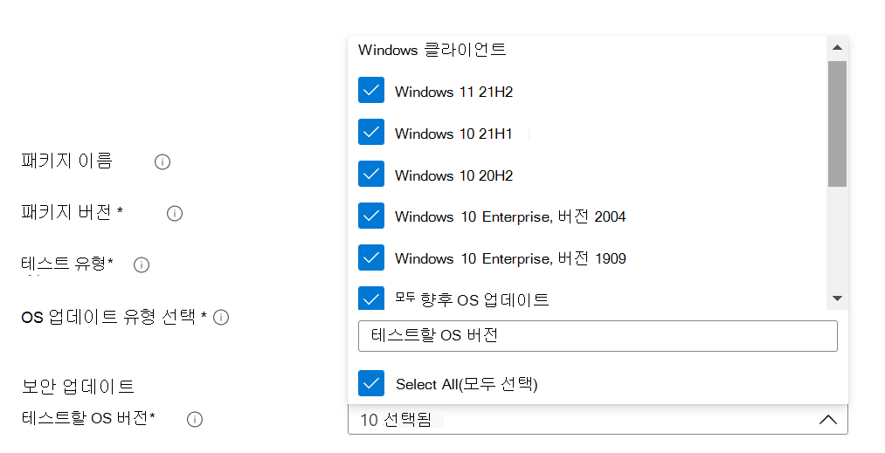
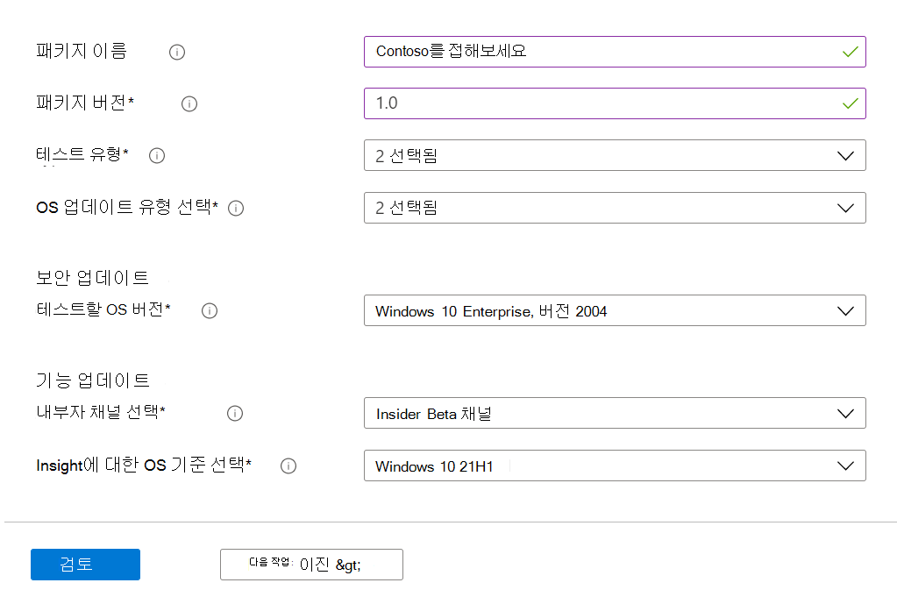

# <a name="step-2-uploading-a-package"></a><span data-ttu-id="d9aff-103">2단계: 패키지 업로드</span><span class="sxs-lookup"><span data-stu-id="d9aff-103">Step 2: Uploading a Package</span></span>

<span data-ttu-id="d9aff-104">테스트 기본 포털 페이지에서 아래와 같이 왼쪽 탐색 모음의 '업로드 새 패키지 옵션으로 이동합니다. 업로드 </span><span class="sxs-lookup"><span data-stu-id="d9aff-104">On the Test Base portal page, navigate to the ‘Upload new package option on the left navigation bar as shown below: </span></span>

<span data-ttu-id="d9aff-105">이 단계에 따라 새 패키지를 업로드합니다.</span><span class="sxs-lookup"><span data-stu-id="d9aff-105">Once there, follow the steps below to upload a new package.</span></span>

## <a name="enter-details-for-your-package"></a><span data-ttu-id="d9aff-106">패키지에 대한 세부 정보 입력</span><span class="sxs-lookup"><span data-stu-id="d9aff-106">Enter details for your package</span></span>

<span data-ttu-id="d9aff-107">테스트 세부 정보 탭에서 요청에 따라 패키지의 이름, 버전 및 기타 세부 정보를 입력합니다.</span><span class="sxs-lookup"><span data-stu-id="d9aff-107">On the Test details tab, type in your package's name, version and other details as requested.</span></span> 

<span data-ttu-id="d9aff-108">**이 대시보드를 통해 Out-of-Box** 및 **Functional 테스트를** 완료할 수 있습니다.</span><span class="sxs-lookup"><span data-stu-id="d9aff-108">**Out-of-Box** and **Functional testing** can be done via this dashboard.</span></span>

<span data-ttu-id="d9aff-109">아래 단계에서는 패키지 세부 정보를 작성하는 방법에 대한 가이드를 제공합니다.</span><span class="sxs-lookup"><span data-stu-id="d9aff-109">The steps below provides a guide on how to fill out your package details:</span></span>

1.  <span data-ttu-id="d9aff-110">**필드에 패키지에 지정될 이름을 ```“Package name``` 입력합니다.**</span><span class="sxs-lookup"><span data-stu-id="d9aff-110">**Enter the name to be given your package in the ```“Package name``` field.**</span></span>

> [!Note]  
> <span data-ttu-id="d9aff-111">입력한 패키지 이름 및 버전 조합은 조직 내에서 고유해야 합니다.</span><span class="sxs-lookup"><span data-stu-id="d9aff-111">The package name and version combination entered must be unique within your organization.</span></span> <span data-ttu-id="d9aff-112">아래와 같이 확인 표시에 의해 유효성이 검사됩니다.</span><span class="sxs-lookup"><span data-stu-id="d9aff-112">This is validated by the checkmark as shown below.</span></span>
  
  - <span data-ttu-id="d9aff-113">패키지의 이름을 다시 사용하려면 버전 번호가 고유해야 합니다(즉, 특정 이름을 사용하는 패키지와 함께 사용되지 않은 경우).</span><span class="sxs-lookup"><span data-stu-id="d9aff-113">If you choose to re-use an package's name, then the version number must be unique (i.e. never been used with an package bearing that particular name).</span></span>
  - <span data-ttu-id="d9aff-114">패키지 이름 + 버전 조합이 고유성 검사를 통과하지 못하면 "이 패키지 버전이 있는 패키지가 이미 *있습니다."라는* 오류 메시지가 표시됩니다.</span><span class="sxs-lookup"><span data-stu-id="d9aff-114">If the combination of the package name + version does not pass the uniqueness check, you will see an error message which reads, *“Package with this package version already exists”*.</span></span> 



2. <span data-ttu-id="d9aff-116">**"패키지 버전" 필드에 버전을 입력합니다.**</span><span class="sxs-lookup"><span data-stu-id="d9aff-116">**Enter a version in the “Package version” field.**</span></span>



3.  <span data-ttu-id="d9aff-118">**이 패키지에서 실행할 테스트 유형 선택**</span><span class="sxs-lookup"><span data-stu-id="d9aff-118">**Select the type of test you want to run on this package**</span></span>

    <span data-ttu-id="d9aff-119">**OOB(Out-of-Box)** 테스트는 패키지 *설치,* *시작,* 닫기 및 제거를 실행합니다.  </span><span class="sxs-lookup"><span data-stu-id="d9aff-119">An **Out-of-Box (OOB)** test performs an *install*, *launch*, *close* and *uninstall* of your package.</span></span> <span data-ttu-id="d9aff-120">설치 후 단일 제거가 실행되기 전에 시작 닫기 루틴이 30번 반복됩니다.</span><span class="sxs-lookup"><span data-stu-id="d9aff-120">After the install, the launch-close routine is repeated 30 times before a single uninstall is run.</span></span> 
    
    <span data-ttu-id="d9aff-121">이 OOB 테스트는 패키지에 대한 표준화된 원격 분석 기능을 제공하여 여러 빌드에서 Windows 제공합니다.</span><span class="sxs-lookup"><span data-stu-id="d9aff-121">This OOB test provides you with standardized telemetry on your package to compare across Windows builds.</span></span>

    <span data-ttu-id="d9aff-122">기능 **테스트는** 패키지에 업로드된 테스트 스크립트를 실행합니다.</span><span class="sxs-lookup"><span data-stu-id="d9aff-122">A **Functional test** would execute your uploaded test script(s) on your package.</span></span> <span data-ttu-id="d9aff-123">스크립트는 업로드 순서대로 실행되고 특정 스크립트에서 오류가 발생하면 후속 스크립트 실행이 중지됩니다.</span><span class="sxs-lookup"><span data-stu-id="d9aff-123">The scripts are run in upload sequence and a failure in a particular script will stop subsequent scripts from executing.</span></span>

> [!Note]
> <span data-ttu-id="d9aff-124">**모든** 스크립트는 가장 80분 동안 실행됩니다.</span><span class="sxs-lookup"><span data-stu-id="d9aff-124">**All** scripts run for 80 minutes at the most.</span></span> 
    
4.  <span data-ttu-id="d9aff-125">**OS 업데이트 유형 선택**</span><span class="sxs-lookup"><span data-stu-id="d9aff-125">**Select the OS update type**</span></span>

   - <span data-ttu-id="d9aff-126">'보안 업데이트'를 사용하면 릴리스 전 월간 보안 업데이트의 증분 Windows 테스트할 수 있습니다.</span><span class="sxs-lookup"><span data-stu-id="d9aff-126">The ‘Security updates’ enables your package to be tested against incremental churns of Windows pre-release monthly security updates.</span></span> 
   - <span data-ttu-id="d9aff-127">'기능 업데이트'를 사용하면 Windows 프로그램 내부자 프로그램에서 시험판 기능 업데이트 빌드를 Windows 테스트할 수 있습니다.</span><span class="sxs-lookup"><span data-stu-id="d9aff-127">The ‘Feature updates’ enables your package to be tested against Windows pre-release bi-annual feature updates builds from the Windows Insider Program.</span></span>
<!---
Change to the correct picture
-->


5.  <span data-ttu-id="d9aff-129">**보안 업데이트 테스트용 OS 버전을 선택합니다.**</span><span class="sxs-lookup"><span data-stu-id="d9aff-129">**Select the OS version(s) for Security update tests.**</span></span>

<span data-ttu-id="d9aff-130">다중 선택 드롭다운에서 패키지가 설치될 Windows OS 버전을 선택합니다.</span><span class="sxs-lookup"><span data-stu-id="d9aff-130">In the multi-select dropdown, select the OS version(s) of Windows your package will be installed on.</span></span> 

  - <span data-ttu-id="d9aff-131">클라이언트 OSes만 Windows 테스트하려면 메뉴 목록에서 해당 Windows 11 OS 버전을 선택합니다.</span><span class="sxs-lookup"><span data-stu-id="d9aff-131">To test your package against Windows Client OSes only, select the applicable Windows 11 OS versions from the menu list.</span></span>
  - <span data-ttu-id="d9aff-132">서버 OSes만 Windows 테스트하려면 메뉴 목록에서 해당 Windows Server OS 버전을 선택합니다.</span><span class="sxs-lookup"><span data-stu-id="d9aff-132">To test your package against Windows Server OSes only, select the applicable Windows Server OS versions from the menu list.</span></span>
  - <span data-ttu-id="d9aff-133">클라이언트 및 Windows OSes에 대해 패키지를 테스트하려면 메뉴 목록에서 적용 가능한 모든 OSes를 선택합니다.</span><span class="sxs-lookup"><span data-stu-id="d9aff-133">To test your package against Windows Client and Server OSes, select all applicable OSes from the menu list.</span></span> 

> [!Note]
> <span data-ttu-id="d9aff-134">서버 및 클라이언트 OSes 둘 다에 대해 패키지를 테스트하기로 선택한 경우 패키지가 호환되는지와 두 OS 모두에서 실행할 수 있는지 확인</span><span class="sxs-lookup"><span data-stu-id="d9aff-134">If you select to test your package against both Server and Client OSes, please make sure that the package is compatible and can run on both OSes</span></span>



<!---
Change to the correct picture
-->
6.  <span data-ttu-id="d9aff-136">**기능 업데이트 테스트에 대한 옵션을 선택합니다.**</span><span class="sxs-lookup"><span data-stu-id="d9aff-136">**Select options for Feature update tests:**</span></span>

  - <span data-ttu-id="d9aff-137">"내부자 채널 선택" 옵션에서 패키지를 테스트할 빌드로 ```Windows Insider Program Channel``` 를 선택합니다.</span><span class="sxs-lookup"><span data-stu-id="d9aff-137">On the option to “Select Insider Channel”, select the ```Windows Insider Program Channel``` as the build which your packages should be tested against.</span></span>
  
    <span data-ttu-id="d9aff-138">현재 Insider Beta 채널에서 플라이트된 빌드를 사용 중입니다.</span><span class="sxs-lookup"><span data-stu-id="d9aff-138">We currently use builds flighted in the Insider Beta Channel.</span></span>

  - <span data-ttu-id="d9aff-139">"인사이트에 대한 OS 기준 선택" 옵션에서 테스트 결과를 비교할 Windows 기준으로 사용할 Windows OS 버전을 선택합니다.</span><span class="sxs-lookup"><span data-stu-id="d9aff-139">On the option to “Select OS baseline for Insight”, select the Windows OS version to be used as a baseline in comparing your test results.</span></span> 

> [!Note]
> <span data-ttu-id="d9aff-140">현재는 서버 OS에 대한 기능 업데이트 테스트를 지원하지 않습니다.</span><span class="sxs-lookup"><span data-stu-id="d9aff-140">We DO NOT support Feature update testing for Server OSes at this time</span></span>
<!---
Note to actual note format for markdown
-->
<!---
Change to the correct picture
-->


7.  <span data-ttu-id="d9aff-142">완료된 테스트 세부 정보 페이지는 다음과 같습니다.</span><span class="sxs-lookup"><span data-stu-id="d9aff-142">A completed Test details page should look like this:</span></span> 


## <a name="next-steps"></a><span data-ttu-id="d9aff-144">다음 단계</span><span class="sxs-lookup"><span data-stu-id="d9aff-144">Next steps</span></span>

<span data-ttu-id="d9aff-145">다음 문서에서는 Serivce에 이진 파일을 업로드하는 방법을 다루고 있습니다.</span><span class="sxs-lookup"><span data-stu-id="d9aff-145">Our next article covers Uploading your Binaries to our serivce.</span></span>
> [!div class="nextstepaction"]
> [<span data-ttu-id="d9aff-146">다음 단계</span><span class="sxs-lookup"><span data-stu-id="d9aff-146">Next step</span></span>](binaries.md)

<!---
Add button for next page
-->

