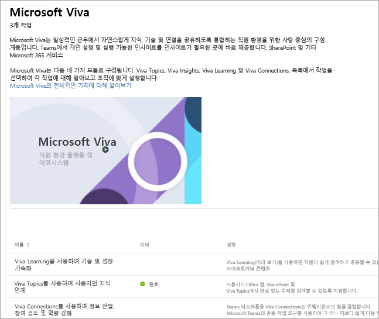

# Microsoft Viva 설정
Microsoft Viva는 일상적인 근무에서 자연스럽게 지식, 기술 및 연결을 공유하도록 통합하는 직원 환경을 위한 사람 중심의 구성 계층입니다. Teams, SharePoint 및 기타 Microsoft 365 서비스에서 개인 설정 및 실행 가능한 인사이트를 인사이트가 필요한 곳에 바로 제공합니다. 

Microsoft Viva는 Viva Topics, Viva Insights, Viva Learning 및 Viva Connections의 네 가지 모듈로 구성됩니다. 전체 제품군을 설정하려면 각 모듈을 개별적으로 설정합니다.
 
### 설정 시작

바로 시작하여 설정을 시작하려면 Microsoft 관리자여야 하며 계정에 로그인되어 있어야 합니다. 

[Microsoft Viva 관리자 페이지로 직접 이동](https://admin.microsoft.com/Adminportal/Home?source=applauncher#/featureexplorer/collections/VivaExperiences)

페이지 하단에서 설정하려는 모듈을 선택합니다.
모듈 페이지에서 **설정 가이드로 이동** 버튼을 선택하거나 Viva 항목의 경우 **시작하기** 버튼을 선택하여 프로세스를 안내하는 설치 마법사로 이동합니다.

또는 나중에 설정하려는 경우 다음 단계를 따릅니다.
1.  Microsoft 365 관리 센터로 이동
2.  왼쪽 탐색에서 **설정** 선택
3.  **Microsoft Viva** 타일 선택
4.  페이지 하단에서 설정하려는 모듈을 선택합니다.
5.  **설정 가이드로 이동** 버튼을 선택하거나 Viva 항목의 경우 **시작하기** 버튼을 선택하여 프로세스를 안내하는 설치 마법사로 이동합니다.

### 자세한 정보
각 모듈에 대한 내용과 모듈을 먼저 설정하는 방법을 자세히 알아보려면 다음과 같은 몇 가지 리소스를 참조하세요.

**Viva Learning** 

기술 및 성장 가속화 – 직원들은 교육 과정부터 마이크로러닝 콘텐츠에 이르기까지 모든 것을 쉽게 발견하고 공유할 수 있습니다.

[개요](/microsoft-365/learning)

[설정 방법 알아보기](/microsoft-365/learning/set-up-teams-admin-center)

**Viva Insights**

생산성 및 웰빙의 균형 – 조직의 모든 사용자가 더 스마트하게 작업하고 균형을 유지할 수 있는 데 도움이 되는 데이터 기반의 개인 정보 보호 인사이트와 실행 가능한 권장 사항을 제공합니다.

[개요](/viva/insights/introduction)

[설정 방법 알아보기](/viva/insights/setup/setup-intro)

**Viva Topics**

사용자를 지식에 연결 – Office 앱, SharePoint 및 검색 결과 내에서 관심 있는 주제를 쉽게 검색할 수 있습니다.

[개요](/microsoft-365/knowledge/)

[설정 방법 알아보기](/microsoft-365/knowledge/set-up-topic-experiences)

**Viva Connections**

정보 제공, 참여 및 역량 강화 - Microsoft Viva Connections는 모든 사용자를 참여시키고 정보를 제공되도록 설계된 현대적인 참여 환경을 위한 통로입니다.

[개요](/sharepoint/viva-connections-overview)

[설정 방법 알아보기](/sharepoint/guide-to-setting-up-viva-connections)

**추가 정보**

[추가 설명서 및 Microsoft Viva에 대해 알아보는 방법 받기](/microsoft-365/viva)
